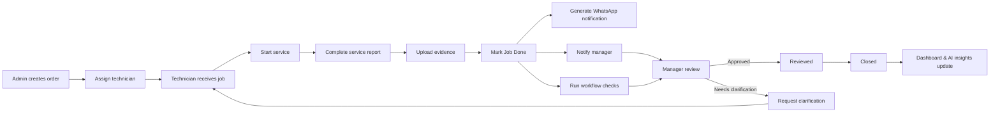
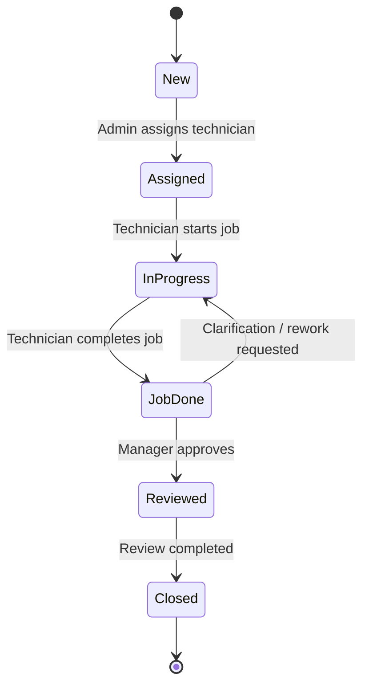
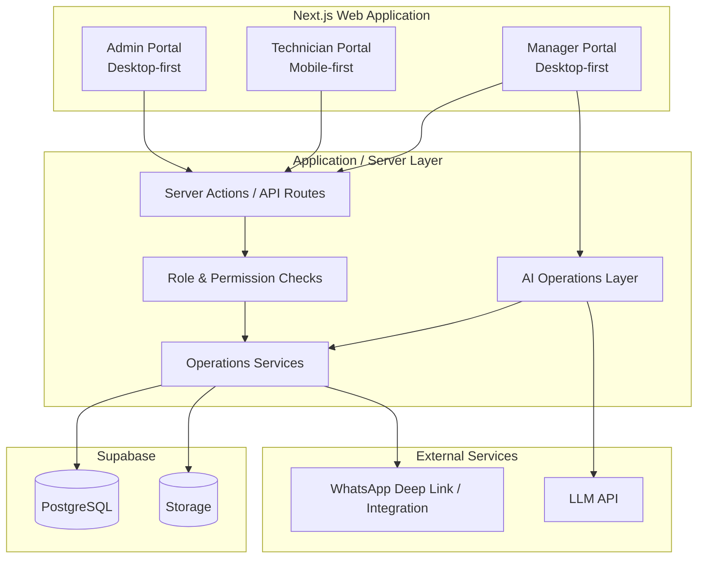
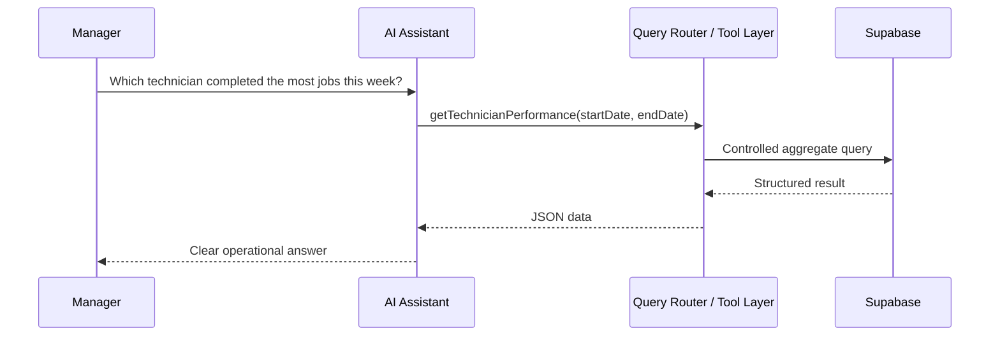
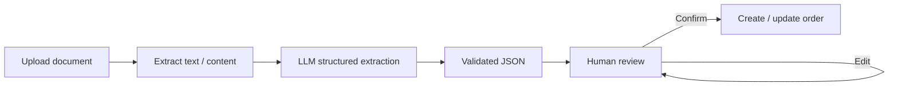
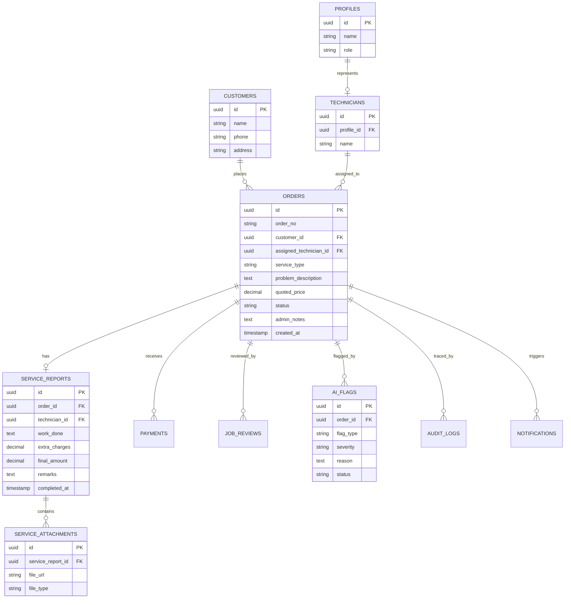

# SejukOps

AI-powered field service operations system for order management, technician workflows, KPI tracking, and operational insights.

> Programmer assessment implementation based on the fictional **Sejuk Sejuk Service Sdn Bhd** operations scenario.

## Product Goal

SejukOps digitises the end-to-end service workflow for a multi-branch air-conditioning service company:

**Order → Assignment → Service → Completion → Notification → Review → Close → Analytics**

The project is intentionally designed as one connected operations system rather than a collection of isolated assessment modules. All portals, dashboards, notifications, and AI features operate on the same underlying operational data.

## Scope

The target implementation covers all assessment modules:

- Admin Portal — order creation and technician assignment
- Technician Portal — mobile-first responsive Web App for field work
- WhatsApp notification trigger
- KPI Dashboard
- AI Operations Query Window
- AI Workflow Supervisor
- AI Document Understanding
- AI Operational Insight

Supporting features are also included in the design to close the workflow properly:

- Manager review and job closure
- Audit trail for key actions
- Mock role switcher
- Structured role/permission boundaries
- Service evidence storage

## End-to-End Workflow

## Order State Model

## System Architecture

## Portals

### Admin Portal

Desktop-first internal operations interface.

Core responsibilities:

- Create service orders
- Auto-generate order numbers
- Capture customer and service details
- Assign technicians
- View order summaries and statuses
- Trace important order actions

### Technician Portal

A **mobile-first responsive Web App**, not a separate native application.

The field workflow prioritises speed and simplicity:

1. View assigned jobs
2. Open job details
3. Start job
4. Record work completed
5. Add extra charges
6. Upload up to six evidence files
7. Review auto-calculated final amount
8. Complete job

The same Next.js application serves desktop and mobile experiences, with technician screens optimised for phone usage and touch interaction.

### Manager Portal

Desktop-first review and operations interface.

Core responsibilities:

- Review completed jobs
- Inspect quoted vs final amounts
- View technician evidence and service reports
- Review AI workflow flags
- Approve or request clarification
- View KPI dashboards
- Ask operational questions through the AI assistant

## Roles & Permissions

The assessment uses a fixed role set:

- **Admin**
- **Technician**
- **Manager**

A simple mock role switcher will be used for assessment/demo purposes. Dynamic role creation is deliberately out of scope.

The implementation should still keep role and permission concepts separate so the authorization model can evolve without redesigning the application.

| Capability | Admin | Technician | Manager |
|---|:---:|:---:|:---:|
| Create order | ✓ |  |  |
| Assign technician | ✓ |  |  |
| View assigned job |  | ✓ | ✓ |
| Start assigned job |  | ✓ |  |
| Complete assigned job |  | ✓ |  |
| Upload service evidence |  | ✓ |  |
| Review completed job |  |  | ✓ |
| Close job |  |  | ✓ |
| View KPI dashboard |  |  | ✓ |
| Use operations AI |  |  | ✓ |

Authorization is not only about role names. Data scope matters as well: a technician should only operate on jobs assigned to that technician, while a manager may view broader operational data.

## AI Architecture

The AI assistant does **not** receive unrestricted database access.

Operational questions are handled through controlled backend tools/queries:

Planned backend tools include concepts such as:

- `getJobs(...)`
- `getOrderDetails(...)`
- `getTechnicianStats(...)`
- `getOperationalSummary(...)`
- `getWorkload(...)`

The LLM interprets and formats results; application code controls which operational data can be retrieved.

## AI Modules

### Operations Query Window

Managers can ask questions such as:

- What jobs did Ali complete last week?
- Which technician completed the most jobs this week?
- How many jobs were completed today?

### Workflow Supervisor

Workflow anomalies should use deterministic checks where possible, with AI used for explanation and recommendations.

Examples:

- Final amount significantly exceeds quoted price
- Job marked done without required evidence
- Unusual extra charges

This avoids using an LLM for rules that normal application logic can enforce reliably.

### Document Understanding

Uploaded operational documents can be converted into structured fields such as:

- Customer name
- Service type
- Service details
- Amount
- Date

The extracted result should be shown for human review before it creates or updates operational records.

### Operational Insight

The system combines deterministic metrics with AI-generated interpretation, for example identifying workload imbalance or unusual service patterns.

AI insight is treated as decision support, not an automatic management decision.

## Data Model Overview

The detailed schema may evolve during implementation; this diagram captures the intended domain boundaries.

## Technology Direction

| Layer | Planned Choice |
|---|---|
| Frontend | Next.js + React + TypeScript |
| Styling | Tailwind CSS |
| Backend | Next.js server layer / API routes |
| Database | Supabase PostgreSQL |
| File Storage | Supabase Storage |
| AI | Provider-agnostic LLM API behind server-side adapters |
| Deployment | Vercel |
| Authentication | Mock role switcher for assessment |

A separate NestJS service or native mobile application is intentionally avoided for the assessment because the required workflow can remain coherent inside one Web application without adding unnecessary deployment or maintenance complexity.

## Implementation Phases

1. **Foundation** — Next.js, Supabase schema, seed data, mock role switcher
2. **Admin Workflow** — order creation and assignment
3. **Technician Workflow** — mobile-first job execution and evidence upload
4. **Completion Workflow** — WhatsApp trigger, audit trail, manager review
5. **KPI Dashboard** — weekly metrics, leaderboard, charts
6. **Core AI** — controlled operations query tools and operational insights
7. **Advanced AI** — workflow supervisor and document understanding
8. **Polish** — validation, responsive QA, error states, README, deployment

## Design Principles

- Build a connected business workflow, not isolated pages
- Keep the technician experience fast and mobile-first
- Prefer deterministic business rules over unnecessary AI decisions
- Restrict AI data access through explicit backend queries/tools
- Keep important actions traceable
- Separate authorization concepts from UI role switching
- Show AI limitations and require human review for consequential actions
- Optimise for a reviewer to understand and test the full workflow quickly

## Status

Specification and architecture defined. Implementation follows the phases above.
