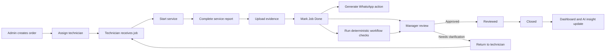
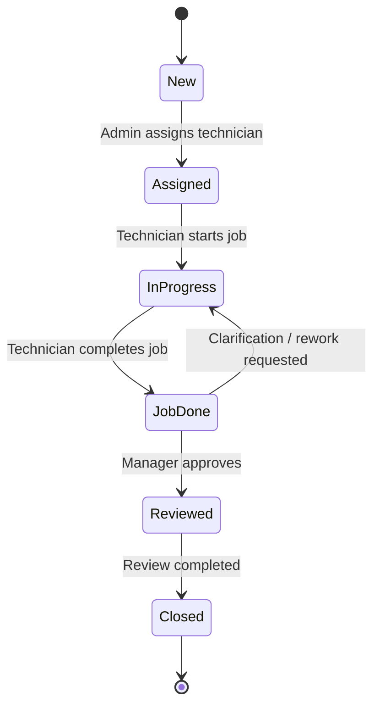
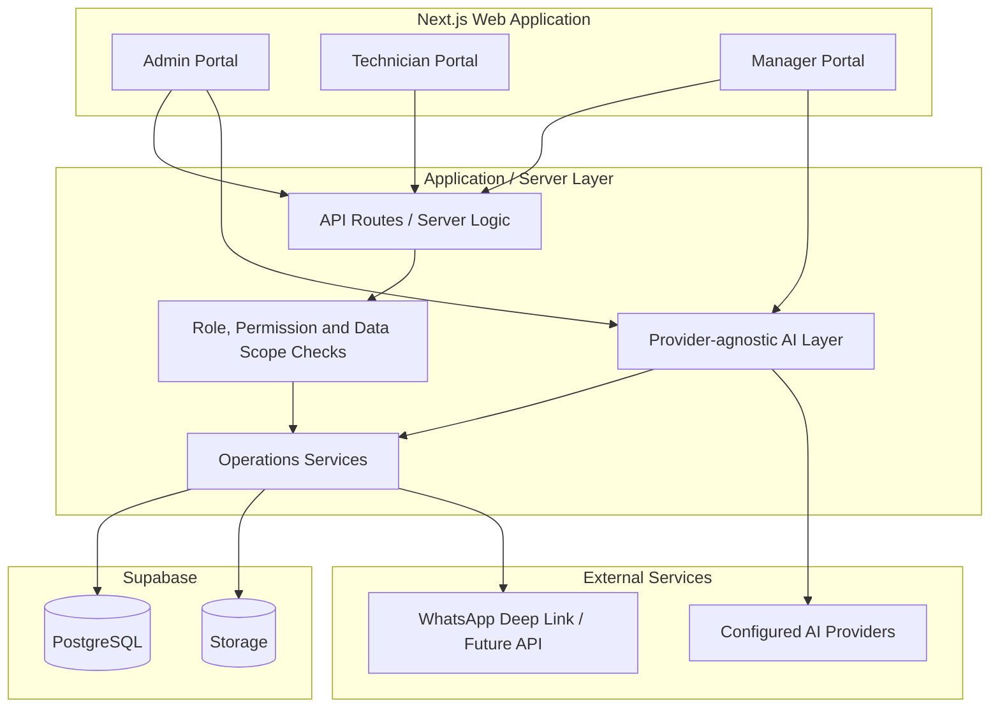
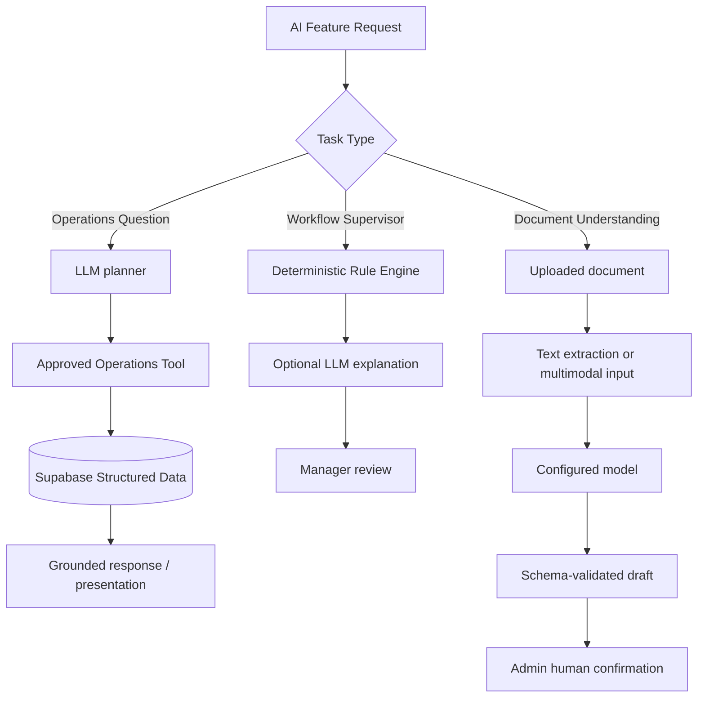
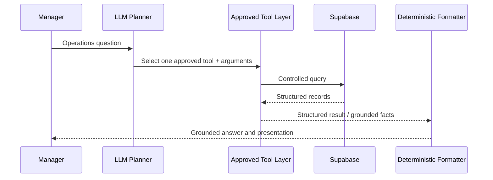

# SejukOps

AI-assisted field service operations system for order management, technician workflows, KPI tracking, manager review, notifications, and grounded operational AI.

> Programmer assessment implementation based on the fictional **Sejuk Sejuk Service Sdn Bhd** operations scenario.

## Reviewer Quick Start

SejukOps is one Next.js web application with three role-oriented portals: Admin, Technician, and Manager.

**Live demo:** https://sejukops-assessment.vercel.app

The deployment should be smoke-tested again against the final `main` commit before submission. The assessment uses a mock role switcher as permitted by the brief; it is not production authentication.

### Routes and mock identities

| Portal | Route | Demo identity |
|---|---|---|
| Landing / role switcher | `/` | Select an identity |
| Admin | `/admin` | Admin Demo |
| Technician | `/technician` | Ali (BR-01), John (BR-02), Bala (BR-03), Yusoff (BR-04) |
| Manager | `/manager` | Manager Demo |
| Admin AI settings | `/admin/ai-settings` | Admin Demo |
| Admin document import | `/admin/document-import` | Admin Demo |
| Manager dashboard | `/manager/dashboard` | Manager Demo |
| Manager Operations AI | `/manager/ai-operations` | Manager Demo |
| AI observability | `/diagnostics/ai-observability` | Admin / Manager demo roles |

Selecting an identity establishes the mock demo session and enforces the matching portal. Direct access with the wrong role redirects to the access-denied state.

### Local setup

Requirements: Node.js `>=20.9.0`, `pnpm` 10, and a Supabase project when exercising live database/storage paths.

```powershell
pnpm install
Copy-Item .env.example .env.local
pnpm dev
```

Open `http://localhost:3000`, select a demo identity, then press **Open**.

### Supabase setup

Configure `NEXT_PUBLIC_SUPABASE_URL`, `NEXT_PUBLIC_SUPABASE_ANON_KEY`, and the server-only `SUPABASE_SERVICE_ROLE_KEY` in `.env.local` using [`.env.example`](.env.example).

For a clean assessment database, apply the SQL files in [`supabase/migrations/`](supabase/migrations/) in filename order, then load [`supabase/seed.sql`](supabase/seed.sql). Migration and seed application are intentionally not performed by `pnpm dev`.

Use a disposable assessment project: the seed establishes deterministic demo/golden data and should not be used against operational data that must be retained.

### AI configuration

Persisted BYOK provider settings require `AI_CONFIG_ENCRYPTION_KEY`. Provider credentials are encrypted and remain server-side. Admin can configure an OpenAI-compatible provider, test the connection, and choose **Single Model** or **Task-based Routing**.

A selected provider never silently fails over to another provider after a runtime failure.

See [`docs/ENVIRONMENT_REQUIREMENTS.md`](docs/ENVIRONMENT_REQUIREMENTS.md), [`docs/AI_RUNTIME_BEHAVIOR.md`](docs/AI_RUNTIME_BEHAVIOR.md), and [OpenWiki AI capabilities](openwiki/workflows/ai-capabilities.md).

### Verification and UAT

```powershell
pnpm lint
pnpm typecheck
pnpm test
pnpm build
node scripts/verify-foundation-data.mjs
```

The authoritative test matrix and Human UAT script are in [`docs/testing/TEST_MATRIX.md`](docs/testing/TEST_MATRIX.md). Verification evidence belongs in [`docs/testing/VERIFICATION_LOG.md`](docs/testing/VERIFICATION_LOG.md).

At the time of this README update, Human UAT is still tracked separately and must not be marked `PASS` without a human executing the documented scenarios.

For the current evidence boundary and caveats, see [`docs/ASSESSMENT_SELF_EVALUATION.md`](docs/ASSESSMENT_SELF_EVALUATION.md) and [`docs/KNOWN_LIMITATIONS.md`](docs/KNOWN_LIMITATIONS.md).

---

## What I Built

SejukOps implements the assessment as one connected operational workflow rather than isolated demo pages.

### Core assessment scope

- Admin Portal — order creation and technician assignment
- Technician Portal — mobile-first field workflow
- WhatsApp notification trigger / deep-link workflow
- KPI Dashboard
- AI Operations Query Window
- AI Workflow Supervisor
- AI Document Understanding
- AI Operational Insight

### Supporting workflow features

- Manager review and job closure
- Audit trail for important actions
- Service evidence storage
- Deterministic seed/golden data
- Role/permission boundaries
- Configurable AI providers and task routing
- Centralised AI observability for provider/tool execution evidence

## Product Goal

SejukOps digitises the service lifecycle for a multi-branch air-conditioning service company:

**Order → Assignment → Service → Completion → Notification → Review → Close → Analytics**

All portals, dashboards, notifications, and AI features operate on the same operational data model.

## End-to-End Workflow



## Order State Model



## Architecture Decisions

SejukOps is **one Next.js application, one deployment, and one Supabase project**. Admin, Technician, and Manager are role-specific experiences inside the same application.



Key decisions:

- Keep the assessment inside one deployable application rather than introducing a separate NestJS service or native mobile application without a demonstrated need.
- Use Ant Design for Admin/Manager and Ant Design Mobile for the field-oriented Technician experience.
- Prefer deterministic application rules for workflow validation instead of asking an LLM to enforce rules normal code can enforce reliably.
- Keep AI provider adapters replaceable and route tasks by capability rather than hard-coding one vendor.
- Keep credentials server-side and encrypted at rest.
- Keep consequential AI outputs human-reviewed.
- Use controlled structured-data tools for operational AI instead of unrestricted database access.
- Do not add RAG/vector infrastructure unless the product actually has a document-knowledge retrieval problem.

## Portal Responsibilities

### Admin

- Create service orders
- Auto-generate order numbers
- Capture customer/service details
- Assign technicians
- Configure AI providers and routing
- Import documents for structured extraction
- Review extracted drafts before creating records

### Technician

Mobile-first workflow:

1. View assigned jobs
2. Open job details
3. Start or reschedule work
4. Record work completed and charges
5. Upload service evidence
6. Review final amount
7. Complete the job
8. Open the generated customer WhatsApp action

### Manager

- Review completed jobs
- Inspect quoted vs final amounts
- Review service evidence and workflow flags
- Approve or request clarification
- View KPI dashboards
- Ask supported operational questions
- Review AI-generated operational insights

## Roles & Permissions

The assessment uses three fixed business roles:

- **Admin**
- **Technician**
- **Manager**

| Capability | Admin | Technician | Manager |
|---|:---:|:---:|:---:|
| Create order | ✓ |  |  |
| Assign technician | ✓ |  |  |
| View assigned job |  | ✓ | ✓ |
| Start/complete assigned job |  | ✓ |  |
| Upload service evidence |  | ✓ |  |
| Review/close completed job |  |  | ✓ |
| View KPI dashboard |  |  | ✓ |
| Use Operations AI |  |  | ✓ |
| View Operational Insight |  |  | ✓ |
| Configure AI providers | ✓ |  |  |
| Import document for extraction | ✓ |  |  |

The mock role switcher is an assessment convenience. The service design still keeps role and data-scope checks separate so a production authentication layer can replace the demo identity mechanism without redesigning the business workflow.

---

## How AI Is Integrated Into the Product

The product AI layer has three different retrieval/execution paths depending on the task.



### Why there is no RAG / Vector DB in the assessment build

The current AI use cases operate mainly on **structured operational records**: jobs, technicians, status, amounts, workload, and KPI aggregates.

A RAG/vector layer would add ingestion, chunking, embedding, retrieval, storage, and evaluation complexity without solving a current data-access problem. Controlled queries are more direct, cheaper to validate, and easier to constrain.

This is a deliberate architecture trade-off rather than a missing feature.

## Supported Operations AI Query Types

Operations AI can select only the following allow-listed backend tools:

| Query type | Approved tool | Example |
|---|---|---|
| Job lookup | `getJobs` | What jobs did Ali complete last week? |
| Technician performance | `getTechnicianStats` | Which technician completed the most jobs this week? |
| Operational summary | `getOperationalSummary` | How many jobs were completed today? |
| Workload | `getWorkload` | Who has the highest active workload this week? |

Supported periods include current-day/week/month scopes and the implemented historical period used by Operations AI (for example `last_week`). Filters are bounded to supported arguments such as technician, status, service type, or order number where the selected tool permits them.

If no approved tool can answer a request, the planner returns a controlled `UNSUPPORTED` or `CLARIFICATION` outcome. It must not invent or execute a new tool.

### Operations AI execution boundary



There is no arbitrary SQL generation and the model never receives unrestricted database access.

## AI Provider Configuration

SejukOps uses a **provider-agnostic server-side AI layer**. Reference models are examples, not hard dependencies.

Admin can configure:

- Provider/display name
- OpenAI-compatible base URL
- API key
- Model name
- Capabilities such as text, vision, tool calling, and structured output

Routing modes:

- **Single Model** — one compatible configured model handles all enabled tasks.
- **Task-based Routing** — each AI task can explicitly use a different provider/model.

Provider failures do not trigger an unconfigured paid fallback.

## AI Modules

### Workflow Supervisor

Workflow anomalies are detected deterministically when possible. AI is used only to explain or contextualise the flag.

Examples:

- Final amount significantly exceeds quoted price
- Job marked done without required evidence
- Unusual extra charges

The rule remains authoritative; the LLM explanation is decision support.

### Document Understanding

Supported documents can be transformed into a structured review draft containing fields such as customer name, service type, details, amount, and date.

Text-native files can use extracted text. Image/scanned inputs require a compatible vision-capable provider. The output is schema-validated and shown to an Admin before any operational record is created.

### Operational Insight

The dashboard supplies deterministic KPI facts to the model. Numeric claims are validated against cited facts, and the result is presented as decision support rather than an automatic management decision.

### AI Observability

Technical diagnostics record centralised evidence about AI execution, including:

- task and trace ID
- execution path / approved tool
- provider and model
- latency
- input/output/total token usage when the provider supplies it
- actual system prompt used for the call
- sanitised provider request/response snapshots

Credentials, raw secrets, base64 document payloads, and extracted document field values are excluded from persistent diagnostics.

---

## Challenges, Assumptions & Trade-offs

No module was particularly difficult in isolation. The broader engineering challenge was keeping workflow rules, role boundaries, data contracts, AI behaviour, observability, and UI states consistent as the system grew.

### Easiest module — Admin Order Submission

The Admin order workflow was the most straightforward module because its requirements were deterministic: validate structured form data, create an order, assign a technician, and persist the result. Most of the complexity was standard business-application design rather than ambiguous system behaviour.

### Hardest module — AI Operations Query Window

The AI Operations module required the most design iteration. Generating an answer was not the difficult part; the challenge was making the AI predictable and inspectable. The model had to stay within an allow-listed tool boundary, retrieve only controlled structured data, handle unsupported requests without inventing tools, and return grounded results that could be verified.

I also added observability for the actual system prompt, provider exchange, selected tool, latency, and token usage so runtime behaviour could be inspected rather than assumed.

Important assumptions and trade-offs:

- **Authentication:** real authentication was intentionally omitted because the assessment explicitly permits mock login/role switching. A production deployment would replace this with real identity and RBAC.
- **One application:** one Next.js application was preferred over extra services because the assessment workflow does not currently justify the operational overhead of multiple deployments.
- **Structured data over RAG:** Operations AI uses controlled database queries because the current problem is transactional/structured, not document knowledge retrieval.
- **Deterministic rules over LLM enforcement:** business rules and workflow flags are application-owned. AI explains or interprets; it does not own state transitions.
- **Human review:** document extraction, manager decisions, and consequential actions remain human-confirmed.
- **WhatsApp:** the assessment implementation demonstrates deep-link generation/opening; it does not claim external delivery/read confirmation.
- **Provider availability:** provider-backed features depend on a valid configured model/API and may be unavailable in an environment without those credentials.

## Known Limitations

The main implementation limitations relevant to a reviewer are:

- Mock role switching is not production authentication.
- The WhatsApp workflow proves generation/opening of a deep link, not delivered/read message state.
- Operations AI supports only allow-listed operational tools; arbitrary SQL and unrestricted data access are intentionally unsupported.
- The assessment build has no runtime RAG/vector knowledge base.
- Document Understanding creates a review draft and requires explicit Admin confirmation before creating an order.
- Workflow Supervisor explanations do not override deterministic workflow rules.
- Operational Insight is decision support and does not make autonomous management decisions.
- Real provider-backed AI requires compatible external credentials/configuration.
- Human UAT is tracked separately and cannot be substituted by automated or agent tests.

See [`docs/KNOWN_LIMITATIONS.md`](docs/KNOWN_LIMITATIONS.md) for environment-specific and release-evidence details.

---

## How I Used AI While Building This Project

I used ChatGPT and task-specific coding agents as an **AI-assisted engineering workflow**, not as a one-shot code generator.

### 1. Scope and architecture discovery

I first discussed the assessment with ChatGPT to decide:

- what should be included in the product scope
- how the roles and workflow should connect
- which modules were necessary
- how each module should be implemented
- which technologies were justified versus unnecessary

One example was the RAG/vector decision: because the assessment did not include a large corpus of company manuals, policies, or training documents, I chose controlled structured-data queries instead of adding a vector database only for technology breadth.

### 2. Phase-based implementation plan

After agreeing on the product outline and architecture, the work was divided into implementation phases with explicit checklists and acceptance criteria.

The goal was to prevent the implementation from drifting as new features were added and to make each phase independently reviewable.

### 3. Multi-agent task ownership

Development used specialised agents for areas such as:

- Frontend / UI / UX
- Backend / data / service logic
- QA / requirement verification
- E2E / workflow testing
- Main orchestration / architecture review

The main agent coordinated sub-agents, preserved system boundaries, reviewed integration decisions, and prevented agents from silently expanding scope or inventing behaviour that conflicted with existing contracts.

### 4. Task-aware model selection

Before development tasks, available models were considered and assigned according to the work being done rather than using one model for everything.

Reasoning-heavy architecture/review work, implementation tasks, and independent QA could therefore use different models based on their strengths and current availability.

### 5. AI output was treated as a proposal, not authority

Generated code was not accepted only because an agent reported success. The workflow was closer to:

**Plan → Implement → Review diff → Build/typecheck/test → Preview/runtime inspection → Human review → Merge**

When the rendered UI or runtime behaviour did not match the intended user experience, screenshots and actual traces were used to drive another iteration.

### 6. Independent verification and observability

Implementation and review were separated where useful so one agent could challenge another agent's output.

The product also gained AI observability because source-code review alone was not enough to answer questions such as:

- Which provider/model was actually called?
- What system prompt was sent?
- Which approved tool was selected?
- What request/response shape did the provider return?
- How much latency/token usage did the call consume?

This made the AI behaviour inspectable rather than relying on assumptions about what the model did.

### 7. OpenWiki-inspired project knowledge continuity

The repository includes an [`openwiki/`](openwiki/) engineering knowledge layer inspired by the OpenWiki concept.

It is used to consolidate completed behaviour, architecture decisions, implementation progress, workflows, known boundaries, and system knowledge so later agents can start from the current system state instead of reconstructing the project from scratch.

This reduces context drift, repeated work, stale architectural assumptions, and agent hallucination during longer multi-phase development.

`openwiki/` is documentation for development continuity; it is **not** a runtime SejukOps RAG feature.

---

## Production Extensions I Would Prioritise

These are production directions, not features required for the assessment.

### 1. Accounts & Payment Workflow

Extend the Manager review flow into a complete Accounts process, including:

- invoices and payment status
- receipts
- outstanding balances
- adjustments/refunds
- technician-collected payment reconciliation

This would complete the assessment's broader Manager / Accounts review direction rather than stopping at service closure.

### 2. Multi-branch Operations

The fictional company operates multiple branches and field teams, so a production system should add:

- branch-level dashboards
- branch-scoped technician assignment
- regional reporting
- branch capacity visibility
- controlled cross-branch assignment/transfer

### 3. Inventory & Spare Parts Management

Add operational material tracking such as:

- spare parts used per service job
- technician van inventory
- warehouse stock
- parts reservation
- low-stock alerts
- job-level material cost

This would make job profitability and field readiness more realistic than tracking service value alone.

### 4. Company Knowledge Base & Technician AI Assistant

If SejukOps later includes a real internal document corpus such as:

- employee handbooks
- company policies
- service SOPs
- safety procedures
- training materials
- equipment/service manuals
- troubleshooting guides

I would add a document knowledge layer with **ingestion → chunking → embeddings → hybrid/vector retrieval → citation-grounded RAG**.

The exact retrieval stack should depend on corpus size and search quality requirements; a vector database would be justified when semantic retrieval adds value, not simply because RAG is available.

That knowledge layer could support a Technician Assistant inside the mobile workflow for:

- SOP lookup
- troubleshooting guidance
- safety checklists
- equipment error-code lookup
- required tools/spare-parts guidance

Structured operational questions would still use controlled database tools, while company/document knowledge would use retrieval. The two data paths should remain separate.

---

## Technology Stack

| Layer | Current choice |
|---|---|
| Frontend | Next.js + React + TypeScript |
| Desktop UI | Ant Design |
| Technician UI | Ant Design Mobile |
| Backend | Next.js server layer / API routes |
| Database | Supabase PostgreSQL |
| File storage | Supabase Storage |
| AI | Provider-agnostic server-side adapters + configurable routing |
| Reference AI setup | DeepSeek V4 Flash / compatible text model; MiMo 2.5 / compatible multimodal model |
| Deployment | Vercel |
| Authentication | Mock role switcher for assessment |

## Development Phases

1. **Foundation** — application scaffold, Supabase schema, seed data, mock roles
2. **Admin Workflow** — order creation and assignment
3. **Technician Workflow** — mobile-first job execution and evidence upload
4. **Completion Workflow** — WhatsApp action, audit trail, manager review
5. **KPI Dashboard** — metrics, leaderboard, charts
6. **AI Configuration** — encrypted BYOK, routing, capability validation
7. **Core AI** — controlled Operations AI and Operational Insight
8. **Advanced AI** — Workflow Supervisor and Document Understanding
9. **Quality & Submission** — observability, testing, UI/UX review, README, deployment evidence

## Repository Knowledge & Detailed Documentation

- [`docs/SYSTEM_SPEC.md`](docs/SYSTEM_SPEC.md) — implementation-level system specification
- [`docs/IMPLEMENTATION_CHECKLIST.md`](docs/IMPLEMENTATION_CHECKLIST.md) — phase acceptance state
- [`docs/KNOWN_LIMITATIONS.md`](docs/KNOWN_LIMITATIONS.md) — release/environment caveats
- [`docs/ASSESSMENT_SELF_EVALUATION.md`](docs/ASSESSMENT_SELF_EVALUATION.md) — evidence-oriented self evaluation
- [`docs/testing/TEST_MATRIX.md`](docs/testing/TEST_MATRIX.md) — automated, E2E, release, and Human UAT scenarios
- [`docs/testing/VERIFICATION_LOG.md`](docs/testing/VERIFICATION_LOG.md) — recorded verification evidence
- [`openwiki/`](openwiki/) — repository-native engineering knowledge/navigation

## Assessment README Coverage

| Assessment request | Where it is covered |
|---|---|
| What you built | **What I Built**, Portal Responsibilities |
| Tech stack used | **Technology Stack** |
| Architecture decisions | **Architecture Decisions** |
| Challenges / assumptions | **Challenges, Assumptions & Trade-offs** |
| How AI was integrated | **How AI Is Integrated Into the Product** |
| Implementation limitations | **Known Limitations** |
| Supported AI query types | **Supported Operations AI Query Types** |
| AI limitations | AI execution boundary + **Known Limitations** |
| Which module was easiest? | **Challenges, Assumptions & Trade-offs** |
| Which module was hardest? | **Challenges, Assumptions & Trade-offs** |
| What I would improve in production | **Production Extensions I Would Prioritise** |
| How I used AI tools while building | **How I Used AI While Building This Project** |

## Status

The implementation is organised by the development phases above. The authoritative release state remains in [`docs/IMPLEMENTATION_CHECKLIST.md`](docs/IMPLEMENTATION_CHECKLIST.md) and actual verification evidence remains in [`docs/testing/VERIFICATION_LOG.md`](docs/testing/VERIFICATION_LOG.md).

Do not infer Human UAT or final submission readiness from this README alone.