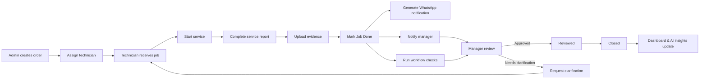
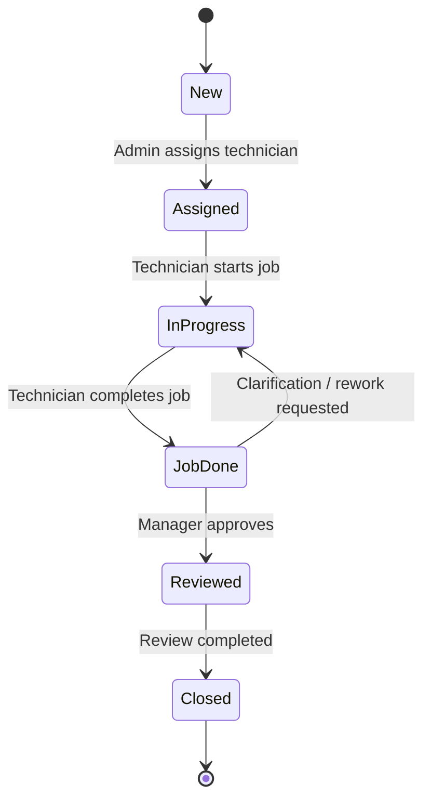
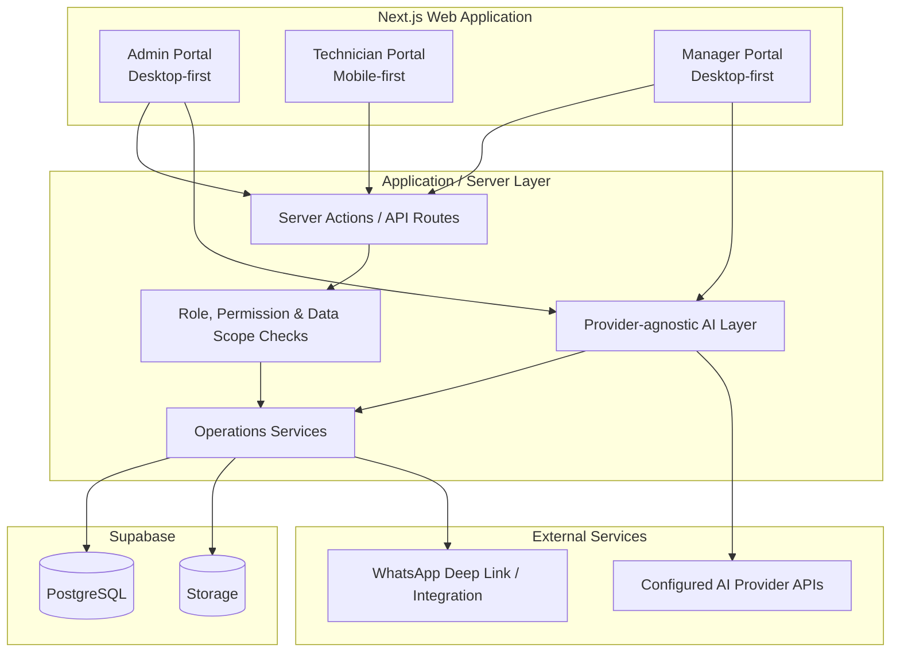
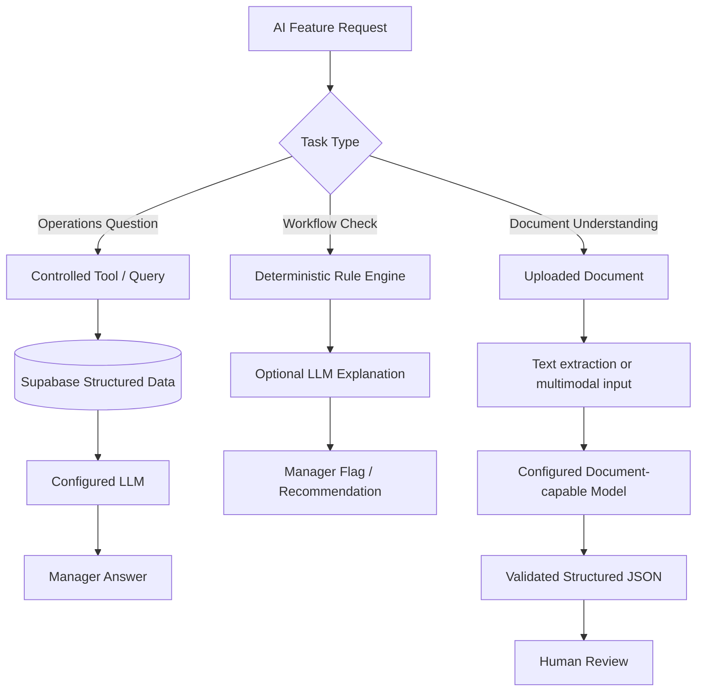
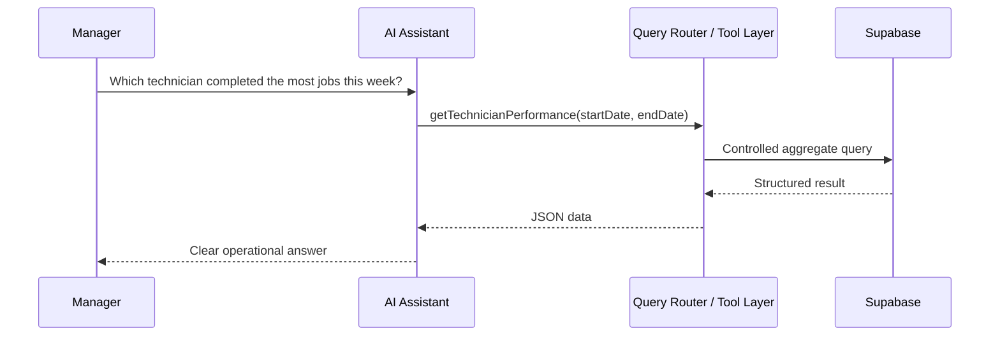
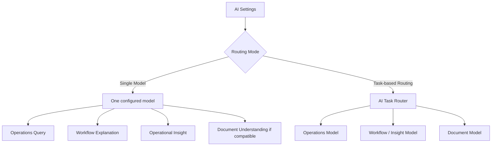
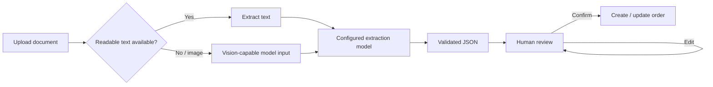
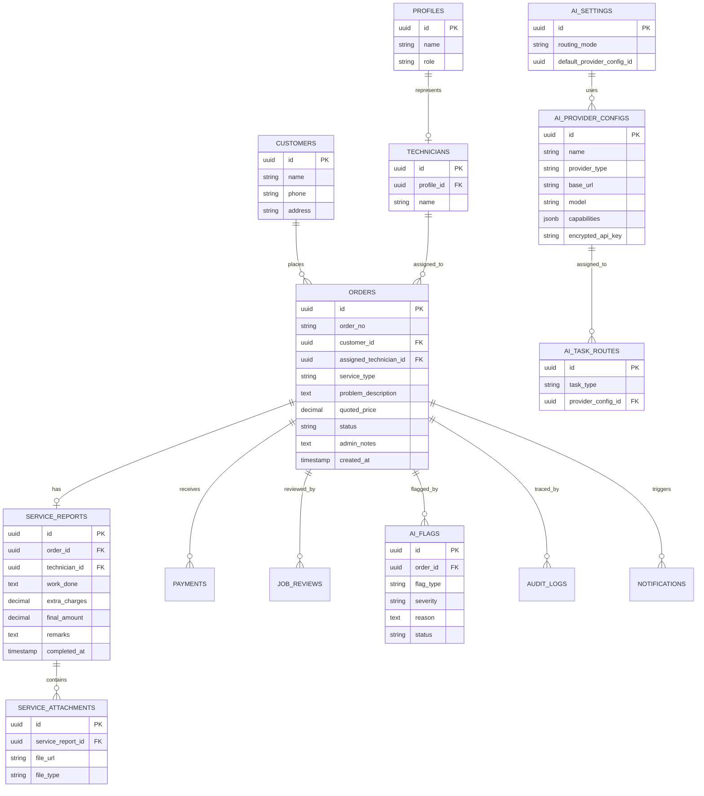

# SejukOps

AI-powered field service operations system for order management, technician workflows, KPI tracking, and operational insights.

> Programmer assessment implementation based on the fictional **Sejuk Sejuk Service Sdn Bhd** operations scenario.

## Product Goal

SejukOps digitises the end-to-end service workflow for a multi-branch air-conditioning service company:

**Order → Assignment → Service → Completion → Notification → Review → Close → Analytics**

The project is intentionally designed as one connected operations system rather than a collection of isolated assessment modules. All portals, dashboards, notifications, and AI features operate on the same underlying operational data.

## Scope

The target implementation covers all assessment modules:

- Admin Portal — order creation and technician assignment
- Technician Portal — mobile-first responsive Web App for field work
- WhatsApp notification trigger
- KPI Dashboard
- AI Operations Query Window
- AI Workflow Supervisor
- AI Document Understanding
- AI Operational Insight

Supporting features are also included in the design to close the workflow properly:

- Manager review and job closure
- Audit trail for key actions
- Mock role switcher
- Structured role/permission boundaries
- Service evidence storage
- Configurable AI providers and routing

## Deployment & Portal Model

SejukOps is **one Next.js application, one deployment, and one Supabase project**. Admin, Technician, and Manager are role-specific portal experiences inside the same Web App rather than three separately deployed websites.

```text
https://<deployment>/admin
https://<deployment>/technician
https://<deployment>/manager
```

```mermaid
flowchart TB
    U[Single SejukOps Deployment] --> R{Role / Route}
    R --> A[/admin\nDesktop-first Admin Portal]
    R --> T[/technician\nMobile-first Technician Portal]
    R --> M[/manager\nDesktop-first Manager Portal]

    A --> S[Shared Server Layer]
    T --> S
    M --> S
    S --> DB[(Shared Supabase Data)]
```

The portals share design tokens, types, validation, database access, server services, and authorization logic, while each role receives a UX appropriate to its work.

## End-to-End Workflow



## Order State Model



## System Architecture



Admin access to the AI layer is limited to configuration and document-processing features. The conversational Operations AI is a Manager feature.

## Portals

### Admin Portal

Desktop-first internal operations interface.

Core responsibilities:

- Create service orders
- Auto-generate order numbers
- Capture customer and service details
- Assign technicians
- View order summaries and statuses
- Import supported documents for structured extraction
- Configure AI providers and routing
- Trace important order actions

### Technician Portal

A **mobile-first responsive Web App**, not a separate native application.

The field workflow prioritises speed and simplicity:

1. View assigned jobs
2. Open job details
3. Start job
4. Record work completed
5. Add extra charges
6. Upload up to six evidence files
7. Review auto-calculated final amount
8. Complete job

The same Next.js application serves desktop and mobile experiences, with technician screens optimised for phone usage and touch interaction.

The Technician Portal does **not** include a general AI assistant because the assessment does not require one and the field workflow should remain focused.

### Manager Portal

Desktop-first review and operations interface.

Core responsibilities:

- Review completed jobs
- Inspect quoted vs final amounts
- View technician evidence and service reports
- Review workflow/AI flags
- Approve or request clarification
- View KPI dashboards
- Ask operational questions through the AI Operations Assistant
- View AI-generated operational insights

## Roles & Permissions

The assessment uses a fixed role set:

- **Admin**
- **Technician**
- **Manager**

A simple mock role switcher will be used for assessment/demo purposes. Dynamic role creation is deliberately out of scope.

The implementation still keeps role and permission concepts separate so the authorization model can evolve without redesigning the application.

| Capability | Admin | Technician | Manager |
|---|:---:|:---:|:---:|
| Create order | ✓ |  |  |
| Assign technician | ✓ |  |  |
| View assigned job |  | ✓ | ✓ |
| Start assigned job |  | ✓ |  |
| Complete assigned job |  | ✓ |  |
| Upload service evidence |  | ✓ |  |
| Review completed job |  |  | ✓ |
| Close job |  |  | ✓ |
| View KPI dashboard |  |  | ✓ |
| Use Operations AI Assistant |  |  | ✓ |
| View operational AI insights |  |  | ✓ |
| Configure AI providers / keys | ✓ |  |  |
| Import document for AI extraction | ✓ |  |  |

Authorization is not only about role names. Data scope matters as well: a technician should only operate on jobs assigned to that technician, while a manager may view broader operational data.

## AI Scope

SejukOps does **not** add a RAG/vector knowledge base for this assessment because the assessment AI questions are based on structured operational data.

Different AI tasks use different data paths:



There is no arbitrary SQL generation, unrestricted database access, or vector retrieval path in the assessment architecture.

## AI Operations Query Architecture

The AI assistant does **not** receive unrestricted database access.

Operational questions are handled through controlled backend tools/queries:



Planned backend tools include concepts such as:

- `getJobs(...)`
- `getOrderDetails(...)`
- `getTechnicianStats(...)`
- `getOperationalSummary(...)`
- `getWorkload(...)`

The model interprets and formats results; application code controls which operational data can be retrieved.

## AI Provider Configuration

SejukOps uses a **provider-agnostic AI layer**. DeepSeek V4 Flash and MiMo 2.5 are the intended reference configuration, not hard dependencies.

An Admin can add provider configurations with:

- Display name
- Provider / adapter type
- Base URL when applicable
- API key
- Model name
- Declared or detected capabilities such as text, vision, tool calling, and structured output

### Routing Modes

Users can choose between two modes.

**Single Model** — one configured model is used for every compatible AI feature. This is useful when a user already has one multimodal/model API and prefers the simplest setup.

**Task-based Routing** — different configured models can be assigned to different workloads. This is useful for cost optimisation, capability differences, or provider preference.



Example reference configuration:

```text
Operations Query       → DeepSeek V4 Flash
Workflow Explanation   → DeepSeek V4 Flash
Operational Insight    → DeepSeek V4 Flash
Document Understanding → MiMo 2.5
```

A reviewer may instead configure another compatible provider/model combination.

### Capability Validation

Routing is capability-aware. For example:

- Operations Query requires the capabilities used by the controlled query implementation.
- Image/scanned-document understanding requires a vision-capable model.
- Structured document extraction should use schema/structured-output support where available.

If a Single Model does not satisfy an enabled feature's requirements, the UI should explain the incompatibility and allow the Admin to switch to task-based routing or another model.

### API Key Handling

Provider keys are treated as server-side secrets:

- Keys are entered through Admin settings.
- Keys are stored encrypted server-side for the assessment configuration.
- The browser should not receive the plaintext key after it is saved.
- Provider requests are made from the server layer, not directly from client components.
- Keys must never be written to logs.
- Environment variables may be supported as a deployment-level fallback.

## AI Modules

### Operations Query Window

The conversational AI assistant belongs to the **Manager Portal**.

Managers can ask questions such as:

- What jobs did Ali complete last week?
- Which technician completed the most jobs this week?
- How many jobs were completed today?

### Workflow Supervisor

Workflow anomalies should use deterministic checks where possible, with AI used only where explanation or recommendations add value.

Examples:

- Final amount significantly exceeds quoted price
- Job marked done without required evidence
- Unusual extra charges

This avoids using an LLM for rules that normal application logic can enforce reliably.

### Document Understanding

Document Understanding is a workflow feature rather than a general chatbot.

Uploaded operational documents can be converted into structured fields such as:

- Customer name
- Service type
- Service details
- Amount
- Date

Text-native documents can use normal text extraction before semantic structured extraction. Images or scanned documents can be sent through a compatible multimodal/vision model. A separate OCR system is not required unless implementation needs justify it.

The extracted result is always shown for human review before it creates or updates operational records.



### Operational Insight

The system combines deterministic metrics with AI-generated interpretation, for example identifying workload imbalance or unusual service patterns.

AI insight is treated as decision support, not an automatic management decision.

## Data Model Overview



The detailed schema may evolve during implementation; this diagram captures the intended domain boundaries.

## Technology Direction

| Layer | Planned Choice |
|---|---|
| Frontend | Next.js + React + TypeScript |
| UI / Styling | Ant Design for Admin/Manager + Ant Design Mobile for Technician |
| Backend | Next.js server layer / API routes |
| Database | Supabase PostgreSQL |
| File Storage | Supabase Storage |
| AI | Provider-agnostic server-side adapters + configurable routing |
| Reference AI setup | DeepSeek V4 Flash for operations; MiMo 2.5 for multimodal documents |
| Deployment | Vercel |
| Authentication | Mock role switcher for assessment |

Ant Design is used for the desktop-oriented Admin and Manager portals because the product is form-, table-, review-, and dashboard-heavy. Ant Design Mobile is used for the field Technician Portal to provide mobile-oriented interaction patterns. Both portal styles must share SejukOps design tokens, status semantics, spacing principles, motion rules, and accessibility expectations so the application still reads as one coherent product.

A separate NestJS service or native mobile application is intentionally avoided for the assessment because the required workflow can remain coherent inside one Web application without adding unnecessary deployment or maintenance complexity.

## Implementation Phases

1. **Foundation** — Next.js, Supabase schema, seed data, mock role switcher, role routes
2. **Admin Workflow** — order creation and assignment
3. **Technician Workflow** — mobile-first job execution and evidence upload
4. **Completion Workflow** — WhatsApp trigger, audit trail, manager review
5. **KPI Dashboard** — weekly metrics, leaderboard, charts
6. **AI Configuration** — provider adapters, encrypted BYOK settings, routing modes, capability validation
7. **Core AI** — controlled operations query tools and operational insights
8. **Advanced AI** — workflow supervisor and document understanding
9. **Polish** — validation, responsive QA, error states, README, deployment

## Design Principles

- Build a connected business workflow, not isolated pages
- Keep all three portals inside one coherent Web application
- Keep the technician experience fast and mobile-first
- Prefer deterministic business rules over unnecessary AI decisions
- Restrict AI data access through explicit backend queries/tools
- Do not add RAG when structured operational queries solve the assessment requirement
- Keep AI providers replaceable and route tasks by capability rather than vendor name
- Keep provider credentials server-side and encrypted at rest
- Keep important actions traceable
- Separate authorization concepts from UI role switching
- Show AI limitations and require human review for consequential actions
- Optimise for a reviewer to understand and test the full workflow quickly

## Detailed Specification

See [`docs/SYSTEM_SPEC.md`](docs/SYSTEM_SPEC.md) for the implementation-level product and system specification.

## Status

Specification and architecture defined. Implementation follows the phases above.