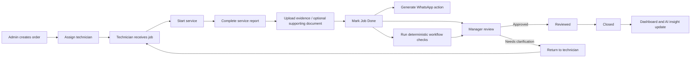

# SejukOps

AI-assisted field service operations system for order management, technician workflows, KPI tracking, manager review, notifications, and grounded operational AI.

> Programmer assessment implementation based on the fictional **Sejuk Sejuk Service Sdn Bhd** operations scenario.

## Reviewer Quick Start

**Live demo:** https://sejukops-assessment.vercel.app

SejukOps is one Next.js application with three role-oriented portals: Admin, Technician, and Manager. The assessment uses a mock role switcher as permitted by the brief; it is not production authentication.

### Final submission status

- Human end-to-end UAT: **PASS** for the integrated operational workflow.
- Production release: **READY** on Vercel.
- Production release commit: `ee4d0dde0a2539ecd9eea17a8bd9254cd0f1f851` on `main`.
- Production smoke: landing page returned HTTP 200; protected Admin access without a demo session redirected as expected.
- Final production runtime-error audit: no Vercel runtime errors were found in the checked release window.
- The final shared `PriceInput` refactor is presentation-only and passed the production build/type-validation path; it does not change workflow or persistence behavior.

Final release evidence is recorded in:

- [`docs/testing/FINAL_HUMAN_UAT.md`](docs/testing/FINAL_HUMAN_UAT.md)
- [`docs/testing/FINAL_RELEASE_VERIFICATION.md`](docs/testing/FINAL_RELEASE_VERIFICATION.md)

The detailed implementation checklist and verification log preserve historical phase-by-phase states. Earlier `NOT_RUN`, `PENDING_ENV`, or `HUMAN_UAT_PENDING` entries describe those phases at the time and are not the current release status.

### Routes and mock identities

| Portal | Route | Demo identity |
|---|---|---|
| Landing / role switcher | `/` | Select an identity |
| Admin | `/admin` | Admin Demo |
| Technician | `/technician` | Ali (BR-01), John (BR-02), Bala (BR-03), Yusoff (BR-04) |
| Manager | `/manager` | Manager Demo |
| Admin AI settings | `/admin/ai-settings` | Admin Demo |
| Admin document import | `/admin/document-import` | Admin Demo |
| Manager dashboard | `/manager/dashboard` | Manager Demo |
| Manager Operations AI | `/manager/ai-operations` | Manager Demo |
| AI observability | `/diagnostics/ai-observability` | Admin / Manager demo roles |

Selecting an identity establishes the mock demo session and enforces the matching portal. Direct access with the wrong role is rejected or redirected by the application boundary.

### AI configuration security

Provider credentials are encrypted server-side and are never read from deployment environment fallbacks. The Admin Demo can review configuration only; use the separately configured `AI_CONFIG_ADMIN_PASSWORD` to unlock changes for 15 minutes. `AI_CONFIG_SESSION_SECRET` signs the HttpOnly unlock cookie. Provider, routing, and connection-test mutations remain server-gated, and changing a provider Base URL requires entering a replacement API key.

---

## What I Built

SejukOps implements the assessment as one connected operational workflow rather than isolated demo pages.

### Core assessment scope

- **Admin Portal** — create service orders, auto-generate order numbers, assign technicians, reschedule work, and inspect traceable order history.
- **Technician Portal** — mobile-first assigned-job workflow, start job, request reschedule, record work/charges, upload evidence, optionally record payment, attach an independent supporting document, and complete the service.
- **WhatsApp Notification Trigger** — generate the customer feedback deep link when a job reaches Job Done and track the application-side READY / OPENED state without claiming external delivery/read status.
- **KPI Dashboard** — Today / This Week / This Month operational metrics, trends, service mix, and technician leaderboard.
- **AI Operations Query Window** — grounded operational questions through allow-listed backend tools rather than arbitrary SQL.

### Optional / advanced AI scope

- **Workflow Supervisor** — deterministic anomaly flags with optional AI explanation.
- **Document Understanding** — upload a document, extract a schema-validated draft, show confidence, and require Admin review before creating an order.
- **Operational Insight** — interpret deterministic KPI facts with numeric/citation validation.
- **AI Observability** — inspect execution path, provider/model, latency, token usage, selected tool, and safe request/response metadata.

### Supporting workflow features

- Manager completion review, clarification/rework, review, and close flow
- Audit trail for consequential actions
- Private Supabase Storage for service evidence and supporting documents
- Deterministic seed/golden data
- Role/data-scope enforcement behind the mock session
- Provider-agnostic AI configuration with encrypted BYOK and task-based routing
- URL-backed Admin/Manager pagination and filters
- Server-side pagination plus Technician infinite scroll
- Remote searchable Branch/Technician Select filters with 300 ms debounce
- Shared operational `PriceInput` for editable monetary fields

---

## End-to-End Workflow



Lifecycle:

**New → Assigned → In Progress → Job Done → Reviewed → Closed**

Clarification/rework can return **Job Done → In Progress**.

Important rule ownership:

- Only Admin assigns technicians.
- Only the assigned Technician can complete the job.
- Managers review completed work.
- Important mutations create traceable audit evidence.
- Business-state transitions are deterministic application/database behavior, not LLM decisions.

---

## Technology Stack

| Layer | Current choice |
|---|---|
| Frontend | Next.js + React + TypeScript |
| Desktop UI | Ant Design |
| Technician UI | Ant Design Mobile |
| Backend | Next.js server layer / API routes |
| Database | Supabase PostgreSQL |
| File storage | Supabase Storage |
| AI | Provider-agnostic server-side adapters + configurable routing |
| Reference AI setup | DeepSeek V4 Flash / compatible text model; MiMo 2.5 / compatible multimodal model |
| Deployment | Vercel |
| Authentication | Mock role switcher for assessment |

The assessment brief suggested React, Supabase, Supabase Storage, Vercel, and a simple mock login/role switch. This implementation keeps those choices within one deployable application.

---

## Architecture Decisions

SejukOps is **one Next.js application, one deployment, and one Supabase project**. Admin, Technician, and Manager are role-specific experiences inside the same application.

Key decisions:

- Keep one deployable application instead of adding another service without a demonstrated need.
- Use Ant Design for Admin/Manager and Ant Design Mobile for the field-oriented Technician experience.
- Use database/application rules for lifecycle validation and authorization.
- Keep consequential actions human-owned.
- Keep AI provider adapters replaceable and route tasks by capability rather than hard-coding one vendor.
- Keep credentials server-side and encrypted at rest when persisted.
- Use controlled structured-data tools for Operations AI instead of unrestricted database access.
- Deliberately omit RAG/vector infrastructure because the current runtime problem is structured operational data, not document-knowledge retrieval.

### Technician field semantics

The assessment lists Technician Name and Timestamp as service-completion fields. In SejukOps these are intentionally not editable inputs:

- **Technician identity** comes from the validated demo session / assigned technician context.
- **Completion timestamp** is generated by the server/database when the completion is accepted.

This prevents a field user from manually changing authoritative identity or completion time.

### Payment vs supporting document

Payment capture is optional. `Payment Amount` and `Payment Method` form one optional structured payment record and must be supplied together when payment is recorded.

`Receipt / supporting document` is independent from payment. It can be attached for Manager review without claiming that payment was received. The system does not OCR or machine-verify the supporting document against the payment fields.

---

## How AI Is Integrated

### Operations AI

Operations AI uses an LLM as a bounded planner:

```text
Manager question
→ LLM selects one approved tool + validated arguments
→ application executes controlled Supabase query/RPC
→ deterministic structured result/facts
→ grounded response and presentation
```

Approved tools:

| Query type | Approved tool | Example |
|---|---|---|
| Job lookup | `getJobs` | What jobs did Ali complete last week? |
| Technician performance | `getTechnicianStats` | Compare Ali and Bala this week. |
| Operational summary | `getOperationalSummary` | How many jobs were completed today? |
| Workload | `getWorkload` | Who has the highest active workload this week? |

There is **no arbitrary SQL generation** and no unrestricted database access.

### Bounded multi-value filters

The final Operations AI tool contract supports bounded multi-value filters where appropriate:

- `getJobs`: multiple order numbers, technician names, statuses, and service types
- `getTechnicianStats`: multiple technician names
- `getWorkload`: multiple technician names

Rules:

- maximum 10 values per multi-value filter
- maximum 25 returned rows
- values within one filter group use **OR** semantics
- different filter groups use **AND** semantics
- the planner still selects at most **one approved tool call per user request**

Example:

```text
Tell me ORD-2026-0038 and ORD-2026-0037
```

is handled by one `getJobs` call with both order numbers rather than two independent tool executions.

If no approved tool can answer a request, the planner returns a controlled `UNSUPPORTED` or `CLARIFICATION` outcome. An invented tool is never executed.

### Workflow Supervisor

Workflow anomalies are detected deterministically when possible. Examples include high amount variance, missing evidence, and unusual extra charges. AI may explain the flag, but the rule remains authoritative and Manager review remains human-owned.

### Document Understanding

Text-native documents can use extracted text; image/scanned inputs require a compatible vision-capable provider. The model output is schema-validated and shown as an editable draft. No operational order is created until Admin explicitly confirms the reviewed values.

### Operational Insight

The dashboard supplies deterministic KPI facts to the model. Numeric claims are validated against the supplied facts and the result is decision support, not an autonomous management action.

### AI Observability

The diagnostics surface records assessment-facing runtime evidence such as:

- task / trace ID
- selected provider and model
- approved tool / execution path
- latency
- token usage when provided
- request/response metadata only (never raw prompt or provider response text)

Credentials, authorization headers, raw secrets, base64 document payloads, and extracted document field values are excluded from persistent diagnostics.

---

## Why There Is No RAG / Vector DB

The current AI use cases operate mainly on structured operational records: jobs, technicians, lifecycle status, amounts, workload, and KPI aggregates.

Adding ingestion, chunking, embeddings, vector storage, retrieval, and RAG evaluation would add complexity without solving the current runtime problem. Controlled queries are more direct and easier to constrain and verify.

A future company knowledge base would justify RAG when SejukOps contains policies, SOPs, training material, safety documents, or equipment/service manuals.

---

## Self-Assessment

### Easiest module — Admin Order Submission

The Admin order workflow was the most straightforward because its requirements are deterministic: validate structured input, create/reuse the customer, create the order, optionally assign a technician, and persist the result.

### Hardest module — AI Operations Query Window

The difficult part was not generating prose. It was making the LLM bounded, grounded, inspectable, and unable to invent executable capabilities. That led to the allow-listed tool boundary, schema validation, deterministic presentation, controlled unsupported outcomes, and runtime observability.

No module was especially difficult in isolation; the broader engineering challenge was maintaining consistency across workflow rules, data contracts, permissions, AI boundaries, observability, and UI behavior as the system grew.

---

## How I Used AI While Building the Project

I used ChatGPT and task-specific coding agents as an **AI-assisted engineering workflow with human-controlled architecture and validation**, not as a one-shot code generator.

The development approach was:

**Scope/architecture discussion → phase/checklist plan → task-specific implementation agents → diff review → build/typecheck/tests → Preview/runtime inspection → independent review where useful → human review → merge**

Separate agent roles were used for frontend/UIUX, backend/data, QA, E2E, and orchestration/architecture review. Task-aware model selection was used when different available models were better suited to implementation versus reasoning/review work.

The repository also contains an [`openwiki/`](openwiki/) engineering knowledge layer inspired by the OpenWiki / LLM-Wiki idea. It consolidates system behavior, architecture decisions, progress, workflows, and boundaries for development continuity. It is documentation for agents/developers, **not** a runtime RAG dependency.

---

## Production Extensions I Would Prioritise

1. **Accounts & Payment Workflow** — invoices, balances, reconciliation, refunds/adjustments, and a real Accounts review role/workflow.
2. **Multi-branch Operations** — branch dashboards, regional reporting, branch capacity, and controlled transfer/cross-branch assignment.
3. **Inventory & Spare Parts** — van/warehouse inventory, job-level parts usage, reservation, low-stock alerts, and material cost.
4. **Company Knowledge Base & Technician AI Assistant** — document ingestion, chunking, embeddings, hybrid/vector retrieval, and citation-grounded RAG for SOPs, safety procedures, training materials, manuals, troubleshooting, and equipment error codes.

Structured operational questions would continue using controlled database tools; document/company knowledge would use retrieval. The two paths should remain separate.

---

## Known Limitations

- Mock role switching is not production authentication/RBAC.
- WhatsApp proves deep-link generation/opening inside the application, not delivered/read status from WhatsApp.
- Operations AI intentionally supports only allow-listed tools; arbitrary SQL and unrestricted database access are unsupported.
- The current runtime has no RAG/vector knowledge base.
- Document Understanding is human-in-the-loop and depends on a compatible external provider for provider-backed extraction.
- Workflow Supervisor explanations and Operational Insight are decision support; they do not own business-state transitions.
- Supporting documents are human-reviewed and are not OCR/payment-verified.
- The existing Supabase project contains historical SQL-Editor-applied migrations whose migration ledger is not fully reconstructed; this is deployment-maintenance debt for future CLI `db push`, not a blocker for the current verified schema/demo.
- A development OpenRouter credential was previously exposed to local browser-automation output; it must not be reused for non-development purposes unless rotated.

See [`docs/KNOWN_LIMITATIONS.md`](docs/KNOWN_LIMITATIONS.md) for details.

---

## Local Setup

Requirements: Node.js `>=20.9.0`, `pnpm` 10, and a Supabase project when exercising live database/storage paths.

```powershell
pnpm install
Copy-Item .env.example .env.local
pnpm dev
```

Configure the values documented in [`.env.example`](.env.example). Persisted BYOK provider settings require `AI_CONFIG_ENCRYPTION_KEY`; Demo Admin editing additionally requires `AI_CONFIG_ADMIN_PASSWORD` and `AI_CONFIG_SESSION_SECRET`.

For a clean disposable assessment database, apply SQL files in [`supabase/migrations/`](supabase/migrations/) in filename order, then load [`supabase/seed.sql`](supabase/seed.sql).

Verification commands:

```powershell
pnpm lint
pnpm typecheck
pnpm test
pnpm build
node scripts/verify-foundation-data.mjs
```

---

## Repository Documentation

- [`docs/SYSTEM_SPEC.md`](docs/SYSTEM_SPEC.md) — implementation-level system specification
- [`docs/IMPLEMENTATION_CHECKLIST.md`](docs/IMPLEMENTATION_CHECKLIST.md) — historical phase/task acceptance state
- [`docs/KNOWN_LIMITATIONS.md`](docs/KNOWN_LIMITATIONS.md) — current caveats and non-goals
- [`docs/ASSESSMENT_SELF_EVALUATION.md`](docs/ASSESSMENT_SELF_EVALUATION.md) — final assessment-oriented self evaluation
- [`docs/testing/TEST_MATRIX.md`](docs/testing/TEST_MATRIX.md) — automated, E2E, release, and Human UAT scenarios
- [`docs/testing/VERIFICATION_LOG.md`](docs/testing/VERIFICATION_LOG.md) — historical verification evidence
- [`docs/testing/FINAL_HUMAN_UAT.md`](docs/testing/FINAL_HUMAN_UAT.md) — final human-reported workflow result
- [`docs/testing/FINAL_RELEASE_VERIFICATION.md`](docs/testing/FINAL_RELEASE_VERIFICATION.md) — final production release evidence
- [`openwiki/`](openwiki/) — repository-native engineering knowledge/navigation

## Assessment README Coverage

| Assessment request | Where it is covered |
|---|---|
| What you built | **What I Built** |
| Tech stack used | **Technology Stack** |
| Architecture decisions | **Architecture Decisions** |
| Challenges / assumptions | **Architecture Decisions**, **Self-Assessment**, **Known Limitations** |
| How AI was integrated | **How AI Is Integrated** |
| Implementation limitations | **Known Limitations** |
| Supported AI query types | **Operations AI**, **Bounded multi-value filters** |
| AI limitations | **How AI Is Integrated**, **Known Limitations** |
| Which module was easiest? | **Self-Assessment** |
| Which module was hardest? | **Self-Assessment** |
| What would improve in production? | **Production Extensions I Would Prioritise** |
| How AI tools were used while building | **How I Used AI While Building the Project** |
