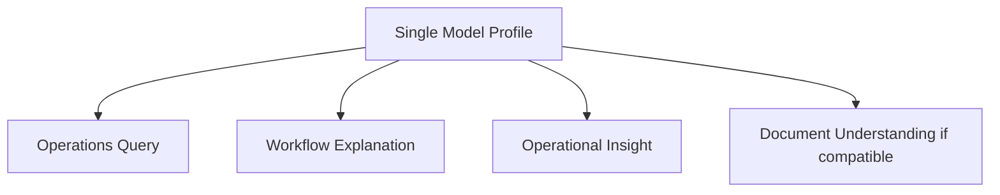
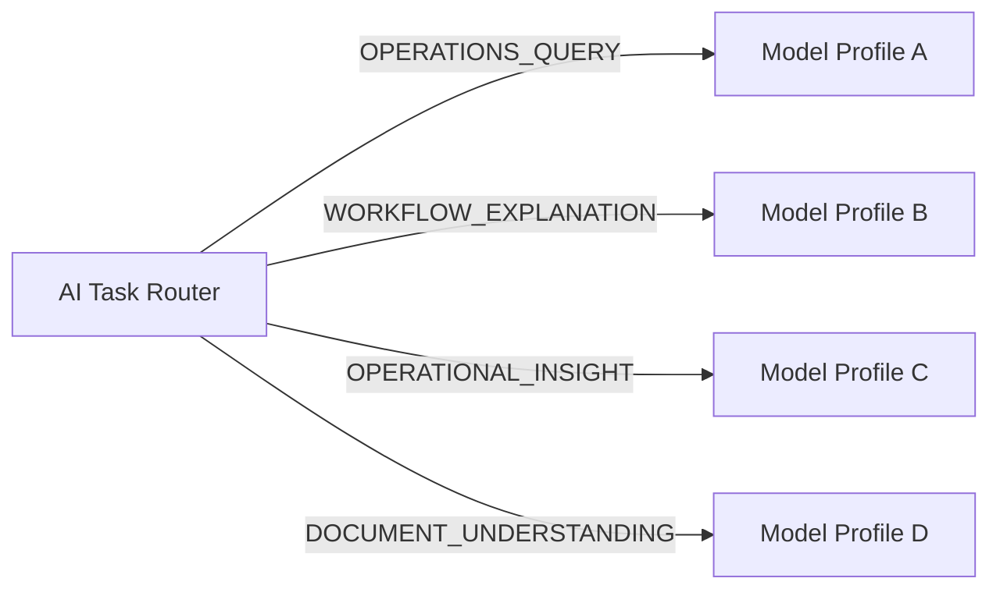
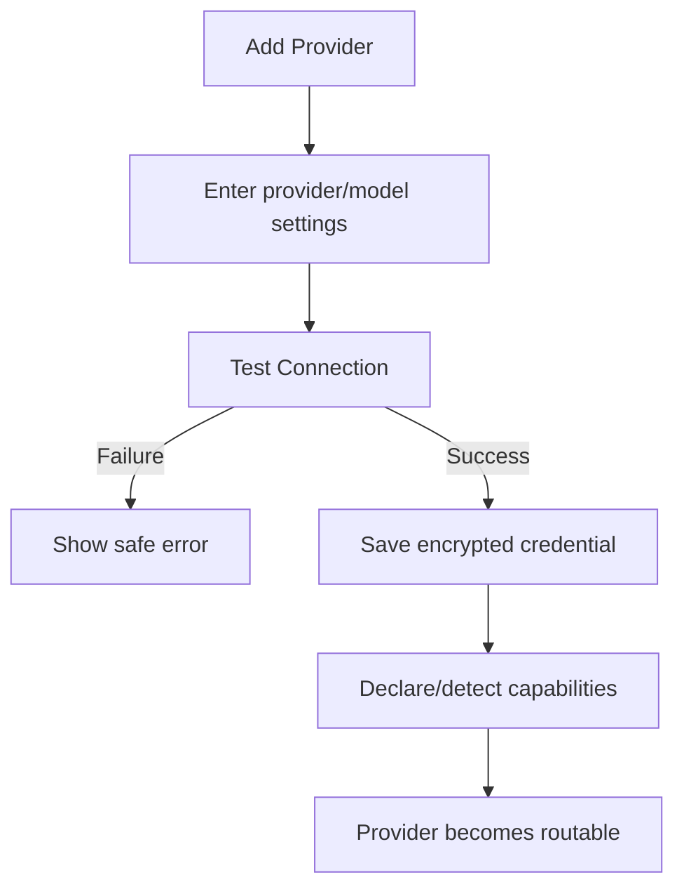
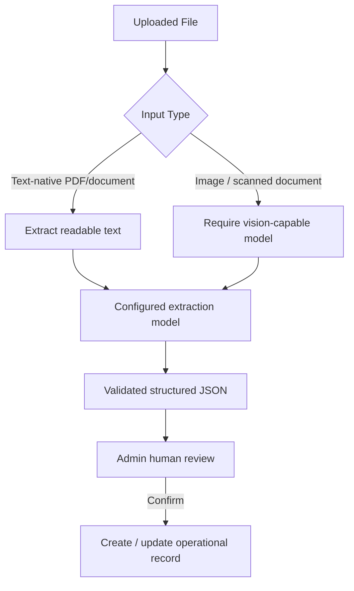
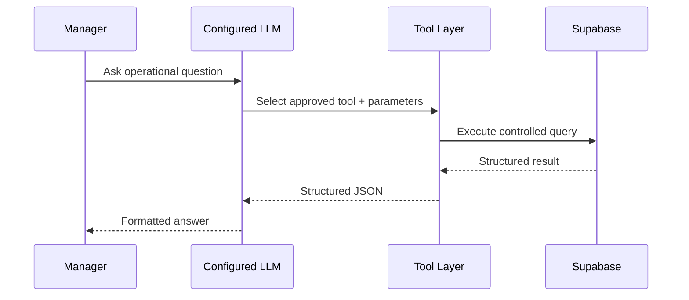

# SejukOps AI Configuration

This document defines the assessment-level AI provider configuration, routing, security, and capability rules.

## 1. Goals

SejukOps should let an Admin configure AI without hard-coding the product to a single vendor or model.

The configuration supports two common preferences:

1. **Single Model** — use one API key/model for all compatible AI features.
2. **Task-based Routing** — use different models for different workloads to optimise cost, capability, or provider preference.

The intended reference setup is:

```text
Operations Query       → DeepSeek V4 Flash
Workflow Explanation   → DeepSeek V4 Flash
Operational Insight    → DeepSeek V4 Flash
Document Understanding → MiMo 2.5
```

This is only the reference configuration. SejukOps must not assume those model names in core domain logic.

---

## 2. AI Tasks

The initial task identifiers are:

```text
OPERATIONS_QUERY
WORKFLOW_EXPLANATION
OPERATIONAL_INSIGHT
DOCUMENT_UNDERSTANDING
```

### Operations Query

Used by the Manager AI Assistant to interpret supported operational questions and call approved backend tools.

### Workflow Explanation

Used optionally after deterministic workflow rules create a flag. The model explains the issue and suggests a review action.

### Operational Insight

Used to explain deterministic KPI/aggregation results such as workload imbalance.

### Document Understanding

Used to transform uploaded document content into a validated structured schema.

---

## 3. Routing Modes

### 3.1 Single Model

One configured provider/model profile becomes the default for every compatible task.



The system must validate that the selected model supports the capabilities required by enabled tasks.

If an image/scanned document is uploaded and the selected model is not vision-capable, Document Understanding must not silently fail or pretend to process it. The UI should show a capability mismatch and offer a compatible provider/model or Task-based Routing.

### 3.2 Task-based Routing

Each task can be assigned to a different configured model profile.



Multiple tasks may still point to the same profile.

---

## 4. Provider Configuration

Suggested Admin UI fields:

```text
Name
Provider / Adapter Type
Base URL (optional)
API Key
Model
Capabilities
- Text
- Vision
- Tool Calling
- Structured Output
```

Example:

```text
Name: DeepSeek Operations
Provider Type: OpenAI-compatible
Base URL: <provider endpoint>
Model: deepseek-v4-flash
Capabilities: Text, Tool Calling, Structured Output
```

```text
Name: MiMo Documents
Provider Type: OpenAI-compatible / dedicated adapter
Base URL: <provider endpoint>
Model: mimo-v2.5
Capabilities: Text, Vision, Structured Output
```

The exact adapter type depends on the API contract implemented in code.

---

## 5. Add Provider Behaviour

The UI should support adding more than the two reference providers.

Suggested flow:



A custom/OpenAI-compatible option is useful where the model provider follows the supported adapter contract.

The assessment should not become a full general-purpose LLM gateway. Only the fields and adapters needed for the documented AI tasks are required.

---

## 6. Capability Model

Suggested capability type:

```ts
type AIModelCapabilities = {
  text: boolean;
  vision: boolean;
  toolCalling: boolean;
  structuredOutput: boolean;
};
```

Suggested task requirements:

| Task | Required / Preferred Capability |
|---|---|
| Operations Query | Text + supported tool/structured interaction |
| Workflow Explanation | Text |
| Operational Insight | Text |
| Document Understanding (text-native document) | Text + structured extraction preferred |
| Document Understanding (image/scanned document) | Vision + structured extraction preferred |

Capability checks happen before execution whenever possible.

---

## 7. Document Input Routing

Document Understanding does not require a standalone OCR system for the assessment.



A dedicated OCR service may be introduced later if real production documents demonstrate a need for it.

---

## 8. Operations AI Data Access

The Operations Assistant does not use RAG for the assessment.

It queries structured operational data through approved tools:



The model cannot:

- Execute arbitrary SQL
- Browse tables directly
- Access all database data without a tool contract
- Invent missing numeric results

RAG, embeddings, and vector search are explicit non-goals unless future requirements introduce a true unstructured knowledge base.

---

## 9. Secret Handling

### 9.1 Browser rule

Provider API calls must originate from the server layer. Client components must not call model providers directly with persisted secrets.

### 9.2 Storage

If a key is saved from the Admin UI:

1. The browser sends it to an authenticated/authorised server endpoint.
2. The server encrypts it using an application secret such as `AI_CONFIG_ENCRYPTION_KEY`.
3. Only ciphertext and safe metadata are stored in the database.
4. The plaintext key is not returned to the browser after save.
5. A masked display may show only safe information such as `••••1234`.

Suggested record fields:

```text
id
name
provider_type
base_url
model
capabilities JSONB
encrypted_api_key
key_last4
status
created_at
updated_at
```

### 9.3 Logs

Never log:

- Full API key
- Authorization header
- Decrypted provider configuration

Error messages returned to the UI should be sanitised.

### 9.4 Environment fallback

Deployment-level environment variables can be supported as a fallback/default configuration.

The exact precedence should be explicit. Recommended behaviour:

```text
Saved Admin configuration
        ↓ if unavailable
Deployment environment configuration
        ↓ if unavailable
AI feature reported as Not Configured
```

---

## 10. Permissions

```text
Admin
- Add/edit/remove provider configurations
- Test provider connection
- Select routing mode
- Assign task routes
- Use document import workflow

Manager
- Use Operations AI Assistant
- View operational insights
- Review workflow flags
- Cannot view or modify plaintext provider credentials

Technician
- No AI configuration
- No general AI assistant
```

---

## 11. Suggested Data Model

### `ai_settings`

```text
id UUID PK
routing_mode TEXT                  # SINGLE_MODEL | TASK_BASED
default_provider_config_id UUID NULLABLE
updated_by UUID
updated_at TIMESTAMP
```

### `ai_provider_configs`

```text
id UUID PK
name TEXT
provider_type TEXT
base_url TEXT NULLABLE
model TEXT
capabilities JSONB
encrypted_api_key TEXT NULLABLE
key_last4 TEXT NULLABLE
status TEXT
created_at TIMESTAMP
updated_at TIMESTAMP
```

### `ai_task_routes`

```text
id UUID PK
task_type TEXT
provider_config_id UUID FK
updated_at TIMESTAMP
```

Recommended uniqueness:

```text
UNIQUE(task_type)
```

for the single-organisation assessment implementation.

---

## 12. Suggested Server Interfaces

```ts
type AITaskType =
  | "OPERATIONS_QUERY"
  | "WORKFLOW_EXPLANATION"
  | "OPERATIONAL_INSIGHT"
  | "DOCUMENT_UNDERSTANDING";

interface AIProviderProfile {
  id: string;
  name: string;
  providerType: string;
  baseUrl?: string;
  model: string;
  capabilities: AIModelCapabilities;
}

interface AIProviderRegistry {
  resolveForTask(task: AITaskType): Promise<AIProviderProfile>;
  validateForTask(
    profile: AIProviderProfile,
    task: AITaskType,
    input?: unknown
  ): Promise<void>;
}
```

Provider-specific clients stay behind the registry/adapter boundary.

---

## 13. Settings UX

Suggested layout:

```text
AI Settings

Routing Mode
(•) Single Model
( ) Task-based Routing

Configured Providers
------------------------------------------------
DeepSeek Operations        Connected
Model: deepseek-v4-flash
Capabilities: Text / Tools / Structured
[Edit] [Test]

MiMo Documents             Connected
Model: mimo-v2.5
Capabilities: Text / Vision / Structured
[Edit] [Test]

[+ Add Provider]
```

Task-based view:

```text
Task Routing
------------------------------------------------
Operations Query        [DeepSeek Operations ▼]
Workflow Explanation    [DeepSeek Operations ▼]
Operational Insight     [DeepSeek Operations ▼]
Document Understanding  [MiMo Documents ▼]
```

Single-model view:

```text
Default AI Model
[Selected Provider / Model ▼]

Compatibility
✓ Operations Query
✓ Workflow Explanation
✓ Operational Insight
✓ Document Understanding
```

or, when incompatible:

```text
Compatibility
✓ Operations Query
✓ Workflow Explanation
✓ Operational Insight
✕ Image Document Understanding — Vision required

Use a vision-capable model or switch to Task-based Routing.
```

---

## 14. Assessment Boundaries

In scope:

- Multiple configurable AI providers/models
- BYOK through Admin settings
- Single Model mode
- Task-based Routing mode
- Capability validation
- Server-side provider calls
- Encrypted persisted keys
- Reference DeepSeek + MiMo setup

Out of scope unless implementation time remains:

- Full multi-tenant provider billing
- User-level API keys
- Provider usage invoicing
- Automatic cheapest-model marketplace routing
- RAG/vector knowledge base
- Fine-tuning management
- Full observability platform for LLM traces
- General-purpose LLM gateway compatibility with every provider
