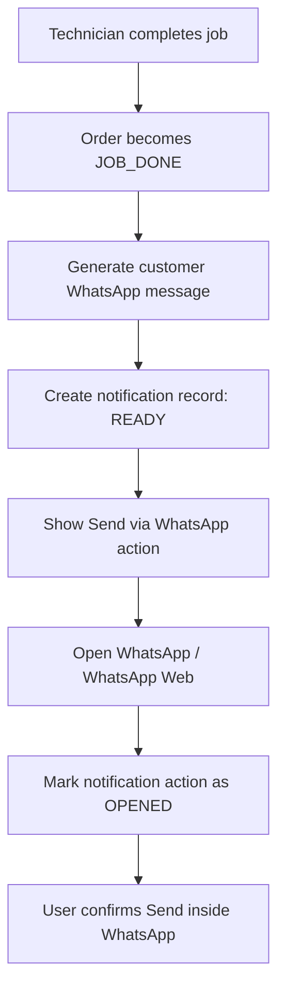
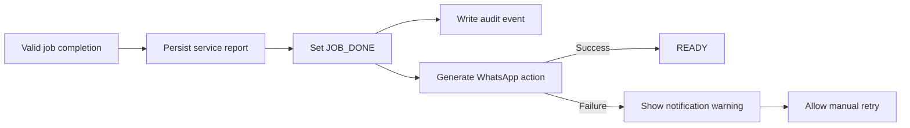
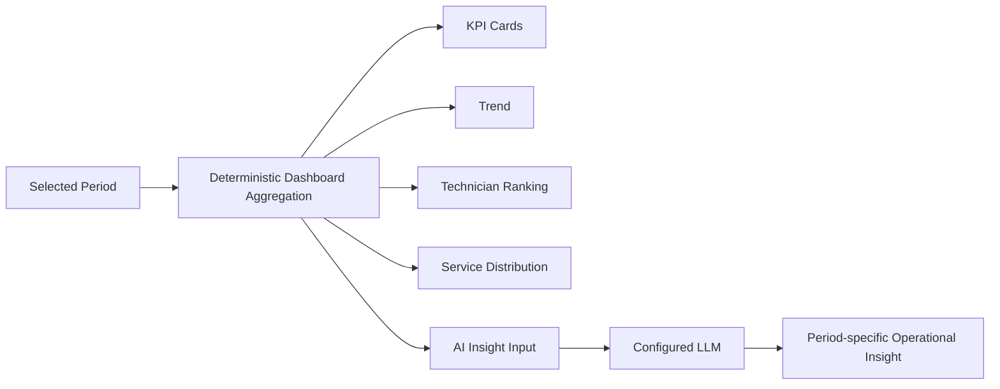
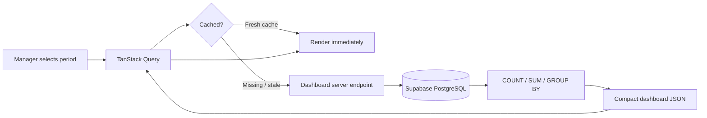
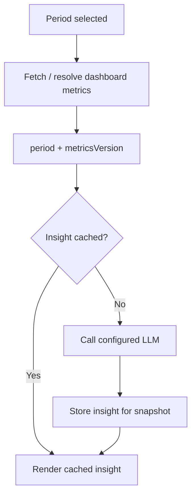

# SejukOps Dashboard & Notification Specification

This document extends `docs/SYSTEM_SPEC.md` with the implementation decisions for the KPI Dashboard and WhatsApp customer notification flow.

The goal is to keep both features practical for the assessment while making the architecture realistic enough to scale beyond demo data.

---

## 1. WhatsApp Customer Notification

### 1.1 Assessment decision

The assessment implementation uses a **WhatsApp deep link with a pre-filled message** rather than a full WhatsApp Business / Cloud API integration.

SejukOps prepares the customer message and opens WhatsApp or WhatsApp Web. The user still confirms and sends the message inside WhatsApp.



The application must not claim to have sent or delivered the message when it only opened a deep link.

### 1.2 Customer message template

Example:

```text
Hi {customerName},

Job {orderNo} has been completed by Technician {technicianName} at {completedAt}.
Please check the service and leave feedback.

Thank you!
```

The generated text must be URL encoded before it is inserted into the WhatsApp deep link.

### 1.3 Primary UX location

After a technician successfully completes a job, the success screen should expose the customer notification action immediately.

```text
Job Completed ✓

✓ Service report saved
✓ Manager review queue updated
✓ Customer WhatsApp message prepared

[ Send Customer WhatsApp ]
[ Back to My Jobs ]
```

The order detail view for Admin / Manager may also expose **Open WhatsApp Again** so office staff can resend or follow up manually if needed.

### 1.4 Notification state model

For the deep-link assessment implementation, use only states that SejukOps can truthfully observe:

```text
READY
OPENED
```

Do **not** use the following states unless a future WhatsApp Business integration actually provides them:

```text
SENT
DELIVERED
READ
```

Reason: opening a deep link does not prove that the user pressed Send, that WhatsApp accepted the message, that the customer received it, or that it was read.

Suggested notification fields:

```text
id
order_id
channel = WHATSAPP
recipient
message
status = READY | OPENED
generated_at
opened_at NULLABLE
```

### 1.5 Completion behavior

WhatsApp notification generation is a secondary side effect of job completion.

A notification failure must **not** roll back a valid completed job.



The completed job remains available to the Manager review queue even if WhatsApp preparation fails.

### 1.6 Manager / Accounts notification

Manager notification should be **in-app**, not another WhatsApp message.

```text
JOB_DONE
├── Customer → WhatsApp deep-link
├── Manager → In-app review queue / notification
└── Dashboard → KPI data becomes eligible for aggregation
```

This keeps the assessment focused and avoids unnecessary messaging infrastructure.

### 1.7 Production upgrade path

Keep notification delivery behind an adapter boundary so the assessment implementation can later be replaced by a real WhatsApp Business provider without changing the business workflow.

```text
NotificationService
├── DeepLinkWhatsAppAdapter       ← assessment
└── WhatsAppBusinessAdapter       ← future production option
```

Application/domain code should request a customer-completion notification without depending on the concrete delivery mechanism.

---

## 2. KPI Dashboard Scope

### 2.1 Portal placement

The KPI Dashboard belongs to the **Manager Portal**.

Recommended route:

```text
/manager/dashboard
```

### 2.2 Time period selector

Use only three fixed periods:

```text
Today | This Week | This Month
```

`This Week` is the default period.

A Custom Range selector is intentionally out of scope for the assessment.

### 2.3 Core KPI cards

The card layout remains consistent across periods:

- Jobs Completed
- Total Amount
- Rescheduled
- Average Job Value

`Average Job Value` is derived deterministically:

```text
average_job_value = total_completed_amount / completed_jobs
```

If there are no completed jobs in the period, return an explicit zero / empty state rather than divide by zero.

### 2.4 Previous-period comparison

Each fixed period may compare against its natural previous period:

| Current filter | Comparison |
|---|---|
| Today | Yesterday |
| This Week | Last Week |
| This Month | Last Month |

This provides useful context without introducing a custom comparison UI.

---

## 3. Period-Aware Chart Granularity

Changing the period must affect more than the KPI numbers. Time-series aggregation should change to match the selected range.

### 3.1 Completion trend

```text
Today      → hourly / time-of-day buckets
This Week  → daily buckets
This Month → weekly buckets
```

Example:

```text
Today
09:00  10:00  11:00  12:00 ...
  1      2      0      3

This Week
Mon  Tue  Wed  Thu  Fri  Sat  Sun
 4    7    5    8    9    6    3

This Month
Week 1  Week 2  Week 3  Week 4  Week 5
  36      41      39      44       7
```

Do not force thirty individual daily bars into the monthly chart when weekly buckets communicate the trend more clearly.

### 3.2 Technician performance

Technician ranking is recalculated for the current period.

Possible values:

```text
technician
jobs_completed
total_amount
average_job_value
reschedule_count
```

The Top Technician / leaderboard is therefore contextual to Today, This Week, or This Month rather than a fixed global ranking.

### 3.3 Service type distribution

Service type distribution is also recalculated for the active period.

Example categories:

```text
Cleaning
Repair
Gas Refill
Installation
```

The chart type can remain stable while its dataset changes with the selected period.

### 3.4 AI Operational Insight

The AI insight must inherit the **same active dashboard period**.



The dashboard calculations remain the source of truth. The LLM interprets already-computed metrics and must not calculate authoritative KPI values from raw records.

---

## 4. Dashboard Data Fetching Architecture

### 4.1 Core rule

The browser must **not** fetch all orders or service reports and calculate dashboard metrics client-side.

Avoid:

```text
Browser
  ↓
Fetch thousands of raw orders / service reports
  ↓
Filter + aggregate in JavaScript
  ↓
Render dashboard
```

Use server/database aggregation instead:



### 4.2 Server-side aggregation

Supabase/PostgreSQL should perform deterministic operations such as:

```text
COUNT completed jobs
SUM final amount
COUNT reschedules
GROUP BY technician
GROUP BY service type
GROUP BY period bucket
```

Only the compact aggregated result is returned to the browser.

Suggested response shape:

```json
{
  "period": "this_week",
  "summary": {
    "completedJobs": 42,
    "totalAmount": 8420,
    "rescheduled": 6,
    "averageJobValue": 200.48
  },
  "comparison": {
    "completedJobsPercent": 12,
    "totalAmountPercent": 8
  },
  "trend": [
    { "label": "Mon", "jobs": 4 },
    { "label": "Tue", "jobs": 7 }
  ],
  "technicians": [
    { "name": "Ali", "jobs": 12, "amount": 2450, "rescheduled": 1 },
    { "name": "Bala", "jobs": 11, "amount": 2180, "rescheduled": 0 }
  ],
  "serviceTypes": [
    { "type": "Cleaning", "count": 18 },
    { "type": "Repair", "count": 13 }
  ],
  "metricsVersion": "..."
}
```

The exact response contract may evolve, but the client should receive dashboard-oriented data rather than the underlying record set.

---

## 5. Client Cache Strategy

### 5.1 Period-based query keys

Cache each fixed period independently.

Conceptual TanStack Query key:

```ts
['manager-dashboard', period]
```

This means:

```text
manager-dashboard + today
manager-dashboard + this_week
manager-dashboard + this_month
```

are three independent cache entries.

If the user switches:

```text
This Week → This Month → This Week
```

the second visit to `This Week` can render cached data immediately rather than waiting for another identical fetch.

### 5.2 Staleness

A short stale window is sufficient for an internal operational dashboard.

Example starting point:

```text
staleTime ≈ 60 seconds
```

This is an implementation default, not a business requirement, and may be tuned later.

### 5.3 Prefetch

After the default `This Week` dashboard loads, the application may prefetch the other two fixed periods at low priority:

```text
Load This Week
    ↓
Render
    ↓
Prefetch Today + This Month
```

This is optional polish for the assessment but low-cost if TanStack Query is already used.

### 5.4 Invalidation

Dashboard cache should be invalidated or marked stale after events that can materially change its aggregates, for example:

```text
JOB_COMPLETED
JOB_REOPENED / clarification resulting in status change
ORDER_RESCHEDULED
REVIEW / closure changes if the metric definition depends on reviewed/closed state
```

Avoid globally invalidating unrelated application queries.

---

## 6. AI Insight Cache

AI Operational Insight should not call an LLM every time the Manager switches between dashboard periods.

### 6.1 Cache identity

Use the active period plus a representation of the underlying metrics snapshot/version.

Conceptually:

```text
AI insight cache key
=
period + metrics_version
```

Example:

```text
this_week + 2026-08-10T12:00:00Z
```

If the Manager returns to `This Week` and the KPI snapshot has not changed, reuse the cached insight.

### 6.2 Regeneration

Regenerate the AI insight when:

- there is no insight for the current metrics snapshot, or
- the underlying dashboard metrics changed.

Do not regenerate merely because the user toggled the period selector.



This improves both perceived performance and AI API cost efficiency.

---

## 7. Database Query Performance

The assessment dataset is expected to be small, but common dashboard query paths should still be index-friendly.

Likely access patterns include:

```text
completed_at BETWEEN start AND end
GROUP BY technician_id
GROUP BY service_type
filter by status
```

Possible indexes to consider during schema implementation:

```text
service_reports(completed_at)
service_reports(technician_id, completed_at)
orders(status)
orders(assigned_technician_id)
```

Add indexes based on actual query plans and data shape rather than creating indexes indiscriminately.

For much larger production datasets, future options could include database views, materialized aggregates, scheduled summary tables, or dedicated analytics storage. These are explicitly unnecessary for the assessment unless real profiling shows a need.

---

## 8. Reschedule Tracking

Rescheduling should not be represented as a permanent order lifecycle state because an order can remain `ASSIGNED` or otherwise active while its scheduled time changes.

Prefer a separate event/history model such as:

```text
order_reschedules
├── id
├── order_id
├── previous_schedule
├── new_schedule
├── reason
├── created_by
└── created_at
```

The dashboard derives `Rescheduled` counts from these records/events for the active period.

This keeps the main lifecycle focused on execution state:

```text
NEW → ASSIGNED → IN_PROGRESS → JOB_DONE → REVIEWED → CLOSED
```

while schedule changes remain traceable.

---

## 9. Final Dashboard Composition

Recommended Manager Dashboard structure:

```text
Manager Dashboard

[ Today | This Week | This Month ]

KPI Cards
├── Jobs Completed
├── Total Amount
├── Rescheduled
└── Average Job Value

Completion Trend
└── Hourly / Daily / Weekly based on period

Technician Performance
├── Leaderboard
└── Period-specific metrics

Service Type Distribution
└── Period-specific distribution

AI Operational Insight
└── Uses the same period + cached metric snapshot
```

The dashboard is intentionally focused on operational decisions rather than general-purpose BI configuration.

---

## 10. Implementation Summary

### WhatsApp

- Customer notification uses a pre-filled WhatsApp deep link.
- Technician gets the primary Send Customer WhatsApp action after completion.
- Admin / Manager can reopen the WhatsApp action from order detail if needed.
- Track only observable states: `READY` and `OPENED`.
- Do not claim `SENT`, `DELIVERED`, or `READ` without a real WhatsApp Business integration.
- WhatsApp failure does not roll back `JOB_DONE`.
- Manager notification is in-app.
- Keep a notification adapter boundary for a future Business API integration.

### KPI Dashboard

- Manager Portal only.
- Fixed periods: Today, This Week, This Month.
- Default: This Week.
- No Custom Range.
- Period changes affect metrics, trend granularity, ranking, distribution, comparison, and AI insight.
- PostgreSQL/Supabase performs aggregation server-side.
- Client receives compact dashboard JSON, not raw operational tables.
- TanStack Query caches each period separately.
- Optional prefetch reduces perceived period-switch latency.
- AI insight is cached by period + metrics snapshot/version.
- Query indexes are added around actual dashboard access patterns.
