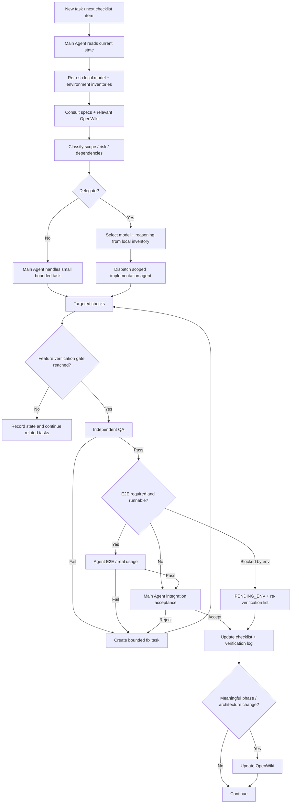

# SejukOps AI-Assisted Development Protocol

## 1. Purpose

This protocol defines how AI agents should plan, delegate, implement, verify, and accept work in SejukOps.

The goal is not to maximise the number of agents. The goal is to preserve project direction while assigning bounded work to the most appropriate available model/reasoning configuration and collecting independent verification evidence.

---

## 2. Authority Model

### Main Agent — Project Orchestrator / Technical Lead

The Main Agent owns:

- project direction and architectural continuity
- current-state understanding
- task decomposition and dependency ordering
- model/reasoning selection
- sub-agent dispatch
- integration decisions
- test scheduling
- acceptance/rejection decisions
- implementation checklist state
- verification traceability

The Main Agent should preserve context for orchestration and acceptance rather than acting as the default coder for every task.

### Implementation Agents — Scoped Executors

Implementation agents operate only inside their assigned scope.

Typical roles:

- Frontend / UIUX
- Backend / Data
- AI Integration
- Infrastructure / Deployment

They may identify architectural concerns but must return those decisions to the Main Agent rather than silently changing project direction.

### QA Agent — Independent Verification

QA answers:

> Is this implementation correct, safe, maintainable, and compliant with the assigned specification?

QA responsibilities include:

- spec compliance
- correctness
- business rules
- authorization/data scope
- error paths
- edge cases
- regressions
- performance concerns
- maintainability
- UI/UX quality where applicable

### E2E / User Simulation Agent — Real Interaction Verification

The E2E Agent verifies actual workflows through the running application when the environment permits it. It should exercise the product as a user rather than only inspect implementation code.

### Human — Product UAT Authority

Human UAT is separate from automated and agent verification. Agents may prepare UAT scenarios and record results reported by a human, but may never fabricate human execution.

---

## 3. Development Lifecycle



---

## 4. Local Model Capability Inventory

Before delegation, create or refresh:

```text
.agent/model-capabilities.local.md
```

This file is not committed.

Example structure:

```text
# Local Model Capability Inventory

Updated: <timestamp>
Host / environment: <tooling environment>

## <model id>
Reasoning modes: <observed/available values>
Code generation: strong | adequate | weak | unknown
Repository analysis: ...
Tool calling: yes | no | unknown
Browser: yes | no | unknown
Vision: yes | no | unknown
Long-context: yes | no | unknown
Known constraints: ...
Best-fit work: ...
```

Rules:

- record only observed or explicitly exposed capabilities
- mark unknowns as `unknown`
- do not rank a model based on unsupported assumptions
- refresh when the available model/tool environment changes

---

## 5. Model and Reasoning Routing

For each task, evaluate:

```text
scope
risk
required capability
reasoning requirement
context size
expected cost
expected latency
verification burden
```

The selected model should be sufficient for the task without unnecessarily using the most expensive/highest-reasoning option.

Examples:

| Work | Preferred routing principle |
|---|---|
| Small styling/copy | low-cost frontend-capable model, low reasoning |
| Standard CRUD | reliable coding model, medium reasoning |
| Mobile workflow with complex state | strong frontend/full-stack model, medium/high reasoning |
| DB lifecycle transaction | strong backend/reasoning model, high reasoning |
| Authorization/security | strong reasoning model, high reasoning |
| AI provider routing/BYOK | strong architecture model, high reasoning |
| Independent QA | preferably a different suitable model/context |
| Browser/UI visual QA | model/agent with browser + vision where available |

The Main Agent records important routing choices in task notes when they materially affect cost, risk, or quality.

---

## 6. Delegation Contract

Every substantial delegated task should specify:

```text
Task ID
Role
Goal
Why this agent/model was selected
Allowed scope/files
Relevant specs
Dependencies
Acceptance criteria
Verification required before handoff
Non-goals / forbidden architectural changes
```

Example:

```text
Task: TECH-04
Role: Frontend / UIUX Implementation Agent
Goal: Implement technician completion form
Scope: technician route/components only
Relevant spec: SYSTEM_SPEC technician workflow
Dependencies: job-detail contract available
Acceptance:
- mobile-first
- work done / charges / evidence / remarks
- final amount is displayed from authoritative calculation
- loading/error/success states
- transition into completion success state
Verification: targeted component/type checks
Do not: change order lifecycle or DB schema
```

---

## 7. Environment Dependency Protocol

Committed definitions live in:

```text
docs/ENVIRONMENT_REQUIREMENTS.md
```

Current-machine status lives in:

```text
.agent/environment-status.local.md
```

The local status file must contain **status only**, never secret values.

Example:

```text
NEXT_PUBLIC_SUPABASE_URL       CONFIGURED
NEXT_PUBLIC_SUPABASE_ANON_KEY  CONFIGURED
AI_CONFIG_ENCRYPTION_KEY       MISSING
DEEPSEEK_API_KEY               MISSING
MIMO_API_KEY                   MISSING
```

When an environment dependency is missing:

1. identify exactly which implementation or verification path depends on it
2. mark those paths `PENDING_ENV`
3. continue independent work
4. use mocks/contracts where they provide meaningful confidence
5. append explicit re-verification tasks
6. when the human supplies the missing configuration, run only the previously blocked/relevant verification groups first

Do not restart the entire development plan solely because a late-stage external credential is unavailable.

---

## 8. Work Status Model

Use these statuses where a simple checkbox loses important information:

```text
TODO
IN_PROGRESS
IMPLEMENTED
PENDING_ENV
QA_PENDING
E2E_PENDING
HUMAN_UAT_PENDING
VERIFIED
BLOCKED
```

Definitions:

- `IMPLEMENTED`: code exists but all required evidence has not yet passed
- `PENDING_ENV`: implementation can continue or is complete, but a required real integration test awaits human-provided environment configuration
- `QA_PENDING`: independent QA is required
- `E2E_PENDING`: runnable real workflow verification is required
- `HUMAN_UAT_PENDING`: development acceptance may be complete, but designated human product validation remains
- `VERIFIED`: all development gates required for this item have passed

---

## 9. Test Strategy — Targeted, Batched, Risk-Based

Running the entire suite after every small task is explicitly discouraged.

### L0 — Targeted Implementation Check

Run after a small implementation unit where useful:

- affected lint/static analysis
- typecheck for affected code or normal project typecheck if cheap
- targeted unit/component test
- narrow contract test

Examples:

- status badge styling change → component/visual check
- validation helper → targeted unit test
- query function → targeted query test

### L1 — Feature Batch Gate

Related tasks are intentionally grouped and tested once they form a coherent feature slice.

Example verification group:

```text
VG-TECH-CORE
- TECH-01 My Jobs
- TECH-02 Job Detail
- TECH-03 Start Job
- TECH-04 Completion Form
```

Only after required members are implemented do we run the Technician feature integration checks and relevant browser flow.

### L2 — Cross-module Integration Gate

Use when one module's behavior becomes meaningful only with another.

Examples:

- Admin creates/assigns order → Technician sees assigned job
- Technician completes job → Manager review queue + WhatsApp action + dashboard invalidation
- Dashboard metrics → period-specific AI insight
- AI Settings → selected provider → Operations Query

### L3 — Phase Gate

At phase completion:

- relevant feature suites
- independent QA
- required E2E flows
- integration acceptance

Do not automatically run unrelated suites from distant modules.

### L4 — Full Regression / Release Gate

Use for:

- major shared architecture changes
- release/deployment candidate
- final assessment submission
- changes that cross many boundaries and make targeted confidence insufficient

This is where the broad automated + E2E regression belongs.

---

## 10. Verification Groups

The Main Agent owns verification scheduling.

A verification group defines:

```text
Group ID
Included tasks/features
Dependencies
Trigger condition
Automated checks
QA scope
E2E scenarios
Environment dependencies
```

If a fix is isolated, rerun the smallest affected verification group. Escalate to broader regression only when the risk/impact warrants it.

---

## 11. Independent QA Protocol

Implementation handoff should include:

- changed files/diff
- acceptance criteria
- tests already run
- known limitations
- environment blockers

QA returns one of:

```text
PASS
FAIL
PASS_WITH_ISSUES
BLOCKED
```

Any `PASS_WITH_ISSUES` item that affects acceptance criteria remains unresolved until Main Agent explicitly accepts the tradeoff or creates a fix task.

---

## 12. Agent E2E / Real Usage

Agent E2E should interact with the actual running application whenever tools/environment permit.

It is not equivalent to code review.

Typical end-to-end assessment scenario:

```text
Admin creates + assigns order
→ Technician sees assigned job
→ Technician starts + completes service
→ WhatsApp action becomes READY/OPENED as applicable
→ Manager receives review item
→ Manager reviews/closes
→ Dashboard reflects data
→ Manager Operations AI returns grounded values
→ Admin document extraction flow is exercised
```

Test cases are tracked in `docs/testing/TEST_MATRIX.md`.

---

## 13. Human UAT

Human UAT cases should be listed before the project is submitted.

Agents may:

- define scenarios
- prepare data
- tell the human what to verify
- record the human-reported result

Agents may not mark Human UAT `PASS` based on agent/browser automation.

---

## 14. Frontend / UIUX Protocol

The Frontend / UIUX Agent is responsible for functional UI **and** interaction quality.

Required concerns:

### Responsive behavior

- Admin/Manager desktop-first layouts
- Technician phone-first layouts
- avoid accidental horizontal overflow
- usable long names/addresses/content

### Interaction states

Every significant async/action surface should deliberately handle applicable states:

```text
idle
hover/focus
loading
success
empty
error
disabled
```

### Motion and transitions

Use motion to communicate:

- state changes
- navigation continuity
- action feedback
- hierarchy changes

Examples:

- `ASSIGNED → IN_PROGRESS` status transition
- form submit loading → success summary
- Dashboard period switch updates data/charts without a jarring blank-page flash
- mobile bottom-navigation active-state transition
- drawers/dialogs/panels opening and closing consistently

Avoid excessive decorative motion, especially in the Technician field workflow.

Respect reduced-motion preferences where practical.

### Visual verification

Frontend/UIUX acceptance requires actual browser/visual inspection, not only source review.

Suggested viewport coverage:

```text
Desktop: ~1440px
Tablet: ~768px
Technician mobile: ~360px / ~390px / ~430px
```

Prioritise models/agents with browser and vision capabilities for UI visual QA when available.

---

## 15. Progress and Verification Traceability

Development progress source of truth:

```text
docs/IMPLEMENTATION_CHECKLIST.md
```

Verification evidence:

```text
docs/testing/VERIFICATION_LOG.md
```

A feature must not be marked `VERIFIED` because an implementation agent reports success. The required gates must have evidence.

---

## 16. OpenWiki Development Knowledge

OpenWiki is used for coding/development context, not as a SejukOps runtime RAG feature.

It should help agents recover:

- architecture
- module boundaries
- data flows
- important source locations
- state transitions
- implementation conventions
- testing architecture

It should not replace explicit design decisions or tests.

Update it after:

- meaningful phase completion
- important architecture changes
- major new module implementation

Avoid updating after every trivial edit.

See `openwiki/INSTRUCTIONS.md`.

---

## 17. Definition of Development Acceptance

Main Agent may mark a feature development-accepted when:

1. implementation satisfies its approved scope
2. required targeted/feature/integration tests pass or have an explicitly accepted blocker
3. independent QA passes
4. required Agent E2E passes or is explicitly `PENDING_ENV`
5. known issues are documented
6. integration does not violate project architecture
7. checklist and verification log are updated

Human UAT can remain `NOT_RUN` or `HUMAN_UAT_PENDING` until a human performs designated product-validation cases.
