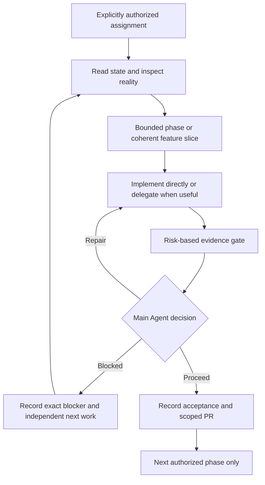

# AI-Native Development Practice — Sejuk Ops

This is the rebuild development method, not the product's agent runtime. It supersedes the assessment's fixed orchestration/checklist workflow. Current authorization is always [PROJECT_STATE.md](../PROJECT_STATE.md); right now it is documentation only.

## Core approach

Define outcomes, service boundaries, constraints, phase acceptance, and evidence. Let the Main Agent choose the smallest effective execution strategy. Prefer native tools/frameworks and direct implementation when useful; delegate bounded work or independent review only when it improves quality or efficiency. More agents and more documentation are not goals.

```mermaid
flowchart TD
    REQUEST[Explicitly authorized assignment] --> STATE[Read state and inspect reality]
    STATE --> SLICE[Bounded phase or coherent feature slice]
    SLICE --> WORK[Implement directly or delegate when useful]
    WORK --> CHECK[Risk-based evidence gate]
    CHECK --> DECIDE{Main Agent decision}
    DECIDE -->|Repair| WORK
    DECIDE -->|Blocked| RECORD[Record exact blocker and independent next work]
    DECIDE -->|Proceed| ACCEPT[Record acceptance and scoped PR]
    RECORD --> STATE
    ACCEPT --> NEXT[Next authorized phase only]
```

This diagram describes future execution, not permission to enter it from this documentation task.

## Phase and decision discipline

Start with [the phase plan](plans/agent-native-rebuild.md). The Main Agent owns dependencies, scope, implementation/integration choices, and acceptance. Phase boundaries may change after inspection; retain requirement IDs, explain changes, and do not silently omit accepted behavior. Do not stop for routine design details already inside the agreed scope. Escalate real major tradeoffs, unresolved destructive targets, new cost/credentials, broader access, or changed product direction.

Sub-agent assignments specify goal, allowed changes, dependencies, contracts, acceptance, required evidence, non-goals, and handoff. Use only tools/models actually available. Avoid overlapping file ownership; integrate in the owning phase PR. An independent reviewer is valuable at security/transaction/architecture boundaries, but do not fabricate one or force a permanent agent hierarchy.

## Single durable project state

`PROJECT_STATE.md` is the only live task/phase ledger. Update it after meaningful work, a gate, or handoff—not after every line edit. Include branch/commit, requirement IDs, what exists, what was verified, actual evidence links, residual failures, missing environment, and the next permitted action.

Statuses distinguish `NOT_STARTED`, `IN_PROGRESS`, `IMPLEMENTED`, `PENDING_ENV`, `VERIFIED`, and `BLOCKED`. Implementation is not verification. A missing external dependency can block one gate without blocking independent authorized work. A documentation-only assignment cannot use that principle to begin implementation.

Specs and decision notes explain intent. Test logs explain results. Neither becomes a competing current task list. Historical assessment checklists and release/UAT results are not recycled as new evidence.

## Verification proportional to risk

Batch multiple related edits, or a substantial change, before running the relevant checks and making a coherent commit. Broad full-project regression is reserved for a justified cross-cutting/phase/release risk, not every edit.

| Change | Minimum useful evidence |
| --- | --- |
| Direction/prose | Authority/status consistency, accepted-scope coverage, local links, changed-file scope. |
| Isolated code/UI | Affected contracts/types and focused tests; visual/browser check for significant UI. |
| Agent/tools/retrieval | Real-provider spike plus deterministic tool/policy tests; evidence/abstention and adversarial inputs. |
| Auth/workspace/Storage/RPC | Direct and indirect negative access checks, role escalation, joins/cache/file boundaries, and live integration. |
| Proposal/transaction/reset | Stale versions, concurrent changes, retries, partial failure, idempotency, reset generation. |
| Release/demo | Necessary broad regression and representative live end-to-end scenarios. |

Use a focused mutation/fault-injection gate for critical logic: tests should detect removed tenant predicates, ignored versions, or skipped permission/approval checks. Choose the method/tools based on affected risk; record justified non-applicability rather than running an entire mutation suite on all work.

Keep evidence classes distinct: static inspection, automated test, live integration, agent browser/E2E, independent review, and human UAT. A successful mock does not establish live model compatibility. Never report unrun tests, synthetic demos as live, or Human UAT without a human result.

## Native-first integration and scope

Use one agent runtime and one MCP adapter; reuse mature parsing, storage, indexing, trace, and test components. Write domain rules, actor mapping, proposal semantics, and product-specific validation; do not recreate generic tool loops, PDF parsers, OAuth servers, or trace platforms.

Pin a tested compatible dependency set during implementation. Preserve server-only credentials, outbound-request restrictions, scoped data access, and truthful error handling when replacing provider plumbing. New UI surfaces do not justify duplicated backend rules.

Agent Continuity is a separate optional environment-side mechanism for bounded execution handoff. No AC database, repo manifest, hook, CI job, or additional repo authority is required here. Ordinary project state/decisions belong in the files above.

## Delivery and stopping

Follow [Git workflow](GIT_WORKFLOW.md): one meaningful phase/feature PR, grouped commits, evidence before acceptance, squash merge only with authorization. Do not merge/deploy merely because code or a plan exists. For the current request, finish at a documentation PR and report that implementation, database changes, and deployment were not performed.
