# SejukOps System Specification

## 1. Purpose

SejukOps is a responsive internal operations platform for a fictional air-conditioning service company with multiple branches and field technician teams.

The system is designed around one operational lifecycle:

**Order → Assignment → Service Execution → Completion → Notification → Review → Closure → Reporting / AI Insights**

The assessment implementation aims to cover every requested module while keeping them integrated around the same data model and workflow.

---

## 2. Product Principles

1. **One connected workflow** — modules operate on shared orders, service reports, users, and events.
2. **One Web application** — Admin, Technician, and Manager are role-specific routes in the same Next.js deployment.
3. **Mobile-first field UX** — technicians use a responsive Web App optimised for phones.
4. **Desktop-first operations UX** — Admin and Manager interfaces favour efficient forms, tables, reviews, and dashboards.
5. **Purpose-fit component systems** — Ant Design serves desktop Admin/Manager workflows and Ant Design Mobile serves the field Technician workflow while sharing product-level tokens and UX conventions.
6. **Deterministic rules first** — explicit business rules stay in application logic; AI is used for interpretation, extraction, summarisation, and decision support.
7. **Controlled AI data access** — the model never receives unrestricted database access and never executes arbitrary SQL.
8. **No unnecessary RAG** — the assessment uses structured operational queries, not a vector knowledge base.
9. **Provider-agnostic AI** — AI features depend on capabilities, not hard-coded vendors.
10. **Human review for consequential AI output** — document extraction and workflow recommendations remain reviewable.
11. **Traceability** — important state changes and business actions are logged.
12. **Server-side aggregation for analytics** — dashboard metrics are computed close to the database rather than from large raw datasets in the browser.
13. **Truthful integration states** — external integrations only expose delivery states the application can actually observe.
14. **Simple assessment auth, realistic boundaries** — use mock role switching while keeping authorization logic explicit.

---

## 3. Actors

### Admin

- Create orders
- Enter customer and service details
- Set quoted price
- Assign technician
- Add admin notes
- View order status
- Import supported documents for structured extraction
- Configure AI providers, keys, models, and routing

### Technician

- View assigned jobs
- Start an assigned job
- Record completed work
- Add extra charges
- Upload service evidence
- Review final amount
- Mark job as completed
- Optionally record payment information
- Open the prepared customer WhatsApp message after completion

### Manager

- Review completed jobs
- Inspect evidence and amount variance
- Resolve workflow flags
- Approve or request clarification
- Close reviewed jobs
- View KPI dashboard
- Use the AI Operations Assistant
- View operational AI insights

The conversational AI assistant is a **Manager feature**. Admin uses AI only where required for configuration and document processing. Technician does not receive a general AI chat assistant.

---

## 4. Role Model & Authorization

### 4.1 Fixed assessment roles

- `ADMIN`
- `TECHNICIAN`
- `MANAGER`

The demo uses a mock role switcher rather than full authentication.

Dynamic Create Role / Role Management UI is deliberately out of scope because the current business requirements define a small, stable role set. The implementation should still separate permissions from UI visibility so a production version can evolve toward configurable RBAC later.

### 4.2 Permission concepts

```text
order:create
order:view
order:assign
order:update
job:view_assigned
job:start_assigned
job:complete_assigned
evidence:upload
payment:record
review:view
review:approve
review:request_clarification
order:close
dashboard:view
ai:query
ai:view_insights
ai:configure
ai:document_extract
```

### 4.3 Data scope

Role checks alone are insufficient.

- Admin operates on permitted operational records.
- Technician may only start or complete jobs assigned to that technician.
- Manager may view and review broader operational records.
- AI provider configuration is Admin-only.

Route protection and server-side operation checks must enforce these boundaries; hiding a navigation item is not sufficient authorization.

---

## 5. Application & Portal Structure

SejukOps is **one repository, one Next.js application, one deployment, and one Supabase project**.

```text
/
├── admin/
│   ├── dashboard
│   ├── orders
│   ├── orders/new
│   ├── orders/[id]
│   ├── documents/import
│   └── settings/ai
│
├── technician/
│   ├── jobs
│   ├── jobs/[id]
│   └── history
│
└── manager/
    ├── dashboard
    ├── reviews
    ├── reviews/[id]
    ├── ai
    └── insights
```

```mermaid
flowchart TB
    APP[Single SejukOps Web App] --> ROLE{Current Role}
    ROLE --> A[/admin\nDesktop-first]
    ROLE --> T[/technician\nMobile-first]
    ROLE --> M[/manager\nDesktop-first]

    A --> SERVER[Shared Next.js Server Layer]
    T --> SERVER
    M --> SERVER
    SERVER --> DB[(Shared Supabase Data)]
```

All portals share types, validation, server services, design tokens, data model, and authorization primitives, while keeping role-specific layouts and navigation.

---

## 6. UX Strategy

The authoritative component-library and UI implementation decision is documented in [`UI_STACK.md`](UI_STACK.md).

### 6.1 Admin — desktop-first

Use Ant Design for the desktop-oriented operations interface.

- Sidebar navigation
- Header with current role/user
- Searchable orders table
- Status filters
- Structured order form
- Order summary after submission
- AI settings page
- Document import/review workflow

### 6.2 Technician — mobile-first responsive Web App

The Technician Portal is not a native mobile app and is not a separately deployed website. Use Ant Design Mobile for the primary field interaction primitives.

Design goals:

- Large tap targets
- Minimal navigation depth
- Important customer/job context visible before action
- Avoid dense tables
- Linear completion form
- Camera/file upload accessible from phone
- Sticky primary action where useful
- Bottom navigation on narrow screens

Suggested navigation:

```text
Jobs | History | Profile
```

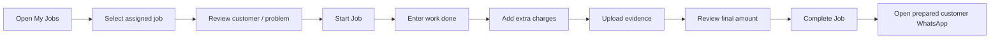

### 6.3 Manager — desktop-first

Use Ant Design for review, analytics, configuration display, and AI-assistant surfaces.

- KPI cards
- Period-aware charts
- Technician leaderboard/performance table
- Completed jobs queue
- Workflow/AI flags
- Review detail page
- AI Operations Assistant
- Operational insight cards

---

## 7. Order Lifecycle

### States

```text
NEW
ASSIGNED
IN_PROGRESS
JOB_DONE
REVIEWED
CLOSED
```

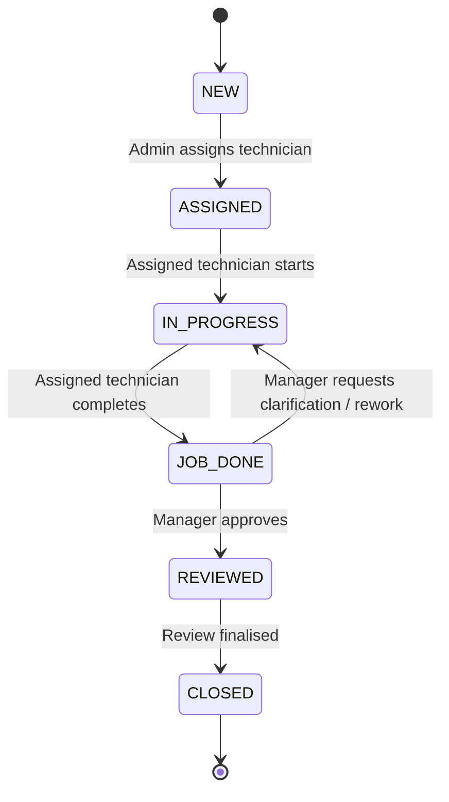

| Transition | Actor |
|---|---|
| NEW → ASSIGNED | Admin |
| ASSIGNED → IN_PROGRESS | Assigned Technician |
| IN_PROGRESS → JOB_DONE | Assigned Technician |
| JOB_DONE → REVIEWED | Manager |
| REVIEWED → CLOSED | Manager / system workflow |
| JOB_DONE → IN_PROGRESS | Manager requests clarification |

Rescheduling is tracked separately and is not introduced as a permanent lifecycle state.

---

## 8. Module 1 — Admin Order Submission

### Fields

- Order No — auto-generated
- Customer Name
- Phone
- Address
- Problem Description
- Service Type
- Quoted Price
- Assigned Technician
- Admin Notes

### Behaviour

1. Admin opens New Order.
2. System generates/reserves a human-readable order number such as `ORD-2026-0001` while using UUID internally.
3. Admin enters order information and selects technician.
4. Server validates input.
5. Order is stored and becomes `ASSIGNED` when a technician is selected.
6. Audit log records creation and assignment.
7. UI shows a submission summary.

---

## 9. Module 2 — Technician Service Job

### Job list

Show order number, customer, service type, address summary, and status. Prioritise `ASSIGNED` and `IN_PROGRESS` work.

### Job detail

Read-only context before starting:

- Order ID
- Customer
- Phone
- Address
- Problem description
- Service type
- Quoted price
- Admin notes where appropriate

### Completion fields

- Work Done
- Extra Charges
- Up to 6 photos/video/PDF files
- Final Amount — auto-calculated
- Remarks
- Technician Name — derived from current mock user
- Timestamp — server generated

Optional payment fields:

- Payment Amount
- Payment Method
- Receipt Photo

### Final amount rule

```text
final_amount = quoted_price + extra_charges
```

The server calculates or verifies the value and must not trust a client-provided total.

### Completion transaction

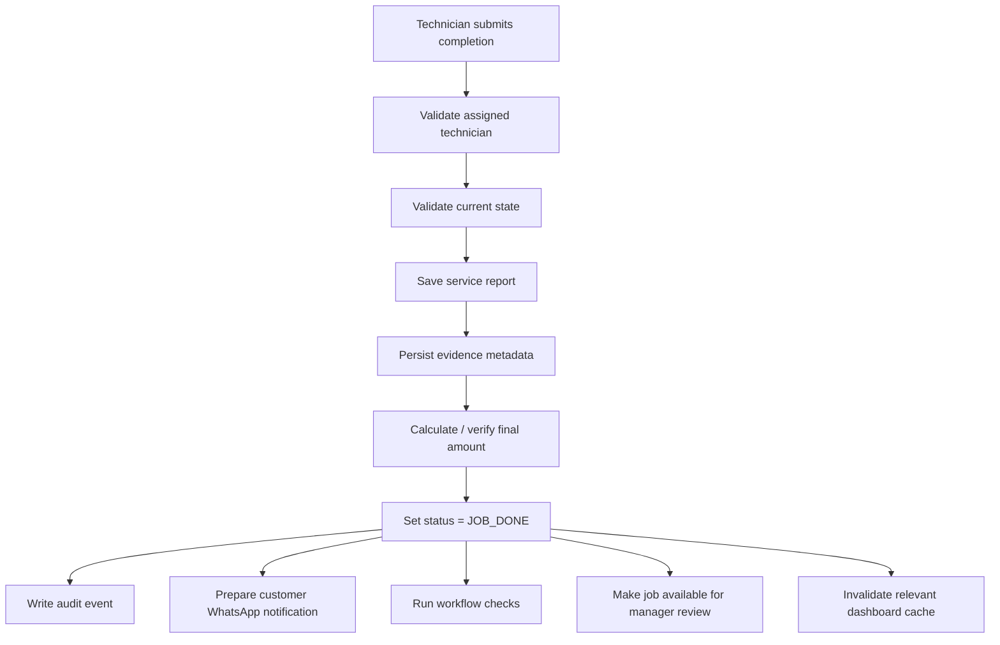

---

## 10. Module 3 — WhatsApp Notification Trigger

### 10.1 Trigger

When order status changes to `JOB_DONE`.

### 10.2 Assessment implementation

The assessment uses a **WhatsApp deep link with a pre-filled message**. SejukOps prepares the message and opens WhatsApp / WhatsApp Web; the user still confirms and sends it from WhatsApp.

A full WhatsApp Business / Cloud API integration is intentionally out of scope.

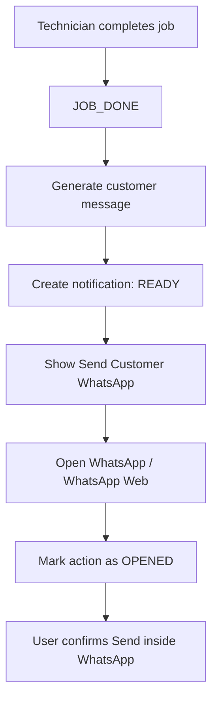

Suggested message:

```text
Hi {customerName},

Job {orderNo} has been completed by Technician {technicianName} at {completedAt}.
Please check the service and leave feedback.

Thank you!
```

The message is URL encoded before being inserted into the deep link.

### 10.3 Primary UX

After successful job completion:

```text
Job Completed ✓

✓ Service report saved
✓ Manager review queue updated
✓ Customer WhatsApp message prepared

[ Send Customer WhatsApp ]
[ Back to My Jobs ]
```

Admin / Manager order detail may expose **Open WhatsApp Again** for manual follow-up.

### 10.4 Observable notification states

For the assessment deep-link implementation, use only:

```text
READY
OPENED
```

Do not claim:

```text
SENT
DELIVERED
READ
```

because a deep link cannot prove that the user actually sent the message or that the customer received/read it.

Suggested notification record:

```text
id
order_id
channel = WHATSAPP
recipient
message
status = READY | OPENED
generated_at
opened_at nullable
```

### 10.5 Failure handling

WhatsApp preparation is a secondary side effect. A valid job completion must not be rolled back if message generation/opening fails.

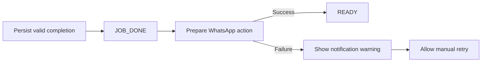

### 10.6 Manager notification

Manager notification is handled in-app through the review queue / notification UI rather than another WhatsApp message.

```text
JOB_DONE
├── Customer → WhatsApp deep link
├── Manager → In-app review queue
└── Dashboard → Aggregated metrics can refresh
```

### 10.7 Production upgrade boundary

```text
NotificationService
├── DeepLinkWhatsAppAdapter       ← assessment
└── WhatsAppBusinessAdapter       ← future production option
```

Business logic should request a completion notification without depending on the concrete provider.

See [`DASHBOARD_AND_NOTIFICATION_SPEC.md`](DASHBOARD_AND_NOTIFICATION_SPEC.md) for the detailed implementation notes.

---

## 11. Manager Review

Manager Review closes the lifecycle defined by the assessment.

Review screen should show:

- Order/customer summary
- Quoted price
- Extra charges
- Final amount
- Work done
- Remarks
- Uploaded evidence
- Payment information if recorded
- Audit history
- Workflow/AI flags

Actions:

- Approve
- Request clarification/rework

```text
Approve: JOB_DONE → REVIEWED → CLOSED
Clarification: JOB_DONE → IN_PROGRESS
```

Every transition is captured in the audit trail.

---

## 12. KPI Dashboard

### 12.1 Portal and period scope

The KPI Dashboard belongs to the **Manager Portal** at `/manager/dashboard`.

Use exactly three fixed periods:

```text
Today | This Week | This Month
```

`This Week` is the default. A Custom Range selector is deliberately out of scope.

### 12.2 Core KPI cards

- Jobs Completed
- Total Amount
- Rescheduled
- Average Job Value

`Average Job Value` is deterministic:

```text
average_job_value = total_completed_amount / completed_jobs
```

Return an explicit zero/empty state if there are no completed jobs.

### 12.3 Previous-period comparison

| Current period | Natural comparison |
|---|---|
| Today | Yesterday |
| This Week | Last Week |
| This Month | Last Month |

### 12.4 Period-aware chart granularity

Changing period changes both the KPI values and the time-series aggregation.

```text
Today      → hourly / time-of-day buckets
This Week  → daily buckets
This Month → weekly buckets
```

Example:

```text
Today
09:00  10:00  11:00  12:00 ...
  1      2      0      3

This Week
Mon  Tue  Wed  Thu  Fri  Sat  Sun
 4    7    5    8    9    6    3

This Month
Week 1  Week 2  Week 3  Week 4  Week 5
  36      41      39      44       7
```

The monthly chart should not force thirty individual daily bars when weekly buckets communicate the trend more clearly.

### 12.5 Technician performance

Recalculate technician ranking for the active period.

Suggested fields:

- Technician
- Jobs Completed
- Total Amount
- Average Job Value
- Reschedule Count

The leaderboard therefore represents the selected period, not a fixed global ranking.

### 12.6 Service type distribution

Recalculate service-type distribution for the selected period. The chart type can remain stable while its dataset changes.

### 12.7 AI insight follows the active period

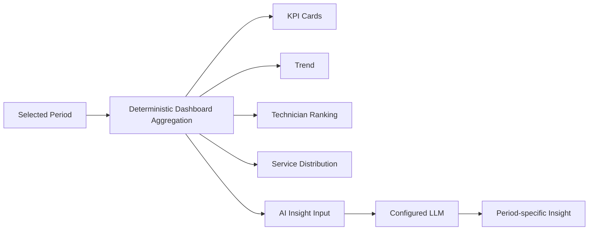

The database/dashboard aggregation is the source of truth. The LLM explains the computed metrics; it is not responsible for authoritative KPI calculation.

### 12.8 Fetching architecture

The browser must not fetch all orders/service reports and aggregate them in JavaScript.

Use server-side/database aggregation and return compact dashboard-oriented JSON.

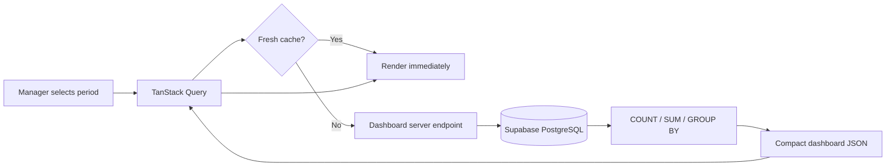

Typical database work:

```text
COUNT completed jobs
SUM final amount
COUNT reschedules
GROUP BY technician
GROUP BY service type
GROUP BY period bucket
```

Example client-facing response:

```json
{
  "period": "this_week",
  "summary": {
    "completedJobs": 42,
    "totalAmount": 8420,
    "rescheduled": 6,
    "averageJobValue": 200.48
  },
  "comparison": {
    "completedJobsPercent": 12,
    "totalAmountPercent": 8
  },
  "trend": [
    { "label": "Mon", "jobs": 4 },
    { "label": "Tue", "jobs": 7 }
  ],
  "technicians": [
    { "name": "Ali", "jobs": 12, "amount": 2450, "rescheduled": 1 }
  ],
  "serviceTypes": [
    { "type": "Cleaning", "count": 18 }
  ],
  "metricsVersion": "..."
}
```

### 12.9 Client cache

Use period-specific TanStack Query keys, conceptually:

```ts
['manager-dashboard', period]
```

This creates separate cache entries for:

```text
today
this_week
this_month
```

If the Manager switches `This Week → This Month → This Week`, cached weekly data can render immediately instead of waiting on another identical fetch.

A practical initial stale window is approximately 60 seconds. This is an implementation default and can be tuned later.

After the default `This Week` load, the other two periods may be prefetched at low priority as optional polish.

### 12.10 Cache invalidation

Invalidate or mark relevant Dashboard queries stale after business events that change aggregates, for example:

```text
JOB_COMPLETED
JOB_REOPENED / clarification
ORDER_RESCHEDULED
review / closure changes if a metric definition depends on review state
```

Avoid globally invalidating unrelated application queries.

### 12.11 AI insight cache

Do not call an LLM every time the Manager toggles Dashboard periods.

Conceptual cache identity:

```text
period + metrics_version
```

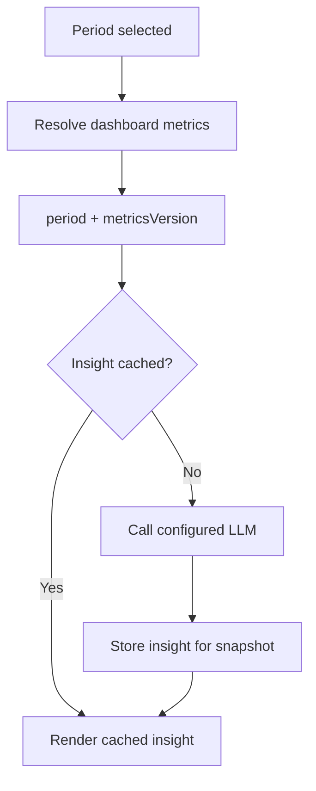

Regenerate only when no cached insight exists for the current metrics snapshot or the underlying metrics changed.

### 12.12 Query performance

Likely access patterns include:

```text
completed_at BETWEEN start AND end
GROUP BY technician_id
GROUP BY service_type
filter by status
```

Candidate indexes:

```text
service_reports(completed_at)
service_reports(technician_id, completed_at)
orders(status)
orders(assigned_technician_id)
```

Indexes should follow actual query plans/data shape rather than be added indiscriminately.

For much larger production datasets, views/materialized aggregates/summary tables may be introduced later, but are unnecessary for assessment scale unless profiling demonstrates a need.

### 12.13 Reschedule tracking

Rescheduling remains separate from the order lifecycle.

Suggested history table:

```text
order_reschedules
- id
- order_id
- previous_schedule
- new_schedule
- reason
- created_by
- created_at
```

Dashboard `Rescheduled` metrics derive from these events/records for the selected period.

See [`DASHBOARD_AND_NOTIFICATION_SPEC.md`](DASHBOARD_AND_NOTIFICATION_SPEC.md) for the focused Dashboard/notification specification.

---

## 13. AI Scope & Data Access

The assessment does **not** require a knowledge base, RAG pipeline, embeddings, or vector database. SejukOps therefore does not add them solely for technology breadth.

The three AI/data paths are deliberately separate:

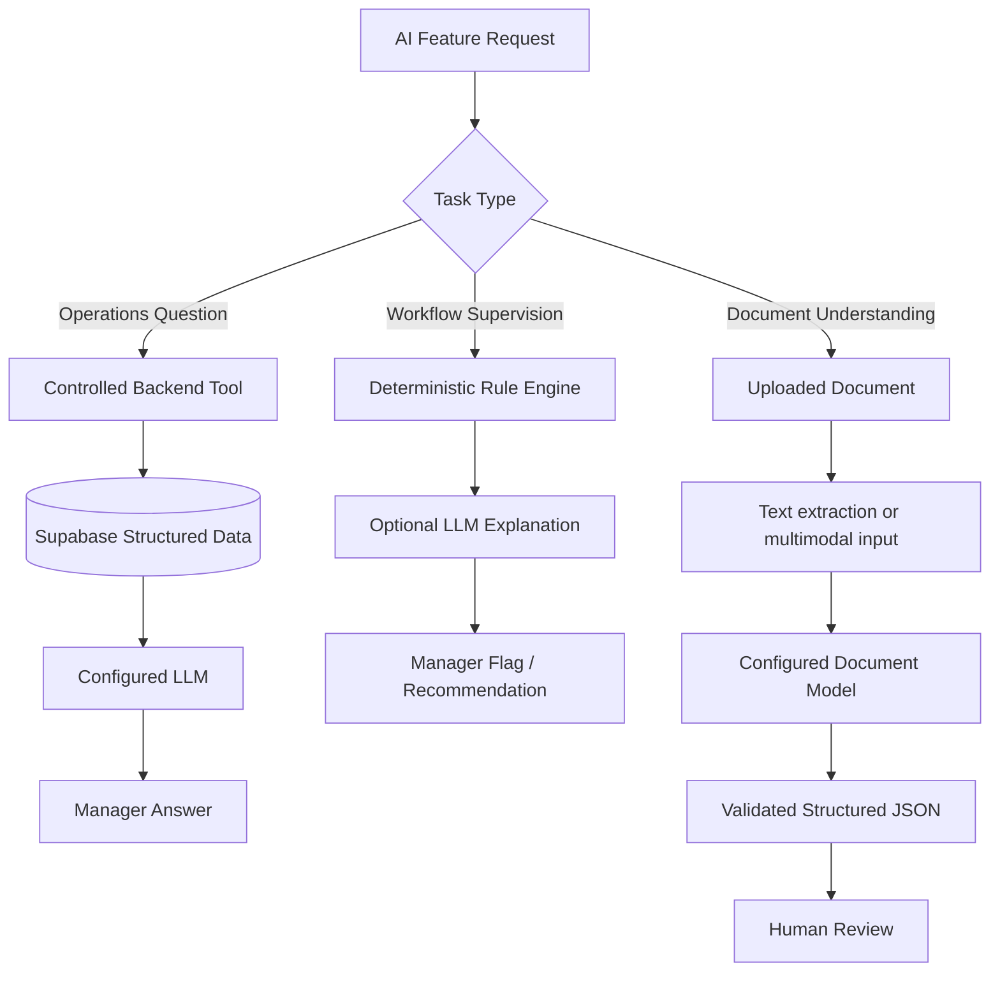

No model receives unrestricted database access and no model executes arbitrary SQL.

---

## 14. AI Operations Query Window

### Goal

Allow Managers to ask operational questions in natural language while preserving controlled access to system data.

Supported examples:

- What jobs did Ali complete last week?
- Which technician completed the most jobs this week?
- How many jobs were completed today?
- What was the total completed amount this week?
- Which technician has the highest workload this week?

### Controlled architecture

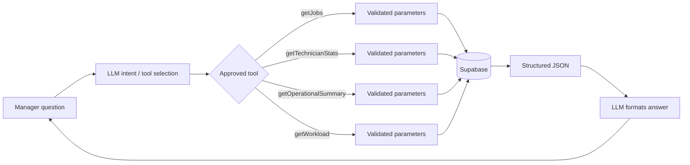

Example tool contracts:

```ts
getJobs({
  technicianId?: string,
  status?: OrderStatus,
  serviceType?: string,
  startDate?: string,
  endDate?: string
})

getTechnicianStats({
  technicianId?: string,
  startDate: string,
  endDate: string
})

getOperationalSummary({
  startDate: string,
  endDate: string
})

getWorkload({
  startDate: string,
  endDate: string
})
```

Guardrails:

- No arbitrary SQL
- No direct table browsing by the model
- Schema-validated tool input
- Server-normalised date ranges
- Bounded query result size
- Clear unsupported/no-results behaviour
- Final numeric values sourced from backend queries

The Operations Assistant also requires a SejukOps-specific deterministic evaluation set covering tool selection, normalised arguments, grounded facts, no-data behavior, unsupported requests, multi-turn follow-ups, tool failures, and boundary attempts. See [`LLM_EVALUATION.md`](LLM_EVALUATION.md).

---

## 15. Advanced AI — Workflow Supervisor

Use deterministic rules for clear operational conditions, and use an LLM only when explanation/recommendation adds value.

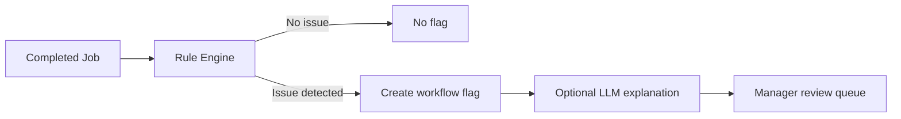

Initial rules:

- Final amount significantly higher than quoted price
- `JOB_DONE` with no service evidence
- Unusual extra-charge ratio/threshold

The LLM may provide plain-language explanation, context summary, and suggested review action. It must not automatically approve, reject, refund, charge, or discipline staff.

---

## 16. Advanced AI — Document Understanding

### Goal

Extract structured operational data from uploaded documents:

- Customer name
- Service type
- Service details
- Amount
- Date

### Processing strategy

Document Understanding is a **workflow feature**, not a general chatbot.

- Text-native PDF/document: extract text, then send relevant content to the configured extraction model.
- Image/scanned document: use a compatible vision/multimodal model.
- A separate OCR service is not required unless later implementation needs justify it.

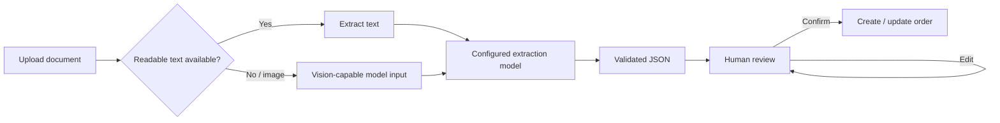

Example output schema:

```ts
type ExtractedServiceDocument = {
  customerName: string | null;
  serviceType: string | null;
  serviceDetails: string | null;
  amount: number | null;
  date: string | null;
};
```

Invalid or missing fields remain explicit rather than guessed. Extracted values are drafts and are never silently written into live operational records without confirmation.

---

## 17. Advanced AI — Operational Insight

Operational metrics are calculated deterministically and then optionally interpreted by the configured model.

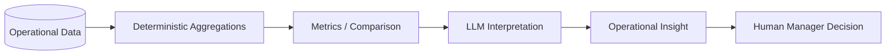

Possible insights:

- Technician workload imbalance
- High reschedule rate
- Large amount-variance trend
- Service-type volume changes
- Completion volume significantly above/below team average

AI insight is decision support, not an automatic management decision. For Dashboard usage, it inherits the selected `Today / This Week / This Month` period and uses the cached metrics snapshot described in Section 12.

---

## 18. AI Provider Configuration & BYOK

SejukOps uses a **provider-agnostic server-side adapter layer**. DeepSeek V4 Flash and MiMo 2.5 are the intended reference setup, but neither is a hard dependency.

### 18.1 Admin settings

Admin can configure one or more AI provider/model profiles:

```text
Provider display name
Provider / adapter type
Base URL (when applicable)
API Key
Model name
Capabilities
- Text
- Vision
- Tool calling
- Structured output
```

The system should also support a custom/OpenAI-compatible style provider entry where the adapter contract permits it.

### 18.2 Routing modes

Two user-selectable routing strategies are supported.

#### Single Model

One configured model handles every AI feature it is compatible with.

Use case: a user already has one capable model/API key and prefers simple configuration.

#### Task-based Routing

Different model profiles are assigned to different AI workloads.

Use case: lower cost, stronger capability matching, or provider preference.

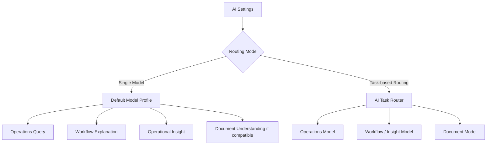

Reference configuration:

```text
Operations Query       → DeepSeek V4 Flash
Workflow Explanation   → DeepSeek V4 Flash
Operational Insight    → DeepSeek V4 Flash
Document Understanding → MiMo 2.5
```

A reviewer can replace these with another compatible combination.

### 18.3 Capability validation

Routing is capability-aware rather than vendor-aware.

Examples:

- Operations Query must support the structured/tool interaction required by the implementation.
- Image/scanned-document processing requires vision/multimodal capability.
- Structured extraction should use schema/structured output when available.

If Single Model is selected but that model cannot support an enabled feature, the UI should explain the incompatibility and offer another model or Task-based Routing.

### 18.4 API key security

Provider calls are always made server-side.

- Admin enters API keys in AI Settings.
- Saved keys are encrypted before persistent storage.
- The application keeps the encryption secret server-side.
- Plaintext keys are not returned to the browser after save.
- Logs must never contain provider keys.
- Environment variables can act as a deployment-level fallback.
- Technician and Manager cannot modify provider credentials.

For assessment scope, AI settings are organisation-level rather than per-user because authentication is mocked and the fictional system represents one company.

See [`AI_CONFIGURATION.md`](AI_CONFIGURATION.md) for the detailed configuration contract.

---

## 19. Audit Trail

Suggested events:

```text
ORDER_CREATED
TECHNICIAN_ASSIGNED
ORDER_RESCHEDULED
JOB_STARTED
SERVICE_REPORT_UPDATED
EVIDENCE_UPLOADED
PAYMENT_RECORDED
JOB_COMPLETED
NOTIFICATION_GENERATED
NOTIFICATION_OPENED
REVIEW_REQUESTED
REVIEW_APPROVED
JOB_CLOSED
WORKFLOW_FLAG_CREATED
WORKFLOW_FLAG_RESOLVED
AI_PROVIDER_CONFIG_UPDATED
AI_ROUTING_UPDATED
```

Audit record:

```text
id
order_id nullable
actor_profile_id nullable
event_type
metadata_json
created_at
```

Audit records are append-oriented and are not edited by normal application flows.

---

## 20. Suggested Data Model

### Core business tables

```text
profiles
technicians
customers
orders
order_reschedules
service_reports
service_attachments
payments
job_reviews
notifications
ai_flags
audit_logs
```

Key shapes:

```text
orders
- id UUID PK
- order_no TEXT UNIQUE
- customer_id UUID FK
- assigned_technician_id UUID FK nullable
- problem_description TEXT
- service_type TEXT
- quoted_price NUMERIC
- status TEXT
- admin_notes TEXT nullable
- created_by UUID FK
- created_at TIMESTAMP
- updated_at TIMESTAMP

order_reschedules
- id UUID PK
- order_id UUID FK
- previous_schedule TIMESTAMP nullable
- new_schedule TIMESTAMP
- reason TEXT nullable
- created_by UUID FK
- created_at TIMESTAMP

service_reports
- id UUID PK
- order_id UUID FK UNIQUE
- technician_id UUID FK
- work_done TEXT
- extra_charges NUMERIC DEFAULT 0
- final_amount NUMERIC
- remarks TEXT nullable
- started_at TIMESTAMP nullable
- completed_at TIMESTAMP nullable
- updated_at TIMESTAMP

notifications
- id UUID PK
- order_id UUID FK
- channel TEXT
- recipient TEXT
- message TEXT
- status TEXT              # READY | OPENED for assessment WhatsApp deep link
- generated_at TIMESTAMP
- opened_at TIMESTAMP nullable
```

### AI configuration tables

```text
ai_settings
- id UUID PK
- routing_mode TEXT               # SINGLE_MODEL | TASK_BASED
- default_provider_config_id UUID nullable
- updated_by UUID
- updated_at TIMESTAMP

ai_provider_configs
- id UUID PK
- name TEXT
- provider_type TEXT
- base_url TEXT nullable
- model TEXT
- capabilities JSONB
- encrypted_api_key TEXT nullable
- key_last4 TEXT nullable
- status TEXT
- created_at TIMESTAMP
- updated_at TIMESTAMP

ai_task_routes
- id UUID PK
- task_type TEXT
- provider_config_id UUID FK
- updated_at TIMESTAMP
```

Suggested task types:

```text
OPERATIONS_QUERY
WORKFLOW_EXPLANATION
OPERATIONAL_INSIGHT
DOCUMENT_UNDERSTANDING
```

### Relationship overview

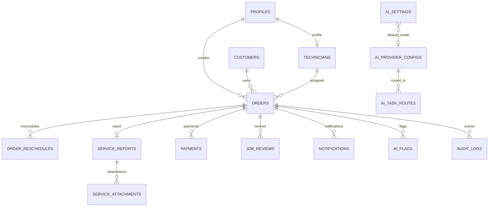

---

## 21. File Storage

Use Supabase Storage for service evidence, receipts, and uploaded source documents.

Suggested paths:

```text
service-evidence/{orderId}/{fileId}-{filename}
receipts/{orderId}/{fileId}-{filename}
documents/{uploadId}/{filename}
```

Store metadata in PostgreSQL rather than relying on storage listing as application state.

Validate file count, MIME type, size, and ownership/order access.

---

## 22. Service & Provider Boundaries

Provider-specific SDK/API details must not leak throughout UI or domain services.

```text
OrderService
TechnicianJobService
ReviewService
DashboardService
AuditService
WorkflowRuleService

NotificationService
├── DeepLinkWhatsAppAdapter
└── future WhatsAppBusinessAdapter

AIService
├── queryOperations(...)
├── explainWorkflowFlag(...)
├── extractDocument(...)
└── generateOperationalInsight(...)

AIProviderRegistry
├── resolveDefaultModel(...)
├── resolveTaskModel(taskType)
├── validateCapabilities(...)
└── createProviderClient(...)
```

Example AI code organisation:

```text
src/server/ai/
├── providers/
│   ├── registry.ts
│   ├── openai-compatible.ts
│   └── provider-types.ts
├── routing/
│   ├── resolve-model.ts
│   └── capabilities.ts
├── operations/
│   └── query.ts
├── workflow/
│   └── explain-flag.ts
├── documents/
│   └── extract-document.ts
└── insights/
    └── generate-insight.ts
```

---

## 23. Error & Edge Case Behaviour

### Orders

- Missing required fields → validation error
- Duplicate generated order number → retry/constraint handling

### Technician actions

- Wrong technician → action blocked
- Job already completed → completion disabled
- Partial upload failure → surface failed files without losing successful uploads

### Notifications

- WhatsApp generation failure → job stays completed; show retry/manual action
- Deep-link opening may set `OPENED`; do not infer sent/delivered/read state

### Dashboard

- No completed jobs → valid empty metrics/charts, not an application error
- Aggregate query failure → show dashboard error state while retaining last cached data where appropriate
- Rapid period switching → resolve from period-specific cache where possible; avoid duplicate identical requests

### AI Operations Query

- Unsupported request → explain supported query scope
- No matching data → explicit no-results answer
- Tool failure → operational error; never fabricate data

### AI Insight

- Existing period + metrics-version insight → reuse cache
- LLM unavailable → deterministic KPI Dashboard remains functional without AI commentary

### Document extraction

- Low-quality/missing fields → null/uncertain fields shown for review
- Invalid amount/date → validation error before confirmation
- Image input routed to non-vision model → block and show capability mismatch

### AI provider configuration

- Invalid key/base URL/model → Test Connection failure without exposing credential
- Provider unavailable → task shows provider error rather than silently changing business data
- Missing compatible route → feature disabled with configuration guidance

---

## 24. Technical Stack

### Frontend

- Next.js
- React
- TypeScript
- Ant Design for Admin and Manager portals
- Ant Design Mobile for the Technician portal
- Shared design tokens / CSS variables and limited project CSS where needed
- TanStack Query for dashboard/query caching where useful

Do not add Tailwind CSS as a second primary styling system merely to match the assessment's preferred-stack wording. See [`UI_STACK.md`](UI_STACK.md).

### Backend / Data

- Next.js Server Actions and/or Route Handlers
- Supabase PostgreSQL
- Supabase Storage
- PostgreSQL aggregation for KPI data

### AI

- Provider-agnostic server-side adapters
- BYOK provider configuration
- Single Model and Task-based Routing
- Structured outputs/schema validation where supported
- Controlled application tools for operational queries
- Reference models: DeepSeek V4 Flash + MiMo 2.5

### Deployment

- Vercel
- Supabase hosted project

### Assessment authentication

- Mock login / role switcher

A separate NestJS backend, native mobile app, RAG/vector system, full WhatsApp Business infrastructure, or full custom role management layer is not required for this assessment.

---

## 25. Implementation Plan

### Phase 1 — Foundation

- Initialise Next.js / TypeScript
- Install/configure Ant Design and Ant Design Mobile
- Establish shared SejukOps design tokens and motion/accessibility conventions
- Configure Supabase
- Create schema and migrations
- Seed mock users and technicians
- Implement role switcher
- Add `/admin`, `/technician`, `/manager` route boundaries
- Add shared layouts/design primitives

### Phase 2 — Admin Workflow

- Orders list
- Create order form
- Auto order number
- Technician assignment
- Order detail
- Audit events
- Reschedule event/history support if included in UI

### Phase 3 — Technician Workflow

- Mobile-first jobs list
- Job detail
- Start job
- Completion form
- File upload
- Final amount calculation
- Optional payment capture

### Phase 4 — Completion & Review

- `JOB_DONE` transition
- WhatsApp deep-link preparation
- `READY / OPENED` notification tracking
- Technician post-completion WhatsApp action
- In-app Manager review queue
- Workflow rules
- Review / clarification / closure

### Phase 5 — KPI Dashboard

- Today / This Week / This Month selector
- This Week default
- Server-side deterministic aggregates
- KPI cards
- Period-aware trend buckets
- Technician performance / leaderboard
- Service-type distribution
- Previous-period comparisons
- Period-specific TanStack Query cache
- Optional prefetch for inactive periods
- Dashboard cache invalidation after relevant events
- AI insight cache by period + metrics version

### Phase 6 — AI Configuration

- Provider registry/adapter contracts
- Admin AI Settings UI
- Encrypted BYOK storage
- Single Model mode
- Task-based Routing mode
- Capability validation
- Test Connection flow

### Phase 7 — Core AI

- Supported operations intents
- Controlled query tools
- Structured tool execution
- Manager AI Operations UI
- Error/empty/unsupported states
- Operational insights
- SejukOps deterministic Operations AI eval dataset/harness
- Candidate-model public tool-use qualification where useful

### Phase 8 — Advanced AI

- Workflow Supervisor explanations
- Document upload/extraction
- Vision/text input routing
- Human review of extracted fields

### Phase 9 — Quality & Submission

- Responsive QA
- Business validation and error states
- Dashboard performance checks
- Realistic seed data
- README screenshots/demo notes
- Self-assessment section
- Deployment

---

## 26. Testing Priorities

### Business rules

- Only Admin assigns technicians
- Only assigned Technician starts/completes job
- Final amount computes correctly
- Invalid state transitions are rejected
- Manager review transitions are valid
- Rescheduling does not corrupt the main lifecycle state

### Notification integration

- `JOB_DONE` generates a `READY` WhatsApp notification record
- Opening the deep link records `OPENED`
- The system never labels a deep-link notification as sent/delivered/read
- WhatsApp preparation failure does not roll back completion
- Manager still receives the completed job in the in-app review queue

### Dashboard

- Today, This Week, and This Month return correct deterministic totals
- Trend granularity changes by selected period
- Technician ranking and service distribution use the same selected period
- Dashboard endpoint returns aggregate payloads rather than raw order tables
- Period cache avoids duplicate identical fetching where possible
- Relevant business changes invalidate/stale the affected Dashboard data
- AI insight reuses the same `period + metricsVersion` cache entry until metrics change

### Integration

- New order appears in assigned Technician Portal
- Service completion updates Manager review queue
- Completed job updates Dashboard metrics
- Completed job triggers WhatsApp preparation
- AI query values match deterministic queries

### Responsive

- Technician flows on narrow phone-sized viewports using Ant Design Mobile
- Admin/Manager flows on desktop widths using Ant Design
- loading/empty/error states and purposeful transitions are visually verified

### AI

- Tool selection for supported operations questions
- Normalised tool arguments match expected filters/date ranges
- Final answer facts match deterministic tool results
- Unsupported/no-data behaviour
- No arbitrary database query path
- Irrelevant requests do not trigger inappropriate tools
- Multi-turn follow-ups preserve relevant context
- Provider capability checks
- Single Model routing
- Task-based routing
- Encrypted key handling
- Document extraction schema validation
- Image input blocked when selected model lacks vision
- Paid-model full evals are run at meaningful AI/release gates rather than after every small UI or prompt edit

See [`LLM_EVALUATION.md`](LLM_EVALUATION.md) for public-benchmark qualification and the SejukOps domain-eval strategy.

---

## 27. Assessment Demo Flow

```mermaid
flowchart TD
    A[Open SejukOps] --> B[Switch to Admin]
    B --> C[Configure AI provider(s)]
    C --> D[Choose Single Model or Task-based Routing]
    D --> E[Create Ahmad service order]
    E --> F[Assign order to Ali]
    F --> G[Switch to Technician: Ali]
    G --> H[Open assigned job]
    H --> I[Start job]
    I --> J[Enter work + extra charges]
    J --> K[Upload evidence]
    K --> L[Complete job]
    L --> M[Open prepared customer WhatsApp]
    M --> N[Switch to Manager]
    N --> O[Review workflow flags]
    O --> P[Review and close job]
    P --> Q[Open KPI Dashboard: This Week]
    Q --> R[Switch Today / This Month and observe period-aware charts]
    R --> S[View cached period-specific AI insight]
    S --> T[Ask AI about Ali / completed jobs]
    T --> U[Switch to Admin]
    U --> V[Upload sample document]
    V --> W[Review extracted structured fields]
```

The end-to-end path should be prioritised over disconnected features.

---

## 28. Supporting Specifications

- [`AI_CONFIGURATION.md`](AI_CONFIGURATION.md) — provider configuration, BYOK, capability validation, and AI routing.
- [`DASHBOARD_AND_NOTIFICATION_SPEC.md`](DASHBOARD_AND_NOTIFICATION_SPEC.md) — focused WhatsApp notification states, Dashboard period behavior, fetching/caching performance, and AI insight caching.
- [`UI_STACK.md`](UI_STACK.md) — Ant Design / Ant Design Mobile selection, shared tokens, motion, and visual acceptance rules.
- [`LLM_EVALUATION.md`](LLM_EVALUATION.md) — public tool-use benchmark qualification and SejukOps-specific deterministic Operations AI evaluation.

---

## 29. Explicit Non-Goals

Unless later product requirements justify them:

- Full production authentication
- User-created custom roles
- Complex tenant/organisation management
- Native iOS/Android Technician apps
- Separate deployments for each portal
- Full WhatsApp Business infrastructure
- RAG/vector knowledge base
- Dashboard Custom Range / general-purpose BI controls
- Autonomous AI decisions that change operational records without review
- Separate NestJS backend solely for architectural appearance

These are valid future extensions but are not required to demonstrate the assessment's engineering goals.