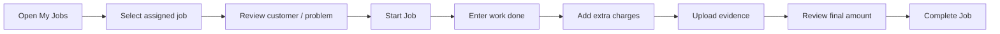
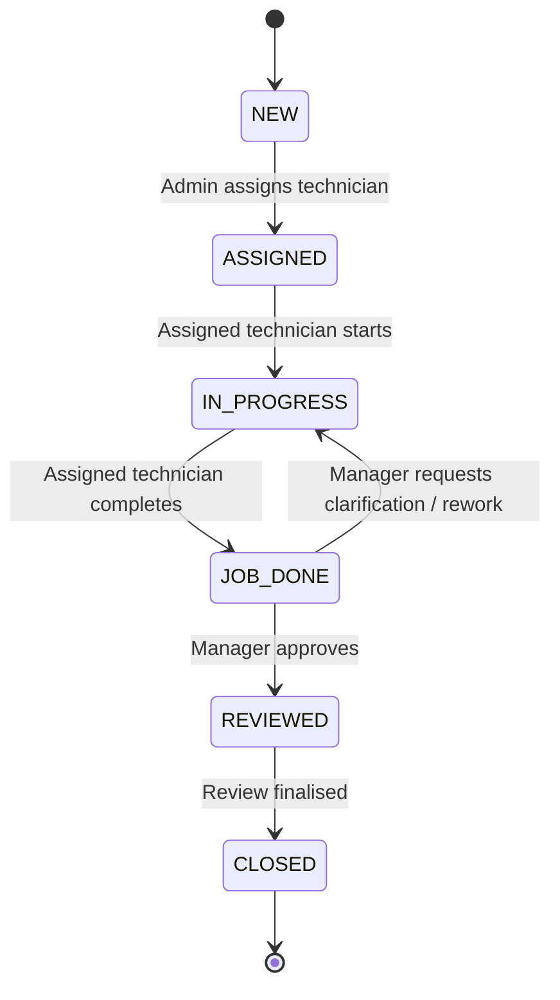
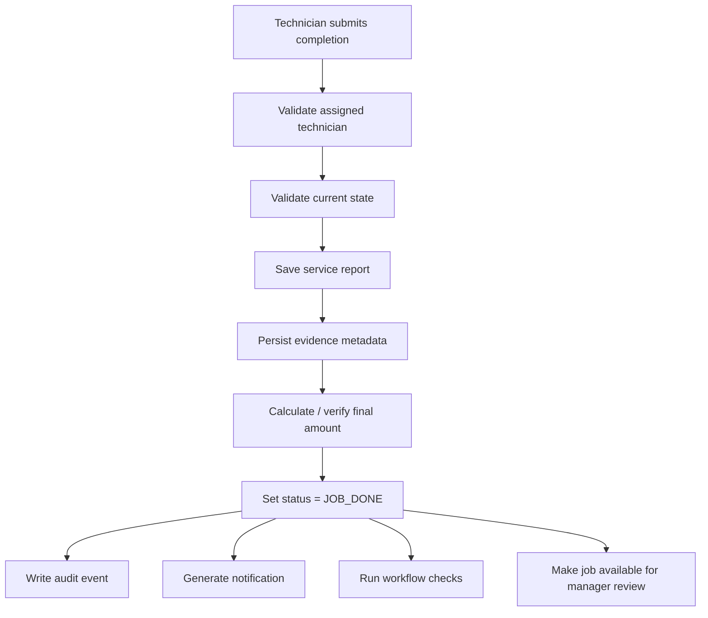
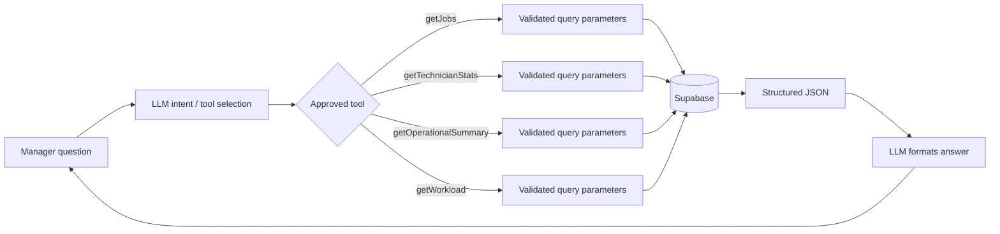
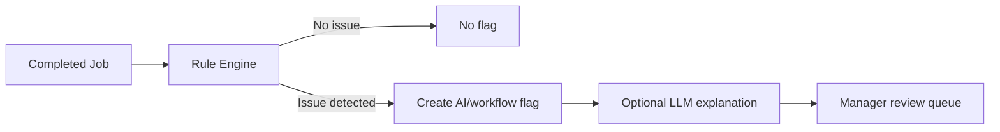
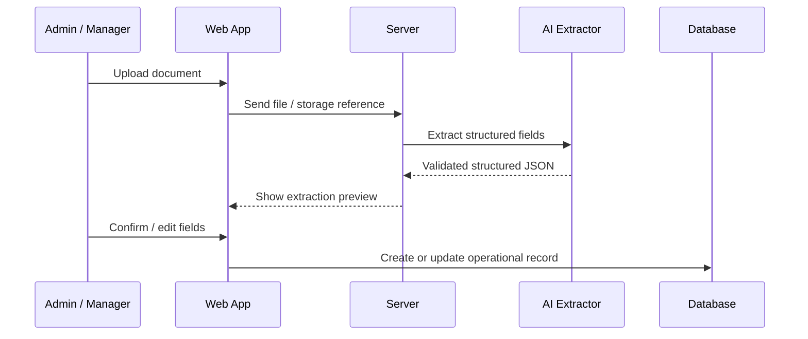
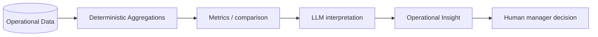
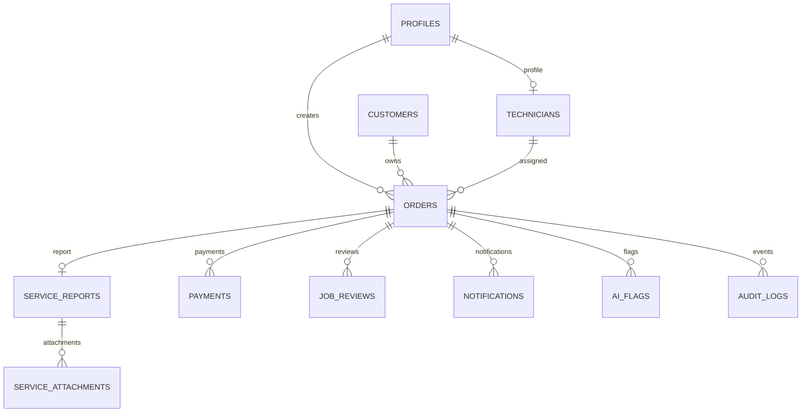
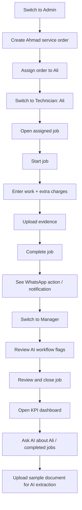

# SejukOps System Specification

## 1. Purpose

SejukOps is a responsive internal operations platform for a fictional air-conditioning service company with multiple branches and field technician teams.

The system is designed around a single operational lifecycle:

**Order → Assignment → Service Execution → Completion → Notification → Review → Closure → Reporting / AI Insights**

The assessment implementation aims to cover every requested module while keeping them integrated around the same data model and workflow.

---

## 2. Product Principles

1. **One connected workflow** — modules must operate on shared orders, service reports, users, and events.
2. **Mobile-first field UX** — technicians use a responsive Web App optimised for phones.
3. **Desktop-first operations UX** — Admin and Manager portals favour efficient tables, forms, review screens, and dashboards.
4. **Deterministic rules first** — normal application logic handles explicit business rules; AI is used for interpretation, extraction, summarisation, and decision support.
5. **Controlled AI access** — the LLM never receives unrestricted database access.
6. **Human review for consequential AI output** — document extraction and AI flags must remain reviewable.
7. **Traceability** — important state changes and business actions are logged.
8. **Simple assessment auth, realistic boundaries** — use mock role switching while keeping authorization logic explicit.

---

## 3. Actors

### Admin

Primary responsibilities:

- Create orders
- Enter customer and service details
- Set quoted price
- Assign technician
- Add admin notes
- View operational order status

### Technician

Primary responsibilities:

- View assigned jobs
- Start an assigned job
- Record completed work
- Add extra charges
- Upload service evidence
- Review final amount
- Mark job as completed
- Optionally record payment information

### Manager

Primary responsibilities:

- Review completed jobs
- Inspect service evidence and amount variance
- Resolve workflow flags
- Approve or request clarification
- Close reviewed jobs
- View KPI dashboard
- Use AI operations query and insight features

---

## 4. Role Model

### 4.1 Assessment decision

The role set is fixed for the assessment:

- `ADMIN`
- `TECHNICIAN`
- `MANAGER`

The demo uses a mock role switcher rather than full authentication.

### 4.2 Why there is no Create Role UI

Dynamic role management is deliberately not included because the current business requirement defines a small, stable set of responsibilities. Adding custom roles would increase authorization complexity without solving an assessment requirement.

The application should nevertheless avoid coupling permissions directly to UI components so a future production version can evolve toward configurable RBAC if needed.

### 4.3 Permission concepts

Suggested permission identifiers:

```text
order:create
order:view
order:assign
order:update
job:view_assigned
job:start_assigned
job:complete_assigned
evidence:upload
payment:record
review:view
review:approve
review:request_clarification
order:close
dashboard:view
ai:query
ai:review_flags
```

### 4.4 Data scope

Role checks alone are insufficient.

- Admin may operate on orders available to the admin scope.
- Technician may only start or complete orders assigned to that technician.
- Manager may view and review broader operational records.

A future multi-branch implementation can add branch-level scoping without changing the core domain model.

---

## 5. Application Structure

```text
/
├── admin/
│   ├── dashboard
│   ├── orders
│   ├── orders/new
│   └── orders/[id]
│
├── technician/
│   ├── jobs
│   ├── jobs/[id]
│   └── history
│
├── manager/
│   ├── dashboard
│   ├── reviews
│   ├── reviews/[id]
│   ├── ai
│   └── insights
│
└── documents/
    └── import
```

Exact routing can change during implementation, but the separation between role experiences should remain clear.

---

## 6. UX Strategy

### 6.1 Admin — desktop-first

Use a conventional internal operations layout:

- Sidebar navigation
- Header with current role / user
- Searchable orders table
- Status filters
- Large structured order form
- Order summary after submission

### 6.2 Technician — mobile-first responsive Web App

The Technician Portal is part of the same Web application and is not a native mobile app.

Design goals:

- Large tap targets
- Minimal navigation depth
- Important customer/job context visible before action
- Avoid dense tables
- Keep completion form linear
- Camera/file upload accessible from phone
- Sticky primary action when useful
- Bottom navigation preferred on narrow screens

Suggested technician navigation:

```text
Jobs | History | Profile
```

The core technician task should require as few steps as possible:



### 6.3 Manager — desktop-first

Use a review-oriented layout:

- KPI cards
- Weekly trend charts
- Technician leaderboard / performance table
- Completed jobs queue
- AI flags
- Review detail panel/page
- Operations AI chat/query window

---

## 7. Order Lifecycle

### 7.1 States

```text
NEW
ASSIGNED
IN_PROGRESS
JOB_DONE
REVIEWED
CLOSED
```

### 7.2 State transitions



### 7.3 State ownership

| Transition | Actor |
|---|---|
| NEW → ASSIGNED | Admin |
| ASSIGNED → IN_PROGRESS | Assigned Technician |
| IN_PROGRESS → JOB_DONE | Assigned Technician |
| JOB_DONE → REVIEWED | Manager |
| REVIEWED → CLOSED | Manager / system workflow |
| JOB_DONE → IN_PROGRESS | Manager requests clarification |

---

## 8. Module 1 — Admin Order Submission

### 8.1 Goal

Allow an Admin to create an order and assign a technician.

### 8.2 Fields

- Order No — auto-generated
- Customer Name
- Phone
- Address
- Problem Description
- Service Type
- Quoted Price
- Assigned Technician
- Admin Notes

### 8.3 Behaviour

1. Admin opens New Order.
2. System generates or reserves an order number.
3. Admin enters order information.
4. Admin selects technician.
5. System validates required fields.
6. Order is stored.
7. Status becomes `ASSIGNED` when a technician is selected.
8. Audit log records order creation and assignment.
9. UI shows a submission summary.

### 8.4 Order number

Recommended human-readable format:

```text
ORD-2026-0001
```

The database record should still use an internal UUID primary key.

---

## 9. Module 2 — Technician Service Job

### 9.1 Goal

Allow technicians to complete assigned work quickly from a phone browser.

### 9.2 Job list

Show:

- Order number
- Customer name
- Service type
- Address summary
- Status
- Scheduled/current context if added later

Prioritise `ASSIGNED` and `IN_PROGRESS` jobs.

### 9.3 Job detail

Read-only context before starting:

- Order ID
- Customer
- Phone
- Address
- Problem description
- Service type
- Quoted price
- Admin notes if appropriate

Primary action:

```text
Start Job
```

### 9.4 Completion fields

- Work Done
- Extra Charges
- Upload up to 6 files
  - photos
  - video
  - PDF
- Final Amount — auto-calculated
- Remarks
- Technician Name — derived from current mock user
- Timestamp — server generated

Optional payment fields:

- Payment Amount
- Payment Method
- Receipt Photo

### 9.5 Final amount rule

```text
final_amount = quoted_price + extra_charges
```

The server must calculate or verify this value; it should not trust a client-provided total.

### 9.6 Completion transaction

When completing a job:



---

## 10. Module 3 — WhatsApp Notification Trigger

### 10.1 Trigger

When order status changes to `JOB_DONE`.

### 10.2 Assessment implementation

Preferred lightweight implementation:

- Generate a WhatsApp deep-link with a pre-filled message.
- Store notification generation/sent metadata if useful.
- Do not require a full WhatsApp Business API integration for the assessment.

### 10.3 Message template

Suggested content:

```text
Hi {customerName},

Job {orderNo} has been completed by Technician {technicianName} at {completedAt}.
Please check the service and leave feedback.

Thank you!
```

### 10.4 Failure handling

Notification failure must not roll back the completed job.

Treat notification delivery/generation as a secondary side effect and surface failures for retry or manual action.

---

## 11. Manager Review

Manager Review is a supporting feature required to make the defined order lifecycle complete.

### 11.1 Review screen

Display:

- Order/customer summary
- Quoted price
- Extra charges
- Final amount
- Work done
- Remarks
- Uploaded evidence
- Payment information if recorded
- Audit history
- AI / workflow flags

### 11.2 Actions

- Approve
- Request clarification / rework

If approved:

```text
JOB_DONE → REVIEWED → CLOSED
```

If clarification is required:

```text
JOB_DONE → IN_PROGRESS
```

The request and state transition should be captured in the audit trail.

---

## 12. KPI Dashboard

### 12.1 Minimum period

Weekly metrics are the minimum useful dashboard scope.

### 12.2 Core metrics

- Jobs Completed
- Total Amount
- Postponed / Rescheduled jobs
- Average Job Value
- Jobs by Technician
- Jobs by Service Type

### 12.3 Technician performance

Suggested table/leaderboard columns:

- Technician
- Jobs Completed
- Total Amount
- Average Job Value
- Reschedule Count

### 12.4 Aggregation principle

Dashboard values should come from deterministic database queries, not from LLM calculation.

AI may interpret these metrics but should not be the source of truth for the numbers.

---

## 13. AI Operations Query Window

### 13.1 Goal

Allow managers to ask operational questions in natural language while preserving controlled access to system data.

### 13.2 Supported question families

Initial support should focus on explicit operational intents:

#### Job lookup

- What jobs did Ali complete last week?
- Show jobs completed today.
- What repair jobs were completed this week?

#### Technician performance

- Which technician completed the most jobs this week?
- How many jobs did Bala complete?

#### Operational totals

- How many jobs were completed today?
- What was the total completed amount this week?

#### Workload

- Which technician has the highest workload this week?

### 13.3 Controlled query architecture



### 13.4 Tool examples

```ts
getJobs({
  technicianId?: string,
  status?: OrderStatus,
  serviceType?: string,
  startDate?: string,
  endDate?: string
})

getTechnicianStats({
  technicianId?: string,
  startDate: string,
  endDate: string
})

getOperationalSummary({
  startDate: string,
  endDate: string
})

getWorkload({
  startDate: string,
  endDate: string
})
```

### 13.5 Guardrails

- The model cannot execute arbitrary SQL.
- The model cannot directly browse database tables.
- Tool input is schema validated.
- Date ranges are normalised server-side.
- Query result size is bounded.
- Unsupported questions return a clear limitation instead of fabricated data.
- Final numeric values come from backend queries.

---

## 14. Advanced AI — Workflow Supervisor

### 14.1 Goal

Flag completed jobs that deserve manager attention.

### 14.2 Architecture decision

Use deterministic rules for clear operational conditions and optionally use the LLM to explain the issue in natural language.



### 14.3 Initial rules

#### High final amount variance

Example rule:

```text
final_amount > quoted_price × threshold
```

The exact threshold should be configurable rather than hidden inside prompt text.

#### Missing service evidence

```text
status = JOB_DONE AND attachment_count = 0
```

#### Unusual extra charge

Can initially be a simple threshold or ratio rule.

### 14.4 Flag shape

```text
id
order_id
flag_type
severity
reason
status
created_at
resolved_at
resolved_by
```

### 14.5 AI responsibility

The LLM can produce:

- Plain-language explanation
- Context summary
- Suggested review action

It must not automatically approve, reject, charge, refund, or discipline staff.

---

## 15. Advanced AI — Document Understanding

### 15.1 Goal

Extract structured operational data from an uploaded document.

### 15.2 Supported output

- Customer name
- Service type
- Service details
- Amount
- Date

### 15.3 Flow



### 15.4 Human-in-the-loop rule

The extracted output is a draft.

Do not silently insert LLM-extracted values into live operational records without showing them for confirmation.

### 15.5 Validation

Use a typed schema for extraction output, for example:

```ts
type ExtractedServiceDocument = {
  customerName: string | null;
  serviceType: string | null;
  serviceDetails: string | null;
  amount: number | null;
  date: string | null;
};
```

Invalid or missing fields should remain explicit rather than guessed.

---

## 16. Advanced AI — Operational Insight

### 16.1 Goal

Explain patterns derived from operational metrics.

### 16.2 Example

```text
Bala completed 11 jobs this week, significantly above the team average.
He also has several active assignments.
Consider reviewing workload distribution.
```

### 16.3 Design



The application calculates the metrics. The LLM explains them.

### 16.4 Possible insights

- Technician workload imbalance
- High reschedule rate
- Large amount variance trend
- Service type volume changes
- Technician completion volume significantly above/below team average

---

## 17. Audit Trail

### 17.1 Goal

Make key business actions traceable.

### 17.2 Events

Suggested event types:

```text
ORDER_CREATED
TECHNICIAN_ASSIGNED
JOB_STARTED
SERVICE_REPORT_UPDATED
EVIDENCE_UPLOADED
PAYMENT_RECORDED
JOB_COMPLETED
NOTIFICATION_GENERATED
REVIEW_REQUESTED
REVIEW_APPROVED
JOB_CLOSED
AI_FLAG_CREATED
AI_FLAG_RESOLVED
```

### 17.3 Audit record

```text
id
order_id
actor_profile_id
event_type
metadata_json
created_at
```

Audit log records should not be edited by normal application flows.

---

## 18. Suggested Data Model

### 18.1 `profiles`

```text
id UUID PK
name TEXT
role ENUM/STRING
created_at TIMESTAMP
```

### 18.2 `technicians`

```text
id UUID PK
profile_id UUID FK -> profiles.id
name TEXT
active BOOLEAN
created_at TIMESTAMP
```

### 18.3 `customers`

```text
id UUID PK
name TEXT
phone TEXT
address TEXT
created_at TIMESTAMP
```

### 18.4 `orders`

```text
id UUID PK
order_no TEXT UNIQUE
customer_id UUID FK -> customers.id
assigned_technician_id UUID FK -> technicians.id NULLABLE
problem_description TEXT
service_type TEXT
quoted_price NUMERIC
status TEXT
admin_notes TEXT NULLABLE
created_by UUID FK -> profiles.id
created_at TIMESTAMP
updated_at TIMESTAMP
```

### 18.5 `service_reports`

```text
id UUID PK
order_id UUID FK -> orders.id UNIQUE
technician_id UUID FK -> technicians.id
work_done TEXT
extra_charges NUMERIC DEFAULT 0
final_amount NUMERIC
remarks TEXT NULLABLE
started_at TIMESTAMP NULLABLE
completed_at TIMESTAMP NULLABLE
updated_at TIMESTAMP
```

### 18.6 `service_attachments`

```text
id UUID PK
service_report_id UUID FK -> service_reports.id
storage_path TEXT
file_name TEXT
mime_type TEXT
file_size BIGINT
created_at TIMESTAMP
```

### 18.7 `payments`

```text
id UUID PK
order_id UUID FK -> orders.id
amount NUMERIC
payment_method TEXT
receipt_storage_path TEXT NULLABLE
recorded_by UUID FK -> profiles.id
created_at TIMESTAMP
```

### 18.8 `job_reviews`

```text
id UUID PK
order_id UUID FK -> orders.id
reviewer_profile_id UUID FK -> profiles.id
decision TEXT
comment TEXT NULLABLE
created_at TIMESTAMP
```

### 18.9 `notifications`

```text
id UUID PK
order_id UUID FK -> orders.id
channel TEXT
recipient TEXT
message TEXT
status TEXT
created_at TIMESTAMP
```

### 18.10 `ai_flags`

```text
id UUID PK
order_id UUID FK -> orders.id
flag_type TEXT
severity TEXT
reason TEXT
status TEXT
created_at TIMESTAMP
resolved_at TIMESTAMP NULLABLE
resolved_by UUID FK -> profiles.id NULLABLE
```

### 18.11 `audit_logs`

```text
id UUID PK
order_id UUID FK -> orders.id NULLABLE
actor_profile_id UUID FK -> profiles.id NULLABLE
event_type TEXT
metadata JSONB
created_at TIMESTAMP
```

### 18.12 Relationship diagram



---

## 19. File Storage

Use Supabase Storage for service evidence and receipts.

Suggested buckets or path organisation:

```text
service-evidence/{orderId}/{fileId}-{filename}
receipts/{orderId}/{fileId}-{filename}
documents/{uploadId}/{filename}
```

Store metadata in PostgreSQL rather than relying on storage listing as application state.

Validate:

- file count
- MIME type
- file size
- ownership / order access

---

## 20. Error & Edge Case Behaviour

### Order creation

- Missing required fields → validation error
- Duplicate generated order number → retry generation / database constraint handling

### Technician actions

- Wrong technician opens job → read restriction or action blocked
- Job already completed → completion action disabled
- Upload partially fails → surface failed files without losing already uploaded files

### Notification

- WhatsApp deep-link generation fails → job remains completed, show notification warning

### AI query

- Unsupported request → explain supported query scope
- No matching data → return an explicit no-results answer
- Tool failure → show operational error rather than hallucinating an answer

### Document extraction

- Low-quality/missing fields → return null/uncertain fields for user review
- Invalid amount/date → validation error before confirmation

---

## 21. AI Provider Boundary

AI integration should be provider-agnostic behind a server-side adapter.

```text
AIService
├── queryOperations(...)
├── explainWorkflowFlag(...)
├── extractDocument(...)
└── generateOperationalInsight(...)
```

Provider-specific SDK/API details should not leak throughout UI or domain services.

Environment variables should hold provider credentials. No provider key should be exposed to the browser.

---

## 22. Suggested Service Boundaries

```text
OrderService
TechnicianJobService
ServiceReportService
PaymentService
NotificationService
ReviewService
DashboardService
AuditService
WorkflowRuleService
AIQueryService
DocumentExtractionService
OperationalInsightService
```

These can remain modules/functions within the Next.js server layer. A separate backend service is not required unless implementation complexity later justifies it.

---

## 23. Technical Stack

### Frontend

- Next.js
- React
- TypeScript
- Tailwind CSS

### Backend / Data

- Next.js server actions and/or route handlers
- Supabase PostgreSQL
- Supabase Storage

### AI

- Server-side provider adapter
- Structured outputs / schema validation where supported
- Controlled application tools for operational queries

### Deployment

- Vercel
- Supabase hosted project

### Authentication for assessment

- Mock login / role switcher

---

## 24. Implementation Plan

### Phase 1 — Foundation

- Initialise Next.js / TypeScript / Tailwind
- Configure Supabase
- Create schema and migrations
- Seed mock users and technicians
- Implement role switcher
- Add shared layout and navigation

### Phase 2 — Admin Workflow

- Orders list
- Create order form
- Auto order number
- Technician assignment
- Order detail
- Audit events

### Phase 3 — Technician Workflow

- Mobile-first jobs list
- Job detail
- Start job
- Completion form
- File upload
- Final amount calculation
- Optional payment capture

### Phase 4 — Completion & Review

- Job Done transition
- WhatsApp deep-link
- Workflow rules
- Manager completed-job queue
- Review / clarification / closure

### Phase 5 — KPI Dashboard

- Weekly aggregates
- KPI cards
- Technician performance table
- Simple charts

### Phase 6 — Core AI

- Define supported question intents
- Implement controlled tools
- Structured tool execution
- Operations query UI
- Empty/error/unsupported states
- Initial operational insights

### Phase 7 — Advanced AI

- Workflow Supervisor explanations
- Document upload and extraction
- Human review of extracted fields
- More operational insight scenarios

### Phase 8 — Quality & Submission

- Responsive QA
- Validation and error states
- Seed realistic assessment data
- README screenshots / demo notes
- Self-assessment section
- Deployment

---

## 25. Testing Priorities

### Business rules

- Only Admin assigns technicians
- Only assigned Technician starts/completes job
- Final amount is computed correctly
- Invalid state transitions are rejected
- Manager review transitions are valid

### Integration

- Order appears in assigned technician portal
- Service completion updates manager review queue
- Completed job updates dashboard metrics
- Completed job triggers notification generation
- AI query returns values matching deterministic queries

### Responsive

At minimum verify technician flows on narrow phone-sized viewports and manager/admin flows on normal desktop widths.

### AI

- Tool selection for supported questions
- Unsupported question behaviour
- Empty data behaviour
- Structured extraction validation
- No direct arbitrary database query path

---

## 26. Assessment Demo Flow

A reviewer should be able to test the product in one continuous scenario:



This end-to-end path should be prioritised over implementing disconnected features that cannot be demonstrated together.

---

## 27. Explicit Non-Goals for the Assessment

Unless time remains after the core specification is complete:

- Full production authentication
- User-created custom roles
- Complex organisation / tenant management
- Native iOS / Android technician apps
- Full WhatsApp Business infrastructure
- Autonomous AI decisions that change operational records without review
- Separate NestJS backend solely for architectural appearance

These are valid future production extensions but are not required to demonstrate the assessment's core engineering goals.

---

## 28. Future Production Extensions

If SejukOps evolved beyond the assessment, reasonable next steps could include:

- Real authentication
- Branch-aware permissions
- Accounts / Finance role
- Branch Manager role
- Configurable RBAC if organisational needs justify it
- Multi-tenant organisation model
- Scheduling / technician availability
- Customer feedback records
- WhatsApp Business API integration
- Background notification jobs and retries
- Offline-aware technician experience / PWA enhancements
- Observability and AI tool-call tracing
- AI evaluation datasets for supported operations queries

These should be driven by actual operating requirements rather than added pre-emptively.
