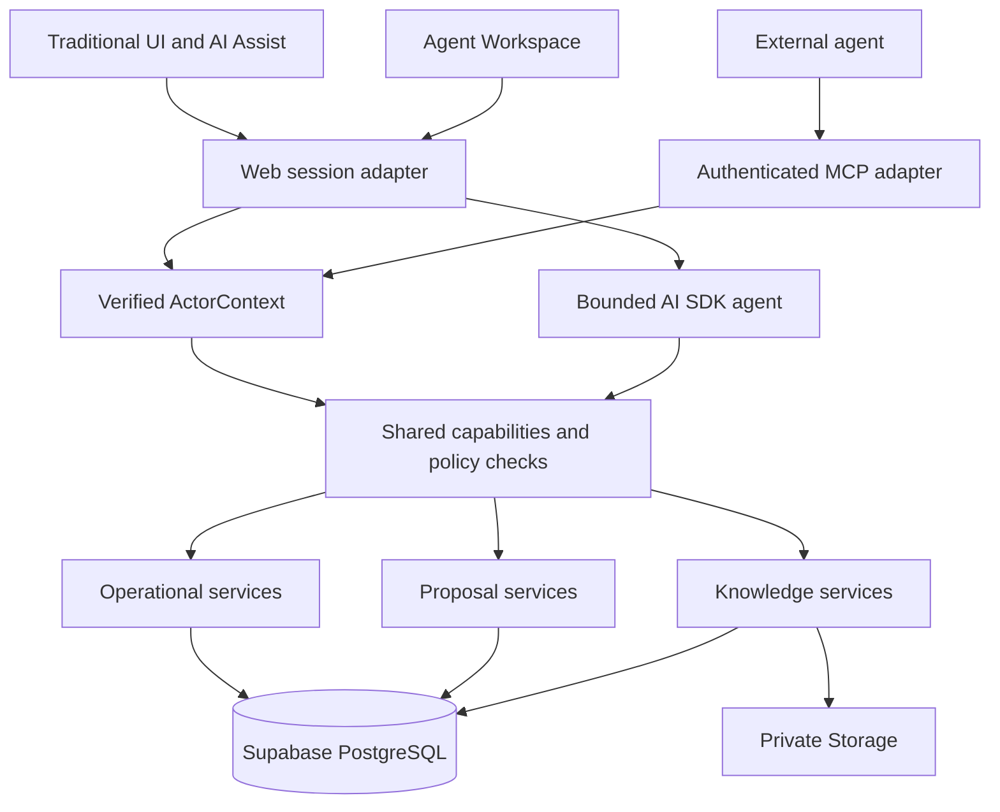

# Sejuk Ops — Agent-native Target Specification

**Decision date:** 2026-09-28. **Status:** accepted discussion direction, documented for review; **not implemented**. The current assignment is documentation only. Execution authorization and actual progress are in [PROJECT_STATE.md](../PROJECT_STATE.md).

This specification replaces the assessment as the product direction. It does not claim that old code now satisfies the new boundaries. The pre-rebuild implementation is preserved at [baseline `8fe1a52`](https://github.com/wong001110/sejukops-assessment/tree/8fe1a52378f1aa2976cab4b6d6b4b9497ab983b3).

## 1. Product goal and scope

Build a small field-service product that can demonstrate how operational data, RAG, tool use, constrained agency, human approval, and verification form one useful workflow. Reuse the useful service/order foundation; do not build a second CRM or an exhaustive feature showcase.

The main story is: **service order → investigate → evidence → proposal → human approval → deterministic execution → visible result/audit**. An agent may choose relevant reads and ask for missing information; it cannot waive a business rule. A recommendation is decision support, not a confirmed technical diagnosis.

Use the existing order as the case context unless a later evidence-backed requirement justifies a separate case entity. Do not invent customer equipment history, certified skills, job duration, live availability, inventory, or pricing rules that the data does not represent. Extend only the minimum model required for the selected demo, using explicitly fictional fixtures and visible limitations.

### Retain, adapt, retire

| Area | Direction |
| --- | --- |
| Order, assignment/reschedule, technician completion, manager review | Retain useful domain rules, transactions, and manual fallbacks; adapt authorization and data scope. |
| Audit, validation, retry/idempotency foundations | Reuse after checking them under real identities, workspace boundaries, and delayed approvals. |
| Conventional UI and contextual AI | Preserve useful screens; remove assessment wording and move private settings out of business roles. |
| Single-tool planner and custom generic AI plumbing | Replace with a bounded framework runtime; retire superseded call sites/contracts/tests when appropriate. |
| Document-to-order extraction | Preserve as a useful intake route; expose it to the agent through the same service boundaries. |
| Knowledge Base/RAG | Add a distinct pipeline; document extraction alone is not RAG ingestion. |
| Optional payment/notification/dashboard extras | May remain if useful and cheap; may be removed if they distract from the agreed demo. No expansion is required. |

Removing an obsolete feature means retiring its superseded runtime, routes, settings, tests, and documentation coherently, not just hiding its menu. Security, audit, and data integrity are not optional features to discard.

## 2. Interaction surfaces

### Traditional + AI Assist

Users navigate records, forms, and workflow steps. AI assists a selected task (summary, related knowledge, suggested next action, or import draft) without taking over unrelated work. Ordinary manual writes remain direct human actions subject to the same permissions and domain rules; they need not become conversational proposals.

### Agent Workspace

Users state an outcome; the agent reduces navigation and unnecessary manual steps. Show task starters and capabilities, not just an empty input. Explain scope and when approval is needed. Show actual tool activity, relevant evidence, missing information, an editable proposal, and links back to records/forms. Initial capabilities: operational questions, case investigation/proposed assignment, and document/knowledge intake.

Use fixed typed components for activity, citations, records, drafts, and approval. Do not generate arbitrary React or rebuild a general chat application. Progress comes from actual execution events; do not expose hidden model reasoning or fabricate tool activity. Keep loading, errors, retry, cancellation, and uncertain outcomes understandable. Onboarding can recede after first use.

Switching surfaces preserves order/workspace/proposal context and refreshes authoritative data. Switching workspaces cancels or detaches the old run, clears incompatible UI context, and never reuses private context or cached results in another workspace. Technician remains mobile-first; full Agent Workspace parity for every business role is not required.

### External agents via MCP

Expose selected business capabilities to authenticated external clients so the website need not be the interaction surface. This is a server adapter, not a second backend and not a requirement for the internal agent to make HTTP/MCP calls back into itself. Protocol/host compatibility and authentication must be proven, not assumed from tool names.

MVP: authenticated, scoped read/search tools and one real-client demonstration. Later: proposals and consequential writes, plus richer external document intake. Preserve the long-term ability to update records externally; do not pretend the read-only milestone already delivers it.

## 3. Identity, workspaces, and Super Admin

Target deployment: one Next.js app and one Supabase project with two data boundaries:

- **Demo workspace:** shared synthetic operational data/KB for all public demo visitors. Changes by other visitors and resets are expected and disclosed.
- **Owner workspace:** private operational data, knowledge, threads, and proposals. Demo membership never grants access here.

This is a real isolation change, not merely two tabs or a filter. Per-visitor cloned environments, organization signup, billing, invitations, and a generic multi-tenant SaaS administration system are outside MVP.

Use Supabase Auth: private owner sign-in (initially a provisioned email/password account) and anonymous sign-in for one-click Demo personas. Do not publish permanent administrator passwords. Demo persona selection is restricted to server-approved roles **in the Demo workspace only**; it is not a client-provided authorization claim. Bind the technician persona to a seeded Demo technician explicitly while keeping the real authenticated visitor in audit events.

| Permission axis | Values | Responsibility |
| --- | --- | --- |
| Platform role | `SUPER_ADMIN`, `USER` | Platform settings, technical observations, workspace administration, Demo reset. |
| Workspace membership role | `ADMIN`, `MANAGER`, `TECHNICIAN` | Business actions and permitted records inside an active workspace. |
| Workspace kind | `DEMO`, `OWNER` | Demo restrictions/quotas versus private data policy. |

The owner is a platform Super Admin with explicit operational membership/context for the two workspaces. Admin assigns/creates; Manager reviews and sees permitted operational summaries; Technician acts on assigned jobs. An Admin label does not grant platform settings. The agent offers only capabilities allowed for the current actor; a Manager cannot acquire assignment authority by asking an agent.

Platform Super Admin can manage both workspaces and inspect technical observations through explicit privileged routes, with audit. Ordinary business reads/writes still specify a workspace and preserve transition rules. Do not silently impersonate another user or remove every workspace predicate whenever `SUPER_ADMIN` appears.

### Actor and enforcement boundary

Web sessions and future MCP credentials resolve server-side to one actor context: authenticated user, profile, platform role, verified active membership/role, workspace, optional Demo persona, credential scopes, and request/audit identifiers. These are conceptual fields, not a final schema.

Capabilities receive a validated actor rather than reading browser cookies internally. Effective access is the intersection of membership/record permissions, Demo restrictions, and external credential scopes; it is never the union of all available roles.

Use server-controlled profiles/memberships for authority, not editable user metadata. Verify the session/token and revalidate sensitive access. Anonymous users being authenticated does not make them owners. Apply least-privilege grants and RLS where data is exposed; audit every service-role/SECURITY DEFINER path because it can bypass RLS. Authenticated pages, token refresh responses, and caches must not leak sessions between users.

## 4. One shared application core

```mermaid
flowchart TB
    GUI[Traditional UI and AI Assist] --> WEB[Web session adapter]
    UI[Agent Workspace] --> WEB
    WEB --> ACTOR[Verified ActorContext]
    EXT[External agent] --> MCP[Authenticated MCP adapter]
    MCP --> ACTOR
    ACTOR --> CAP[Shared capabilities and policy checks]
    AGENT[Bounded AI SDK agent] --> CAP
    WEB --> AGENT
    CAP --> OPS[Operational services]
    CAP --> KB[Knowledge services]
    CAP --> PROP[Proposal services]
    OPS --> DB[(Supabase PostgreSQL)]
    PROP --> DB
    KB --> DB
    KB --> STORE[Private Storage]
```

Reuse domain schemas and capability definitions where useful, with thin adapter-specific validation/metadata. Do not expose a tool for every internal helper, mirror raw tables, or provide arbitrary SQL. Internal and external tools can expose different subsets of the same capability library. Avoid nesting a second paid agent behind every MCP read; optional server-side investigation must be explicit and budgeted.

Workspace identity follows the whole data graph: branches/customers/technicians/orders, related reports/evidence, drafts/imports, knowledge versions/chunks, proposals, threads, usage, and audit. A child may inherit scope through a checked parent or carry its own workspace field; either way cross-workspace associations must be impossible. Verify joins, aggregate RPCs, foreign keys, Storage authorization, retrieval, citation opening, caches, and privileged diagnostics—not just top-level lists.

Shared demo business data does not require publicly exposing every visitor's conversation or private upload. Keep threads actor-scoped by default. Treat anything published into the Demo KB or attached to shared demo orders as shared; warn against personal/confidential uploads. Owner content must never become a demo sample, prompt, trace preview, or seed.

## 5. Agent and consequential actions

Use one bounded runtime. It can select read tools, retrieve knowledge, ask focused questions, and prepare a proposal. Set step, time, token/output, and cost budgets; allow cancellation and bounded retries. A model error or missing evidence must not turn into a write. Exact limits are configuration validated in implementation, not promises in this document.

A proposed write is a durable product record, not a sleeping agent or a yes/no sentence in chat:

**Create proposal → end investigation → human reviews exact payload → authorize/execute proposal → result/audit.**

The proposal binds workspace, author, action type, target IDs, exact payload/version, evidence references, expected business-state version, expiration, and idempotency identity. Editing creates a revised proposal requiring fresh approval. Backend execution checks actor permissions, proposal status, payload/version, current target state, represented scheduling constraints, and reset generation. Persist the state change, execution result, and business audit atomically where feasible; handle retries without duplicate effects. Reject stale plans rather than rerunning the model to silently change an approved action.

MVP write scope is one complete service-order creation/assignment path, including the retained document-to-order draft path where practical—not a suite of autonomous pricing, refunds, cancellations, and bulk rescheduling. Reuse or extract atomic domain operations rather than chaining independent writes that can partially succeed.

A model-emitted approval field or a client simply sending `approved=true` is not evidence of human confirmation. Internal approval uses a trusted UI action. Later MCP writes need a specified, tested authorization/consent contract; host confirmation UI alone is not a backend business guarantee. Plain-text clients can receive summaries and source identifiers; a rich approval card is not a portable protocol promise.

## 6. Documents and knowledge

Keep two explicit purposes under shared intake plumbing:

1. **Operational import:** document → extracted order draft → review → create an order.
2. **Knowledge intake:** SOP/manual/policy → parse/metadata → review/index → publish → citation-grounded retrieval.

The agent prepares and explains imports, extracts metadata, flags missing versions/possible duplicates, and asks for the minimum unresolved information. Conventional upload/review remains available. A scanned form is not automatically a supported knowledge PDF merely because the older extractor accepts images.

MVP knowledge input: bounded Markdown/text and text-native PDF. Use private Storage, existing parsing where suitable, stable source/version/chunk identifiers, and explicit indexing failure states. Derive brand/model/version only when supported by evidence; unknown stays unknown. Exact hash duplicates can be detected deterministically; semantic duplicates and supersession are suggestions requiring review.

Separate publication state (`DRAFT`, `PUBLISHED`, `ARCHIVED`) from indexing state (`PENDING`, `PROCESSING`, `READY`, `FAILED`). Only **authorized, PUBLISHED + READY** versions are retrievable. Draft analysis may create chunks before approval, but they must not silently enter production retrieval. A replacement becomes active only when ready; failures must not discard the existing active version. Deletion/archive must remove retrieval eligibility and invalidate relevant caches/citations appropriately.

Use workspace/permission/version filters inside retrieval. Start with a measured metadata-filtered vector baseline; compare against a simple full-context/keyword baseline on the small corpus. Add hybrid retrieval/reranking only when evaluation justifies it. Test English/Chinese questions and evidence matching rather than assuming translated answers prove cross-language retrieval; full website localization is not required by this scope.

Citations are generated from actual returned source IDs and locations. A valid source ID does not prove support for a claim: test claim-to-passage support separately. Do not invent page numbers. If parsing fails, evidence is missing/outdated/conflicting, or equipment is unidentified, return a useful limitation/request instead of a confident diagnosis.

Document processing is a deterministic ingestion workflow, not a separate autonomous agent. Bound file size/pages/work; use an established job mechanism only if measured work exceeds request/runtime constraints. No arbitrary remote-URL fetcher in MVP. External-agent files require an explicit authorized transfer or an existing stored file reference; a ChatGPT attachment or local sandbox path is not automatically reachable by an MCP server.

## 7. Platform settings, observation, and abuse limits

The Super Admin console owns provider credentials/routing, technical observations, usage/quotas, workspace administration, Demo reset, and later MCP credential configuration. Business users see sanitized activity/evidence/results, not provider secrets, private traces, raw errors, or private configuration.

Keep AI provider configuration global initially, with fixed/budgeted Demo routing and a separate Owner policy. Do not add per-workspace BYOK/billing. Reuse existing encrypted configuration where appropriate; show masked credentials and replace/rotate actions, never secret readback. Provider endpoint changes remain restricted and protected against unsafe outbound destinations.

Use Langfuse for technical AI traces/datasets/experiments rather than recreating its dashboard. Platform UI can provide protected summaries and authorized links; no public trace sharing by default. Preserve business audit independently of AI telemetry. Redact customer/document content according to policy and always exclude credentials, tokens, signed file URLs, and hidden reasoning. Trace-export failure must not break or duplicate an operational transaction.

Public Demo requires limits enforced server-side: anonymous-sign-in abuse protection, per-actor and per-IP throttling, workspace/global AI budgets, allowed models, bounded agent runs, upload/index quotas, and a kill switch. Separate user IDs alone are not a spending limit. Ordinary roles cannot change models/quotas or mint privileged credentials. Fixture/scripted fallback must be explicitly labeled; never silently substitute it for a failed live model.

## 8. Data replacement and Demo reset

The owner explicitly permits abandoning old Sejuk Ops application records and reseeding both workspaces; backward-compatible data migration is not an MVP requirement. Existing SQL history/code may be simplified or replaced in a coherent future implementation phase. Keep a reproducible clean schema/seed path rather than depending on undocumented dashboard changes.

**No reset/migration/data deletion occurs in the direction PR.** Later destructive operations must target the verified Sejuk Ops resource and approved application-data scope. The allowance is not permission to delete Supabase projects, organizations, unrelated records, credentials, or accounts. If target/scope cannot be established, that operation remains blocked.

After the fresh baseline, routine reset is **Demo-only**. Super Admin explicitly triggers it; automatic scheduling is optional later. Lock or gate new demo writes, invalidate pending proposals/runs via a generation/version boundary, clear owned temporary files/records safely, reseed deterministic synthetic cases, and restore access. Stale workers cannot republish or write into the new generation. Preserve minimal protected reset/security audit and do not reset Owner data, memberships, or platform secrets.

## 9. Stack decision and feasibility boundaries

| Layer | Direction | Decision still requiring implementation evidence |
| --- | --- | --- |
| Web/UI | Existing Next.js/TypeScript, Ant Design; Ant Design Mobile for field flow | Dependency compatibility/security review; no cosmetic framework rewrite. |
| Agent | AI SDK bounded tool-loop and typed UI/tool contracts, Zod | Installed-version API, provider tool/stream behavior, failure/approval integration. |
| Data/Auth | Supabase Auth, PostgreSQL, private Storage, pgvector | Real session/actor mapping and end-to-end workspace isolation. |
| Ingestion | Existing `unpdf` where suitable; `@langchain/textsplitters` as a focused utility | Input limits, extraction quality, chunk metadata, embedding model/dimensions. |
| Observation/evaluation | Langfuse; existing useful audit/diagnostics reused | Compatible SDK/runtime versions, redaction, protected access, actual traces. |
| Tests | Existing Vitest; targeted browser/E2E tooling such as Playwright | Select minimal additions from actual host/repo support. |
| MCP | Official TypeScript SDK or one maintained Next.js-compatible adapter | One supported remote transport/auth/client combination; do not install competing servers. |

Do not also introduce LangChain agents, LangGraph, and LlamaIndex by default. LangGraph becomes relevant if true durable pause/resume or long-lived event orchestration is required; persisted product proposals do not require it. Select versions during the compatibility spike and pin a coherent dependency set then. No package/dependency change belongs to this PR.

Complexity is concentrated in cross-cutting Auth/workspace isolation, privileged RPCs, reliable knowledge lifecycle, and external-client authorization—not the chat input or MCP endpoint registration. A two-workspace system is not a production multi-tenant assurance without isolation evidence.

### Official implementation references

These are reference entry points, not compatibility certification. Recheck current documentation/changelogs when execution is authorized.

- [Supabase anonymous sign-ins](https://supabase.com/docs/guides/auth/auth-anonymous) and [RLS](https://supabase.com/docs/guides/database/postgres/row-level-security).
- [AI SDK loop control](https://ai-sdk.dev/docs/agents/loop-control).
- [Langfuse AI SDK integration](https://langfuse.com/integrations/frameworks/vercel-ai-sdk).
- [MCP authorization](https://modelcontextprotocol.io/specification/latest/basic/authorization).

## 10. Non-goals and acceptance authority

No multi-agent society, long-term autonomous memory, general workflow builder, full schedule optimization, inventory/finance suite, arbitrary database tools, arbitrary file support, per-visitor cloned SaaS tenancy, or universal MCP-host compatibility. No unsupervised consequential writes. No requirement to copy Agent-native CRM's code or treat its previous demo as live-provider evidence for Sejuk Ops.

Acceptance scenarios and phase dependencies are in [the rebuild plan](plans/agent-native-rebuild.md). Actual implementation, verification, and authorization are recorded only in [PROJECT_STATE.md](../PROJECT_STATE.md).
