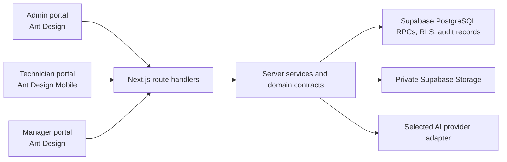

# SejukOps System Overview

SejukOps is one Next.js application with three role-oriented portals backed by Supabase/PostgreSQL. The portals share domain contracts and operational records but expose different actions and presentation patterns.

## Portal Boundaries

| Portal | Primary purpose | UI entry points | Main service boundaries |
|---|---|---|---|
| Admin | Create, assign, schedule, and inspect orders; configure AI; import documents | `src/app/admin/`, `src/components/admin/` | `admin-orders`, `ai-config`, `document-understanding` |
| Technician | View assigned jobs, start work, request rescheduling, upload evidence/receipt, complete jobs | `src/app/technician/`, `src/components/technician/` | `technician-jobs`, `technician-completion` |
| Manager | Review completions, reschedule, inspect KPIs, ask grounded operations questions, review workflow flags | `src/app/manager/`, `src/components/manager/` | `manager-review`, `manager-dashboard`, `ai-operations`, `workflow-supervisor` |

Admin and Manager are desktop-oriented and use Ant Design. Technician is mobile-first and uses Ant Design Mobile. The UI decision is authoritative in [`docs/UI_STACK.md`](../../docs/UI_STACK.md).

## Layering Convention

1. `src/domain/**` contains browser-safe schemas, contracts, errors, and deterministic domain helpers.
2. `src/components/**` owns interactive UI and thin API adapters.
3. `src/app/api/**` validates HTTP input and maps normalized service outcomes to safe responses.
4. `src/lib/services/**` owns authorization-aware orchestration and server-only integration logic.
5. `supabase/migrations/**` owns durable schema, constraints, RLS, security-definer RPCs, and transactional idempotency.
6. `tests/**` provides focused contract, static-boundary, unit, and integration evidence.

Secrets and service-role clients must remain server-only. Browser-safe domain contracts must not expose encrypted credentials, storage tokens beyond the immediate signed-upload response, or provider error bodies.

## Source Map

- Product and lifecycle authority: [`docs/SYSTEM_SPEC.md`](../../docs/SYSTEM_SPEC.md)
- Operational rules: [`docs/OPERATIONS_RULES.md`](../../docs/OPERATIONS_RULES.md)
- Environment definitions: [`docs/ENVIRONMENT_REQUIREMENTS.md`](../../docs/ENVIRONMENT_REQUIREMENTS.md)
- Shared operation types: `src/domain/operations.ts`
- Authentication and permissions: `src/lib/auth/`
- Supabase clients: `src/lib/supabase/`
- Database history: `supabase/migrations/202608100001_foundation.sql` through the latest forward-only migration
- Deterministic assessment fixtures: `supabase/seed.sql` and `src/domain/assessment-fixtures.ts`

## Current-State Rule

This page describes the intended and implemented architecture shape, not phase acceptance. Consult the checklist and verification log before claiming that a feature has passed live integration, Agent E2E, or Human UAT.

