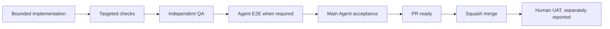

# Verification and Delivery

## Evidence Chain

An implementation report is not acceptance evidence by itself. Human UAT stays `NOT_RUN` until a human performs the scenario and reports the result.

## Test Scheduling

| Level | Use |
|---|---|
| L0 | Smallest affected lint, type, unit, contract, or component check |
| L1 | Related feature batch gate |
| L2 | Cross-module integration gate |
| L3 | Phase gate with independent QA and relevant E2E |
| L4 | Full regression/release candidate |

Do not run the broadest suite after every edit. Choose the smallest verification group that covers the risk, then broaden at integration or phase boundaries.

## Source of Truth

Reviewer setup and local commands: [`README.md`](../../README.md#reviewer-quick-start). Scope/evidence self-evaluation: [`docs/ASSESSMENT_SELF_EVALUATION.md`](../../docs/ASSESSMENT_SELF_EVALUATION.md). Release caveats: [`docs/KNOWN_LIMITATIONS.md`](../../docs/KNOWN_LIMITATIONS.md).

- Work state: [`docs/IMPLEMENTATION_CHECKLIST.md`](../../docs/IMPLEMENTATION_CHECKLIST.md)
- Verification evidence: [`docs/testing/VERIFICATION_LOG.md`](../../docs/testing/VERIFICATION_LOG.md)
- Test scenarios and Human UAT script: [`docs/testing/TEST_MATRIX.md`](../../docs/testing/TEST_MATRIX.md)
- Development protocol: [`docs/DEVELOPMENT_PROTOCOL.md`](../../docs/DEVELOPMENT_PROTOCOL.md)
- Git workflow: [`docs/GIT_WORKFLOW.md`](../../docs/GIT_WORKFLOW.md)

Allowed status vocabulary includes `TODO`, `IN_PROGRESS`, `IMPLEMENTED`, `PENDING_ENV`, `QA_PENDING`, `E2E_PENDING`, `HUMAN_UAT_PENDING`, `VERIFIED`, and `BLOCKED`. Do not collapse these into a misleading checked/unchecked state.

## PR Boundary

Each development phase or major feature is integrated through one owning PR. Small related tasks and multiple agent contributions remain within that PR. Sub-agent count does not determine PR count.

Substantial PRs begin as Draft, remain Draft while required gates are unresolved, and use Squash and Merge after Main Agent acceptance. Future work starts from updated `main`, not from the already squash-merged branch.

## Knowledge Update Procedure

When architecture or a major feature stabilizes:

1. identify which knowledge pages are affected
2. verify claims against accepted specs, implementation, and tests
3. update only the relevant pages and their source links
4. retain truthful pending/blocked evidence
5. include the update in the owning phase/feature PR when practical
6. check internal links and scan for secrets/local values

This procedure implements the OpenWiki living-documentation concept without requiring a generator or adding a runtime dependency.

## Submission Documentation Boundary

Reviewer setup notes may describe available routes, demo identities, environment definitions, migration/seed sequencing, and runnable local checks. They must not invent a deployment URL, screenshots, provider success, or Human UAT result. OpenWiki remains repository-native engineering documentation: it is neither a runtime RAG feature nor a LangChain, OpenRouter, or external-model dependency.
