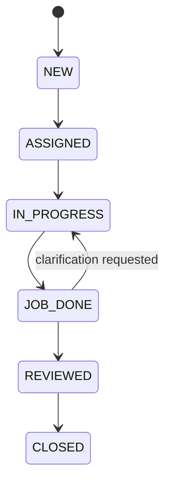
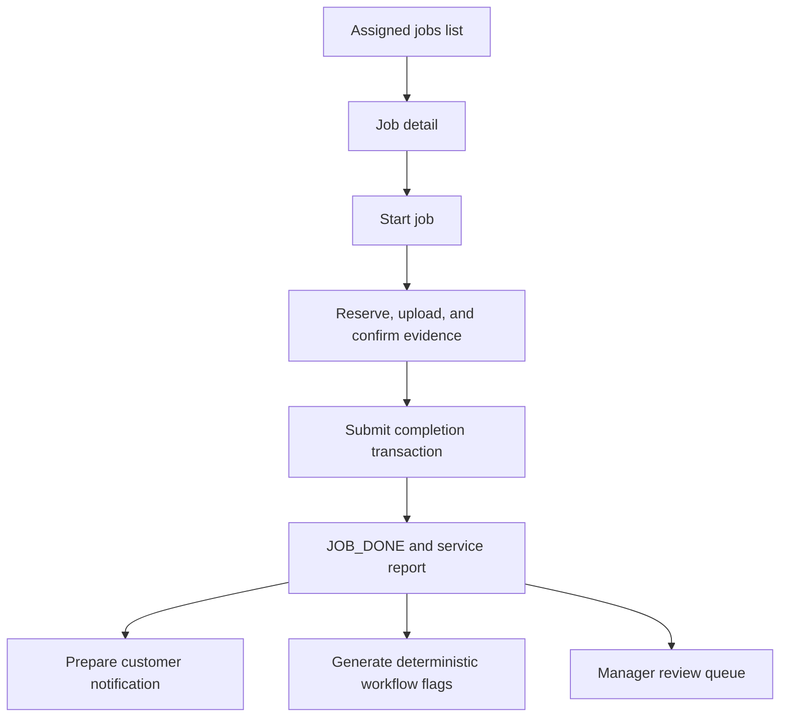

# Operations Lifecycle

## Authoritative Order States

Transitions are constrained in PostgreSQL and mirrored by browser-safe contracts. Never add a UI-only state or bypass a transactional transition merely to simplify a screen.

## Admin Submission and Scheduling

Admin creates or reuses a customer by normalized phone, creates an order, optionally assigns an active Technician from the selected branch, and records audit history atomically. Direct rescheduling creates an executed reschedule event; it does not rewrite history. Technician requests create pending requests for Admin/Manager resolution and do not directly alter the schedule.

Malaysia time (`Asia/Kuala_Lumpur`) is authoritative for operational dates, period boundaries, and same-day reschedule classification. Shared helpers live in `src/lib/time/malaysia.ts`.

## Technician Job Flow

Completion calculates the authoritative final amount from the quote snapshot plus extra charges. Evidence and an optional payment receipt are bound atomically. Exact completion replay must not duplicate reports, payments, attachments, audits, notifications, or flags.

## Clarification and Revision

A Manager clarification returns the order to `IN_PROGRESS`, keeps prior review/payment/evidence history, notifies the assigned Technician with the clarification note, and permits a new completion revision. Workflow flags and completion notifications are revision-aware so historical records remain truthful while current queues use the latest revision.

## WhatsApp Boundary

SejukOps prepares an encoded WhatsApp deep link rather than sending a background message. Only a user-initiated POST may mark a prepared notification `OPENED` and redirect/open the `wa.me` URL. A state-changing GET is not permitted. Core job completion remains committed even when notification preparation fails.

## Dashboard Effects

Manager KPIs are computed server-side for fixed Malaysia-time periods. Client query keys include the selected period, and known cross-role mutations invalidate only the Manager dashboard family. AI Operational Insight is secondary: KPI data remains visible when insight generation fails.

## Primary Sources

- [`docs/SYSTEM_SPEC.md`](../../docs/SYSTEM_SPEC.md)
- [`docs/OPERATIONS_RULES.md`](../../docs/OPERATIONS_RULES.md)
- [`docs/DASHBOARD_AND_NOTIFICATION_SPEC.md`](../../docs/DASHBOARD_AND_NOTIFICATION_SPEC.md)
- `src/lib/services/admin-orders/service.ts`
- `src/lib/services/technician-jobs/service.ts`
- `src/lib/services/technician-completion/service.ts`
- `src/lib/services/manager-review/service.ts`
- `src/lib/services/manager-dashboard/service.ts`
