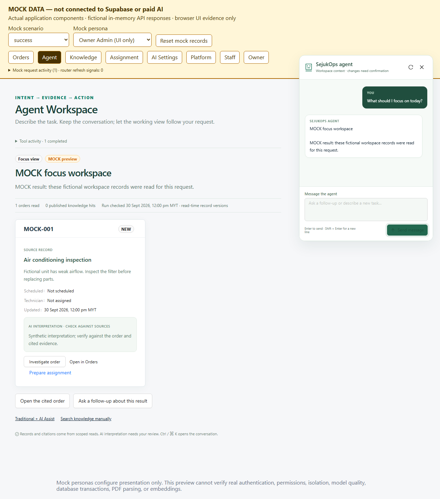

# Agent Workspace interaction correction — 2026-10-05

## Delivered behavior

The Agent Workspace now has one continuous conversation and an adaptive canvas, following the interaction in the supplied recording and `agent-native-crm` reference snapshot `0f38ab3582a254053e45e6091eed4491b76733da`. Traditional + AI Assist remains a separate navigation mode over the same operational services.

The bounded AI SDK 6 runtime selects a validated focus, investigation, comparison, knowledge, or clarification layout. Fixed React components render it. Record fields come from scoped reads, and cited excerpts must match published sources read during the run. Model interpretation is labeled separately. No generated code, arbitrary HTML, SQL, shell, external links, approval tool, or execution tool is accepted.

The conversation supports follow-up context, new conversation, minimize/reopen, Escape, Ctrl/Cmd+K, cancellation, retry, and actual tool activity. Desktop uses a floating dialogue dock; narrow screens expose the completed canvas and allow reopening the retained conversation. Switching account, role, workspace, or focused order resets its page session. Navigation/reload transcript persistence is not implemented.

Formal Admin can prepare one persisted PENDING assignment proposal. The UI retrieves and compares its canonical saved fields, then requires explicit human confirmation through the existing guarded endpoint. STALE/EXPIRED or changed proposals cannot be confirmed. Guest reads and follows links to its permitted manual Demo actions; Guest cannot prepare or inspect private saved proposals. Manager scheduling, Technician progress, document intake, and knowledge publishing retain their traditional flows. MCP remains deferred.

## Verification

| Evidence | Result and boundary |
| --- | --- |
| Rendered Mock browser | Nine grouped cases PASS at 1280×720 and 390×844; all five views, follow-up/context reset, guarded duplicate send, cancel/late response, recovery/quota, inert hostile content, malformed/truncated/foreign references, explicit proposal confirmation and STALE result, keyboard controls. Zero runtime errors/external requests. Deliberate 503/409 fixture console errors are documented. [Raw evidence](mock/result.json). |
| Focused contracts/runtime/route/UI | Final focused run106/106 PASS: runtime56/route25/transport11/technicians4/observability4/lifecycle6. Full shared run initially had 837 PASS, three outdated Agent UI lifecycle failures and one optional live-JWT skip; the failed file was repaired and rerun in full. These are separate runs, not a claim of a new all-green full-suite run. |
| Independent review | GPT 6.1 Sol independently ran runtime53/route25/transport11: 89/89 PASS. Three findings were repaired: informational preparation intent, whole-run hung-await deadline, and metadata storage delaying terminal EOF. The original shortened deadline probe now rejects with TimeoutError. This is a scoped source/fake-provider review, not hosted penetration testing. |
| Targeted mutation | Six-assertion baseline PASS; four selected virtual-source mutants KILLED, none survived/invalid. Guest preparation denial, current request/history authority, citation binding, per-step allowance. Executed assertions and source load markers checked; physical runtime source unchanged. [Evidence](mutations.json). |
| TypeScript / ESLint | PASS; full lint had zero errors and six preexisting warnings in ignored local portfolio scripts. |
| Production build | PASS, including the new conversation endpoint and native workspace page. |
| Real browser/provider | A complete three-order focus view matched independent current Orders API fields. Its free-form follow-up returned SOURCE_ONLY, then later runs returned a controlled error. Complete two-turn acceptance remains **REPAIR**. The prompt now gives a valid concrete object example, every field limit, exact context UUID guidance and relevant-tool guidance; safety validators remain strict. A post-fix attempt with only1/20 allowance left returned UNAVAILABLE before any successful read. Further paid calls stopped. Raw live screenshots/logs are retained locally in this report's live/ directory and excluded from the public PR. |
| Human UAT | NOT_REPORTED. |

## Fixes found during verification

- Rapid double-click previously hit a Send button that turned into Cancel; the actions now remain separate.
- A sticky composer fell below a 720px desktop viewport; the floating dock remains within it.
- A stale confirmation response previously kept the displayed PENDING label; validated status now remains visible after rejection.
- Model/source results distinguish read-time versions from a transactionally consistent snapshot.
- Server and client deadlines, fresh authority checks, late-write guards, and terminal stream completion remain bounded.

## Resource and delivery boundary

Only the confirmed SejukOps Test Demo is used for real reads. Real Guest entry creates/revokes a normal visit and paid calls consume the existing shared allowance; no business fixtures, staff identities, passwords, provider configuration, migrations, resets, unrelated memento project, emails, deployment, or production changes are part of this slice. Browser contexts and owned temporary services are closed after verification.

Saved proposal persistence/execution is covered by fake-provider/service contracts and the rendered Mock flow in this slice. A fresh authenticated formal-Admin live run is NOT_RUN; old one-time temporary-account permissions are not reused. Reference material is an interaction guide, not evidence that every CRM feature was ported.

The implementation is delivered as one feature PR. Merge and production deployment remain separate decisions.

## Main decision and remaining acceptance

**PROCEED** for the conversation/canvas implementation, Mock presentation, source binding, bounded runtime and guarded human approval behavior. **REPAIR** for complete configured-provider continuous-follow-up acceptance: retry the two-read browser script after the Guest allowance resets, or use a legitimately authenticated formal account. The runner now refuses a two-read run with fewer than four remaining calls. No automatic quota increase or provider reconfiguration is made.

The first live attempt was prevented by sandbox network access before entry; the next used an overly strict icon-bearing link selector. A later CDP response-body capture deadlocked after requests completed. This is retained as a failed capture; Main verified and revoked its exact Guest visit by ID, workspace and creation time, then rechecked process ownership before closing only that test browser. The final driver uses an in-page clone of the same response (no extra request), bounded waits and a finally cleanup. Other test visits exited normally and returned403 when reused. The final driver did not get a complete successful two-turn run in this batch. The prior live success screenshot is preserved below; latest screenshots are diagnostic evidence, not showcase acceptance.

Main's final exact Test readback found zero active visits created in this run window; owned test processes and ports3100/3200 were closed. Raw cleanup evidence is retained locally in cleanup.json and excluded from the public PR. One live interpretation called an old scheduled date “tomorrow”. Server referenceTime and Asia/Kuala_Lumpur are now supplied, and client/history clock substitution is rejected; a focused test verifies this. Live model language accuracy still needs recheck. Mutation evidence records its actual source hash before this last clock-only correction; the tested guards are unchanged.

